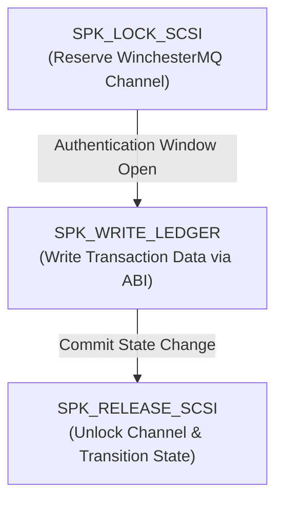

# Agentic Transfluxor Word and Sentence Composition Strategy

This document defines the protocols for constructing, testing, and chaining **Auncient** Transfluxor words and sentences to drive logical agentic operations across the WinchesterMQ and ABI subsystems.

---

## 1. Word Construction Framework

Every Transfluxor word is formulated by mapping a physical acoustic signal to a logical engine operation. In compliance with the unified register mapping rules, each word is constructed using three matching domains:

### VM Register Context
*   **Logical Command Binding:** The word contains a distinct WinchesterMQ command byte (`wmq_cmd`) and ABI opcode (`abi_op`) mapped to target registry operations (e.g., SCSI locking).
*   **Time-Gating (Wheeler Jump):** A decay parameter ($t_{\text{decay}}$) defines the window during which the transistor gates remain open. Once this duration is exceeded, the transient voltage collapses, locking the register.

### Mathematical Function
*   **Modular Hash Resolution:** The physical wave coordinates ($F_1, F_2$) and decay thresholds are summed and mapped to a unique modular identifier:
    $$\text{WordID} = \text{Hash}(F_1, F_2, t_{\text{decay}}) \pmod{\text{MotzkinPrime}}$$
*   **Elliptic Gen:** The feedback frequency is resolved programmatically using Clendenin rational approximations:
    $$\text{Feedback} = \text{RationalApprox}(F_1, F_2) \cdot \text{EllipticIntegral}(k)$$

### Visual / Geometric Projection
*   **Orbital Mapping:** The resolved frequencies modulate the orbital phase angles ($\phi_w$) and frequency multipliers ($f_x, f_y, f_z$) of the rendered Lissajous projected wireframe envelope.

---

## 2. Compound Words (Polyphonic Chords)

To execute parallel transactions (such as locking a channel and writing data in the same cycle), agents compose compound words. 
*   **Superposition Principle:** The waveforms of multiple independent words are mixed programmatically:
    $$S_{\text{compound}}(t) = A_1 \sin(2\pi F_{1a} t) + A_2 \sin(2\pi F_{1b} t)$$
*   **Parallel Resolution:** The TPU registry matches the composite resonance peaks to multiple active word entries concurrently.
*   **Lock Contention Avoidance:** Polyphonic dispatches resolve in parallel, eliminating the sequential clock cycles that trigger bus lock contentions.

---

## 3. Sentence Formulation (Sequential Execution)

Sequential agentic operations are chained together by emitting streams of waveforms in logical temporal order. A standard transactional sequence (sentence) follows this pathway:

1.  **Establish Channel Lock:** `SPEAK 440.0 880.0 0.4 1` (`SPK_LOCK_SCSI`).
2.  **Commit Business Logic:** `SPEAK 350.0 700.0 0.2 2` (`SPK_WRITE_LEDGER`).
3.  **Release Channel Lock:** `SPEAK 600.0 1200.0 0.5 3` (`SPK_RELEASE_SCSI`).

---

## 4. Automated Testing and Auditing Protocol

To verify new words and sentences, the agent executes the following testing loops:
1.  **Generation Validation:** Ensure the generated sample is saved as a `.DAT.BIN` asset.
2.  **Temporal Verification:** Assert that all commands within a sentence execute before the Wheeler Jump decay window collapses.
3.  **Low-Power Gating Audit:** Verify that the total power consumption does not exceed the target threshold ($0.0109\text{W}$ under a $78.2\%$ power cut).
