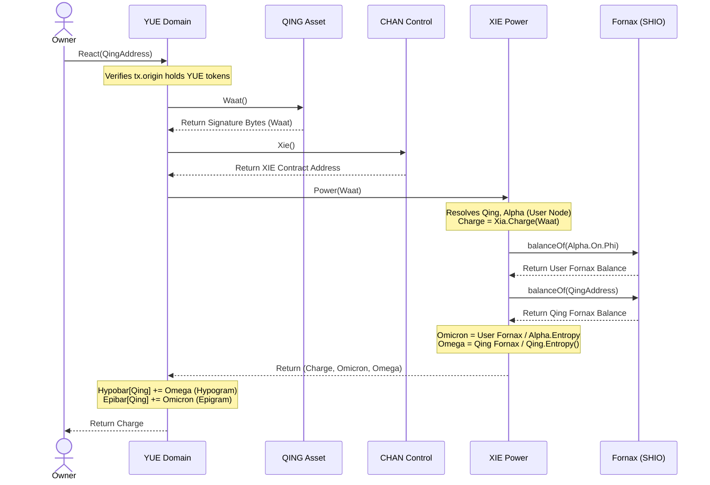

# Architecture Reference Manual

This document provides a comprehensive mapping of the Dysnomia system architecture, identity layers, on-chain state metrics, physical virtual hardware engines, and telemetry pipelines.

---

## 1. System Topology Layers

The Dysnomia ecosystem is organized into modular layers that separate identity management, state tracking, and asset manipulation:

```
  [ Identity Layer ]           [ Control Layer ]           [ Domain Layer ]
        LAU     <------------->      CHAN      <------------->    YUE (Domain)
                                      |
                                      v
                                     XIE (Power)  ----------> Fornax (SHIO)
                                      |
  [ Asset Layer ]                     v
     QING (Token)  -------------------+ (Waat/Signature)
          |
          v
     XIA (Engine)  <------------->  SHIO (Fomalhaute)
```

### A. Identity Layer (LAU)
* **Purpose**: Manages unique user identity structures.
* **Instantiation**: Created dynamically via `LAUFactory.New("username", "SYMBOL")`.
* **Registration**: Bounds owner profiles via `LAU.Username("username")`.

### B. Control Layer (CHAN & XIE)
* **CHAN**: Controls permissions and binds domain transactions to execution engines.
* **XIE**: Binds energy/signature variables to resolve dynamic SHIO registers (e.g., `Fornax` registry references).

### C. Domain Layer (YUE)
* **Purpose**: Coordinates trading pairs and computes live system reactions. It tracks dynamic metrics known as **Hypobar** (Hypogram) and **Epibar** (Epigram) for registered assets.

### D. Asset Layer (QING & XIA)
* **QING**: Digital tokens exposing signature verification methods (`Waat()`).
* **XIA**: High-level execution modules that resolve physical virtual hardware indexes.

---

## 2. Dynamic Metric Resolution Flow

The sequence below illustrates how a domain reaction computes user power states and updates the internal Hypogram and Epigram metrics:



---

## 3. Stellar Architecture Mapping

The virtual hardware structures inside the physical execution engine reflect the triple star coordinates of the **Fomalhaut** stellar system:

1. **Fomalhaut A**: The primary massive star and its surrounding debris disk define the **Dielectric Rod** base coordinates (`Xi`).
2. **Fomalhaut B** (TW Piscis Austrini): The variable flare star coordinates dictate the dynamic **drift velocity** and temporal state transitions.
3. **Fomalhaut C** (LP 876-10): The distant dwarf coordinates map to the constraints of the **Diejective Cone** endpoint (`Daiichi`).

---

## 4. Auncient VM State Registry Mapping

The **Auncient** Dysnomia VM registers are mapped to storage keys on the EVM. When the telemetry processor queries the contract view, it resolves these registers:

| Register Name | Storage Type | Mathematical Formula / Transform | Geometric Manifestation |
|---|---|---|---|
| **Base** | `uint64` | Root value $B$ for modular arithmetic operations | Starting phase angle offset ($\phi_w$) of $q_w$ |
| **Channel** | `uint64` | $Channel = Base^{Signal} \pmod{MotzkinPrime}$ | Frequency multiplier ($f_x$) of X-axis coordinate |
| **Signal** | `uint64` | Exponent scaling factor | Camera orbital velocity scaling |
| **Pole** | `uint64` | $Pole = Base^{Secret} \pmod{MotzkinPrime}$ | Translation vector offset of the projection axis |
| **Secret** | `uint64` | Modular private exponent | Shear distortion matrix offset |
| **Foundation** | `uint64` | $Foundation = Base^{Identity} \pmod{MotzkinPrime}$ | Frequency multiplier ($f_z$) of Z-axis coordinate |
| **Element** | `uint64` | $Element = Beta + Charge$ | Interior chord lines visual density |
| **Chin** | `uint64` | Bottom clamp boundary | Coordinate compression along the negative Y-axis |
| **Dynamo** | `uint64` | $Dynamo = Base^{Signal} \pmod{Element}$ | Frequency multiplier ($f_y$) of Y-axis coordinate |

---

## 5. Non-Blocking Locus of Control Principles

All external dependencies are treated as mathematically decoupled inputs routed through the system's **`Void`** contract to eliminate performance bottlenecks:

1. **Asynchronous Telemetry (`PEEK`):** Read-only telemetry polling occurs in isolated parallel threads without blocking state-writing (`POKE`) operations.
2. **Optimistic Rendering:** The UI displays state predictions instantly, updating when background blockchain consensus queries complete.
3. **State Autonomy:** Internal application loops act as the final state authority, treating external RPCs as advisory inputs rather than blocking guards.
