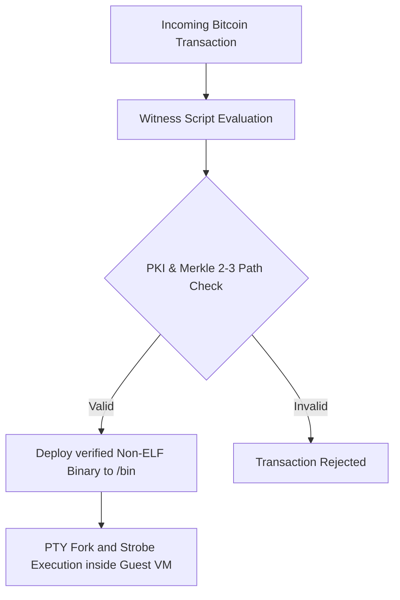

# TSFi2 Bitcoin VM Transaction Resolver Specification

This document details the architecture, opcodes, and verification scripts used by the **Bitcoin VM Transaction Resolver** to evaluate off-chain transactions, verify file signatures, and execute non-ELF utilities inside the booted guest Linux VM.

---

## 1. Unified Resolver Pipeline

The ZMM VM transaction resolver integrates ledger spent transitions with virtual execution pipelines:

---

## 2. Extended Bitcoin Script Opcodes

To support the arithmetic and state tracking of Double-Array Trie (DAT) state transitions directly in Bitcoin Script, the evaluator thunk ([tsfi_btc_thunk.c](file:///home/mariarahel/src/tsfi2/atropa_pulsechain/firmware/tsfi_lib/tsfi_btc_thunk.c)) supports these custom opcodes:

* **`OP_ADD` (`0x93`)**: Pops two stack elements, converts them to integers, sums them, and pushes the 4-byte result back to the stack.
  * *DAT Role*: Computes `next_state = base[current_state] + input_character`.
* **`OP_ROLL` (`0x7a`)**: Pops $n$, and shifts the $n$-th stack element to the top of the stack, deleting it from its previous position.
  * *DAT Role*: Consumption of previous states to prevent stack size accumulation.
* **`OP_EQUAL` (`0x87`)**: Pops the top two elements, compares their contents, and pushes a single-byte boolean (`1` on success, `0` on mismatch) to the stack.
  * *DAT Role*: Checks if the final state matches the expected leaf index.

---

## 3. Strict Stack Cleanup Standards

To prevent transaction scripts from preserving intermediate stack frames (which violates standard Bitcoin validation rules), the compiler enforces a strict stack depth of **exactly 1** at the end of execution:

1. **Step 0**: Pushes initial state as a constant.
2. **Step $\ge 1$**: Uses `OP_ROLL` to consume the parent state during `OP_EQUALVERIFY`, keeping stack size constrained.
3. **Exit Check**: Appends `PUSH <expected_final_state>` followed by `OP_EQUAL`. This leaves only a single boolean `1` (true) or `0` (false) on the stack, which is the exact spender condition checked by standard Bitcoin transaction verification rules.

---

## 4. Test Verification Suites

The transaction resolver system is verified by the following test suites:

* **[test_coaxial_btc_dat.c](file:///home/mariarahel/src/tsfi2/atropa_pulsechain/tsfi2-deepseek/tests/test_coaxial_btc_dat.c)**: Verifies multi-step DAT state transitions in pure Bitcoin Script using `OP_ADD`, `OP_ROLL`, and `OP_EQUAL`, validating stack cleanup.
* **[test_btc_zmm_thunk_ls.c](file:///home/mariarahel/src/tsfi2/atropa_pulsechain/tsfi2-deepseek/tests/test_btc_zmm_thunk_ls.c)**: Verifies the compilation and evaluation of the ZMM execution thunk for `ls /bin`.
* **[test_btc_resolver_comprehensive.c](file:///home/mariarahel/src/tsfi2/atropa_pulsechain/tsfi2-deepseek/tests/test_btc_resolver_comprehensive.c)**: Simulates the complete transaction verification pipeline, processing multiple script transitions in sequence.
