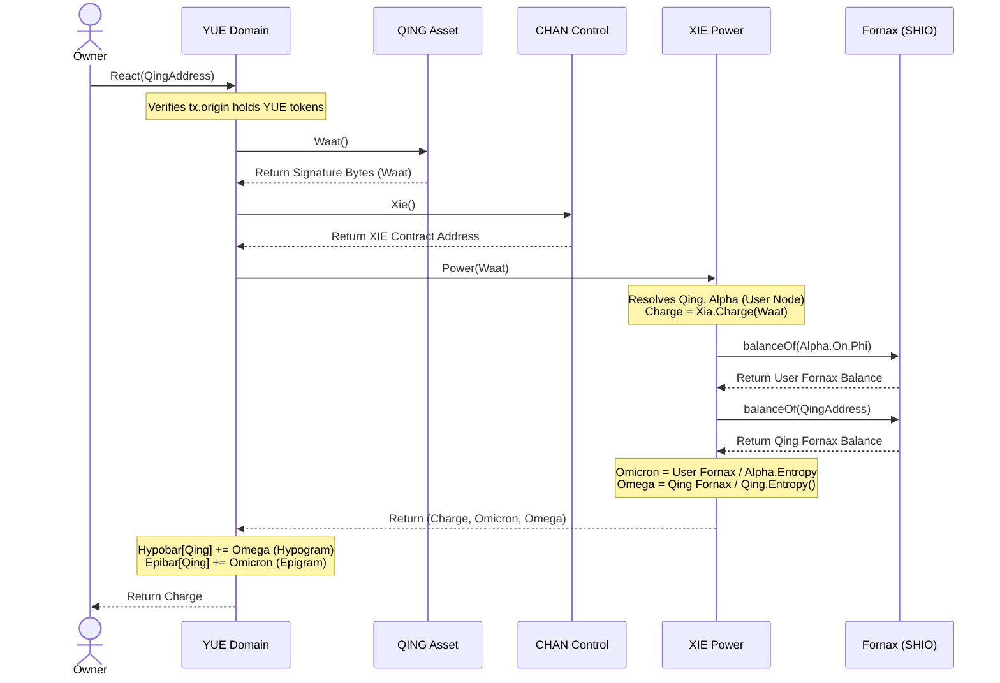

# Dysnomia System Integration Map

This document defines the architectural identities, contract relationships, and state metrics (Hypobar, Epibar, and Core Reactions) that govern the Dysnomia ecosystem.

---

## 1. System Topology

Below is the dependency map between identity, control, domain, asset, and physical engine layers:

```
  [ Identity Layer ]           [ Control Layer ]           [ Domain Layer ]
        LAU     <------------->      CHAN      <------------->    YUE (Domain)
                                      |
                                      v
                                     XIE (Power)  ----------> Fornax (SHIO)
                                      |
  [ Asset Layer ]                     v
     QING (Token)  -------------------+ (Waat/Signature)
          |
          v
     XIA (Engine)  <------------->  SHIO (Fomalhaute)
```

### A. Identity: LAU
* **Deployment**: Instantiated dynamically via `LAUFactory.New("username", "SYMBOL")`.
* **Registration**: Configured by invoking `LAU.Username("username")` to permanently bind the owner's identity.

### B. Control: CHAN & XIE
* **CHAN**: Controls opt-ins, permissions, and links domain operations to reaction engines.
* **XIE**: Resolves the **Fornax** `SHIO` contract:
  ```solidity
  Fornax = SHIO(Xia.Mai().Qi().Zuo().Cho().Void().Nu().Psi().Mu().Tau().Upsilon().Eta().Psi());
  ```

### C. Domain: YUE
* **Purpose**: Manages pairs (`Hong`/`Hung`) and collects `Hypobar` (Hypogram) and `Epibar` (Epigram) stats for registered assets.

### D. Asset: QING & XIA
* **QING**: Individual tokens exposing signature methods (`Waat()`).
* **XIA**: Low-level execution module resolving rods like `Fomalhaute` (SHIO).

---

## 2. Metric Resolution Sequence

The sequence below illustrates how a domain reaction calculates `Hypobar` and `Epibar` stats:



---

## 3. Core Reaction Layer & Fomalhaut Stellar Design

* **Rod Resolution**: `XIA` resolves the target `SHIO` (Fomalhaute) at the designated index:
  ```solidity
  Fomalhaute = Mai.Qi().Zuo().Cho().Void().Nu().Psi().Mu().Tau().Upsilon().GetRodByIdx(
      Mai.Qi().Zuo().Cho().Void().Nu().Psi().Mu().Tau().Xi()
  ).Shio;
  ```
* **Evaluation**: `ReactFomalhaute(Mu)` evaluates the reaction by passing the resolved contract to the library:
  ```solidity
  function ReactFomalhaute(uint64 Mu) public returns (uint64, uint64) {
      return ReactShioCone(Fomalhaute, Mu);
  }
  ```

### Stellar Architecture (Astronomical Mapping)
The structure of the `Fomalhaute` contract and its coordinates inside the physical engine map to the complex triple star system of **Fomalhaut**:
1. **Fomalhaut A**: The primary massive star and its surrounding debris disk define the **Dielectric Rod** base coordinates (`Xi`).
2. **Fomalhaut B** (TW Piscis Austrini): The variable flare star dictates the dynamic **drift velocity** and temporal logic mutations in the Logic Gates.
3. **Fomalhaut C** (LP 876-10): The distant red dwarf coordinates act as the boundary constraint of the **Diejective Cone** endpoint (`Daiichi`).
