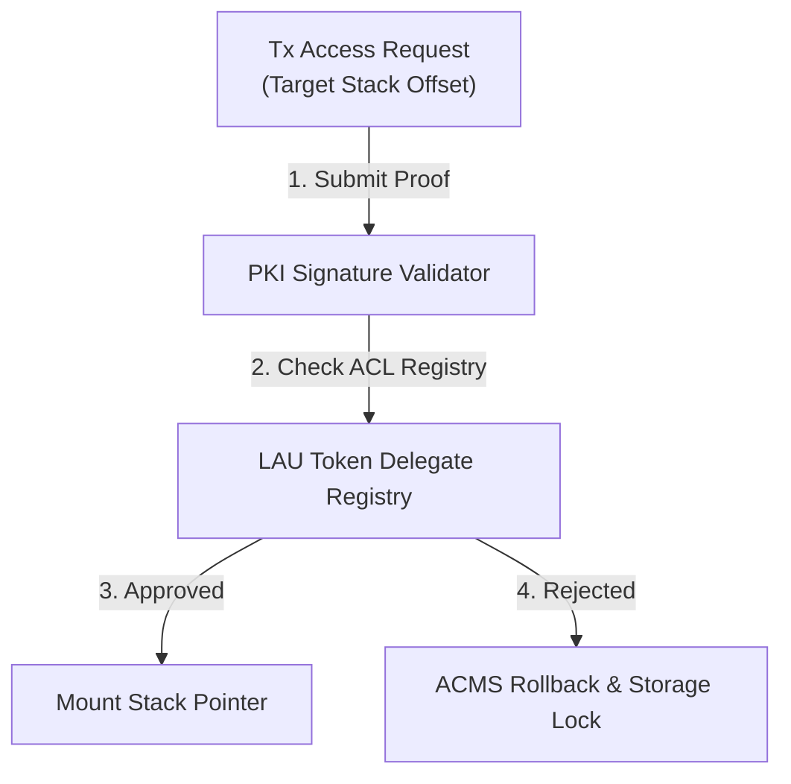

# LAU-Capable Access Control Lists & PKI Proof Validation

This document defines the cryptographic permissioning and Access Control List (ACL) validation pipelines protecting ZMM stack-level objects based on active Public Key Infrastructure (PKI) proof credentials.

---

## 1. The Dynamic Permissioning Pipeline

---

## 2. Memory-Mapped ACL Header Structure

Every provisioned stack object has a **32-byte security header** prepended to its offset boundaries:

| Byte Offset | Size (Bytes) | Field Name | Description |
|---|---|---|---|
| `0x00 - 0x07` | 8 | ACL Bitmask | Read, Write, and Admin permission bits mapped to roles. |
| `0x08 - 0x0F` | 8 | LAU Threshold | Minimum LAU token balance required to authorize Write access. |
| `0x10 - 0x1F` | 16 | Owner Public Key Hash | Keccak256 hash of the owner's active PKI public key. |

---

## 3. Cryptographic Verification Loop

When a task executes an accessor method (e.g., writing to a stack-mapped ledger), the ZMM compiler executes the following verification loop:

### A. PKI Signature Verification
1. The transaction must supply a message signature:
   $$\text{Sig} = \text{Sign}_{\text{PrivateKey}}(\text{TaskID} \mathbin{\Vert} \text{StackAddress} \mathbin{\Vert} \text{Nonce})$$
2. The microkernel recovers the public key and asserts:
   $$\text{RecoveredPublicKey} == \text{AuthorizedACLPublicKey}$$

### B. LAU Token Gating (The Delegate Registry)
1. Using the recovered caller address, the system queries the `Delegate` registry mapping:
   $$\text{SoulID} = \text{LAU(UserToken).Saat(1)}$$
2. The microkernel asserts that the caller's active LAU token balance is greater than or equal to the stack's `LAU Threshold`.
3. If both PKI verification and LAU threshold checks pass, the scheduler shifts the active base pointer to mount the stack frame.
4. If validation fails, the access is rejected, the transaction is logged to `zmm_system_state.dat.bin`, and an immediate ACMS recovery rollback is triggered to protect storage slots.
