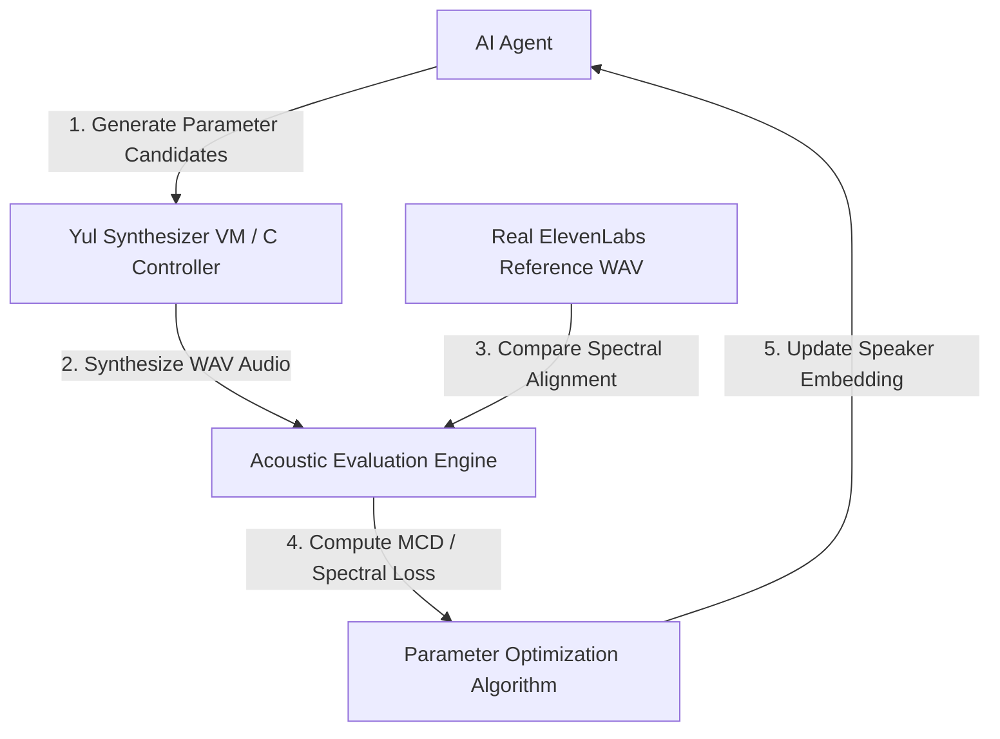

# Closed-Loop Speech Synthesis Optimization Plan

To enable the AI to autonomously monitor, develop, and optimize speech synthesis routines toward matching the ElevenLabs Ana reference sample, we need to build a **closed-loop feedback optimization pipeline**. This pipeline allows the AI to compile, execute, evaluate, and calibrate synthesis parameters programmatically.

## Architecture Diagram

---

## What Needs to Be Built

### 1. Acoustic Evaluation & Similarity Metric Suite
We need a command-line tool (preferably Python utilizing Librosa/SciPy, or C using FFT) that compares the generated output `karateka_c_synthesis.wav` against the target `test_ana.wav`.
*   **Mel-Cepstral Distortion (MCD)**: The standard metric for voice synthesis closeness.
*   **Dynamic Time Warping (DTW)**: To align phoneme duration mismatches so we can compare spectral envelopes at matched boundaries.
*   **Spectral Convergency Loss**: To measure overall spectral curve match.

### 2. Auto-tuning Optimization Loop
An optimization script (e.g., using Genetic Algorithms or Bayesian Optimization) that:
1.  Generates candidate speaker latent coefficient vectors (9-dimensional reflection coefficients).
2.  Invokes `./tests/test_speech_c_controller <voice> <phonemes>` with the parameters.
3.  Evaluates the MCD score.
4.  Iterates until the synthesized voice converges to the target ElevenLabs sound signature.

### 3. Dynamic Memory/Storage Interface for Coefficients
Currently, voice latent coefficients are hardcoded in the frontend and solidity files. We need:
*   A JSON storage registry (e.g., `config/speaker_profiles.json`) containing dynamic coefficients.
*   An upgraded C controller that loads these coefficients dynamically at runtime instead of relying on hardcoded parameters.

---

## Action Plan

### Step 1: Create a Python Acoustic Alignment Evaluator
Create a Python script `scripts/voice_aligner.py` that loads two WAV files, performs DTW, and computes the MCD.

### Step 2: Integrate Evaluator with the Node Server
Expose a new API endpoint `/api/optimize-voice` that accepts a set of candidate weights, synthesizes the audio via the C controller, runs the MCD evaluator, and returns the metric.

### Step 3: Implement the Optimization Loop
Build a wrapper script that runs the optimization loop in the background and writes the optimized weights to the contract or local config.
