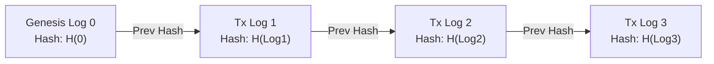

# XplOS Transaction Log Validation & Verification Specification

This document defines the cryptographic validation and consistency verification pipelines for active transaction logs stored within the `.dat.bin` filesystem layout under **Auncient** constraints.

---

## 1. Cryptographic Ledger Chain Structure

To guarantee that transaction logs are tamper-proof, log entries are chained sequentially using a cryptographic hash link, forming an append-only ledger:

Each log entry is serialized into exactly **64 bytes** using the following structured format:

| Byte Offset | Size (Bytes) | Field Name | Description |
|---|---|---|---|
| `0x00 - 0x03` | 4 | Transaction ID | Unique incremental identifier for the transaction. |
| `0x04 - 0x0B` | 8 | Pre-State CRC | Checksum of registers (`Base`, `Channel`, `Dynamo`) before execution. |
| `0x0C - 0x13` | 8 | Post-State CRC | Checksum of registers after commit. |
| `0x14 - 0x1F` | 12 | Event Metadata | Action identifier and calling contract address mapping. |
| `0x20 - 0x3F` | 32 | Chained Hash | SHA-256 hash of the complete log entry combined with the previous entry's hash. |

---

## 2. The Verification Pipeline

To ensure runtime integrity, the system implements a continuous validation loop within the cooperative scheduler:

### A. Integrity Verification Routine
1. **Genesis Anchoring:** Start from log offset `0` at genesis.
2. **Iterative Hash Matching:** For each log block $i$:
   $$\text{ExpectedHash}_i = \text{SHA256}(\text{BlockData}_i \mathbin{\Vert} \text{Hash}_{i-1})$$
3. **State Transition Checks:** Assert that:
   $$\text{PreState}_i == \text{PostState}_{i-1}$$
4. **Active State Comparison:** The final block's $\text{PostState}_N$ must match the active memory registers.

### B. Exception & Recovery Handling
* **Hash Mismatch:** Indicates log tampering. The system immediately locks all active task slots, triggers a Defcon power alarm, and reloads the last verified state from `evm_storage.dat.bin`.
* **Incomplete Commit:** If a crash occurs mid-transaction, the validation loop intercepts the dangling state, matches it against the uncommitted log entry, and executes an immediate rollback using the pre-state backup values.
