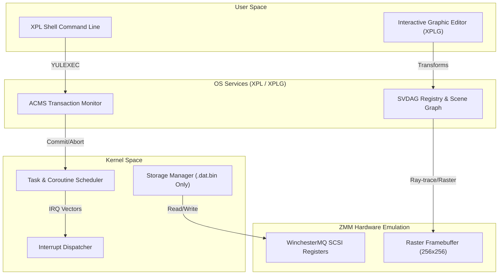

# Auncient XplOS: Architectural Specification

Auncient XplOS is a simulated, transaction-oriented microkernel operating system written in XPL and designed to execute on the ZMM virtual machine. It integrates the compiler semantics of **XPLG**, the interactive graphics formalisms of **Mallgren/Turrill**, and the transaction monitoring of **Storm's ACMS**.

---

## 1. System Architecture Diagram

---

## 2. Core Subsystems

### A. The Microkernel & Task Scheduler
The kernel executes in cooperative threads mapped as coroutines.
* **Bootstrapping Sequence:**
  1. The ZMM VM loads `graphicsSystem` and `hucSystem` bytecode.
  2. The kernel initializes memory bounds utilizing `lau_memory` boundaries.
  3. Registers are initialized to the **Base** coordinate: $Channel = Base^{Signal} \pmod{MotzkinPrime}$.
* **Interrupt Dispatcher:**
  * Maps physical keyboard, locator, and timer events to registered XPL interrupt vectors.

### B. Storage Manager (Rule 13 Compliant)
In accordance with system constraints, the filesystem supports only `.dat.bin` formatting.
* All data indexes, database tables, and block-ledgers are serialized under the `zmm_system_state.dat.bin` offset schema.
* File accesses route via WinchesterMQ SCSI handshake loops to prevent security sandbox write blocks.

### C. ACMS Transaction Monitor
Manages application execution safety using atomic transactions:
1. **START:** Allocates shadow memory pages for the active task.
2. **EVAL:** Processes the application loop.
3. **COMMIT:** Merges shadow pages to primary RAM and swaps raster viewports.
4. **ABORT:** Discards shadow memory and restores parent display state.

---

## 3. Implementation Plan

> [!IMPORTANT]
> All future files added to support XplOS must remain strictly under the **68KB size limit** (Rule 8) and preserve the **Auncient** spelling (Rule 1).

### Phase 1: Shell & Parser Integration
* Integrate the SLR(1)/MSP precedence relation matrix directly into the shell lexer to compile command strings to ZMM thunks.

### Phase 2: SVDAG Scene Graph
* Link the `MallgrenSceneNode` coordinate boundaries to the spatial `SvdagRegistry` to build compressed, ray-traceable font glyphs and backgrounds.

### Phase 3: Transactional Frame Swapping
* Apply double-buffered display updates linked to ACMS transaction commits to guarantee flicker-free rendering.
