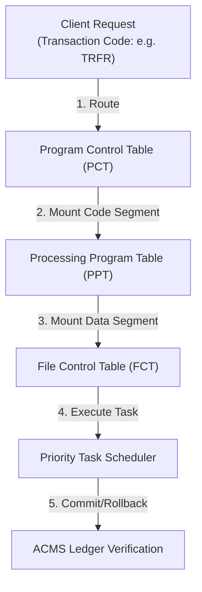

# XplOS CICS-Style Binary Specification

This document defines how the basic **XplOS** binary acts as a CICS (Customer Information Control System) OLTP transaction engine, mounting system tables and scheduling transaction tasks natively.

---

## 1. The Transaction Processing Loop



---

## 2. Mounted CICS Control Tables

The basic binary maps CICS control frames onto ZMM stack objects using fixed offsets:

### A. Program Control Table (PCT)
Maps 4-character transaction codes directly to program entry pointers and priority values:

```xpl
/* XPL Schema representing PCT Record */
DECLARE PCT_RECORD STRUCTURE(
    TRANS_ID(4) CHARACTER,   /* Transaction identifier code (e.g. 'BALN') */
    PROG_NAME(8) CHARACTER,  /* Linked program identifier string */
    TASK_PRIORITY FIXED      /* Task priority level (0 to 3) */
);
```

### B. File Control Table (FCT)
Binds logical file identifiers to virtual database sectors inside `zmm_system_state.dat.bin` under Rule 13:

```xpl
/* XPL Schema representing FCT Record */
DECLARE FCT_RECORD STRUCTURE(
    FILE_ID(8) CHARACTER,    /* Logical file database handle (e.g. 'LEDGER') */
    VFS_PATH(32) CHARACTER,  /* Swap file path on disk (*.dat.bin only) */
    ACCESS_MODE FIXED        /* Read / Write permissions bitmask */
);
```

---

## 3. Transaction Execution & ACMS Bounds
1. **Interactive Shell Trigger:** The user shell or network socket receives a transaction request (e.g. `TRFR 0x01 0x02 50`).
2. **Dynamic Mounting:** The loader queries the PCT, mounts the target program code segment from PPT, and resolves the database pointers via FCT using address-based resolution (Rule 9).
3. **Execution QoS:** The scheduler spawns a priority-bound task (`tsfi_xplos_create_task_priority`) based on the PCT configuration, allowing financial accounting updates to pre-empt background animations.
4. **Ledger Commit:** The task runs inside an ACMS transaction boundary, validating the append-only cryptographic ledger chain prior to committing changes.
5. **Exception Rollback:** If a PKI/LAU proof fails validation mid-execution, the transaction immediately rolls back using the uncommitted pre-state state registers.
