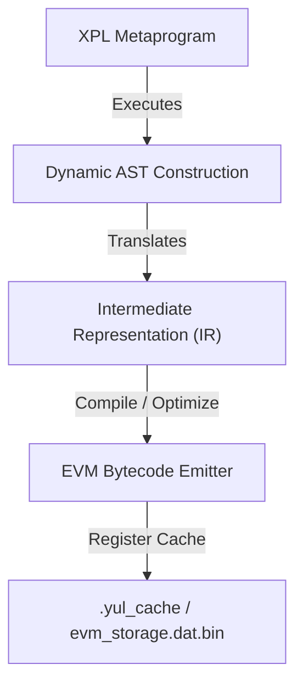

# Synthesizing EVM Contract Bytecode via XPL Metaprogramming

Instead of manually writing Yul contracts, we can utilize **XPL** as a program-generator compiler. An XPL meta-program dynamically constructs, optimizes, and compiles EVM contract binaries at runtime.

---

## 1. The Metaprogramming Pipeline



---

## 2. Dynamic AST Representation in XPL

An XPL program defines contracts as logical tree nodes using structured data types. The following abstract records represent instructions, variables, and function boundaries:

```xpl
/* XPL Metaprogram Contract Node Definitions */
DECLARE NODE_TYPE_FUNC LITERAL '1', NODE_TYPE_ASSIGN LITERAL '2', NODE_TYPE_OP LITERAL '3';

DECLARE CONTRACT_AST_NODE STRUCTURE(
    TYPE FIXED,
    SYMBOL CHARACTER,
    VAL_OFF FIXED,
    CHILD_LEFT POINTER,
    CHILD_RIGHT POINTER
);
```

---

## 3. Dynamic Compilation & Code Emission

The XPL generator traverses the constructed AST recursively, translating logical nodes into strict-assembly Yul text statements.

### A. The Emitter Loop
* **Function Nodes:** Emitted as `function <name>(<args>) { ... }`.
* **Storage Access:** Automatically maps to caller isolation patterns:
  `sstore(keccak256(caller(), <index>), <val>)`
* **Register Binding:** Resolves **Base**, **Channel**, and **Pole** arithmetic dynamically using target constants (e.g. `MotzkinPrime`).

### B. Security Governance Sweeps
During AST traversal, compile-time sweeps (via **XCOM**) check all generated leaf nodes:
* If a node contains a direct write to a privileged hardware register range without user security clearance, compilation is halted immediately.
* This prevents runtime exploits by locking down memory protection rules before bytecode generation.

---

## 4. Architectural Benefits
1. **Dynamic Optimization:** The compiler eliminates unused variables and redundant storage load/stores during the IR traversal phase.
2. **Zero Manual Overhead:** Smart contracts are compiled dynamically based on active application parameters rather than static disk files.
3. **Formal Verification:** The generated code is guaranteed to follow structural boundary rules since the emitter code template is formally validated.
