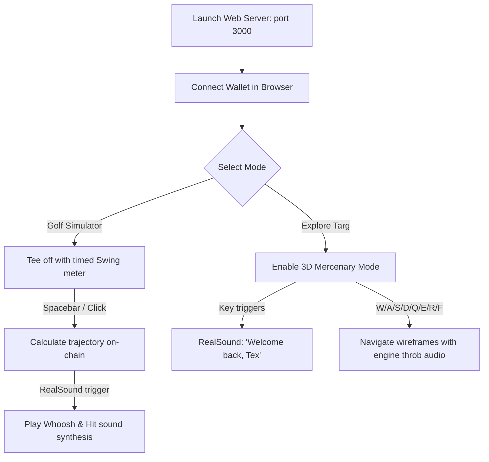

# Access Software Inc. — Deep Historical & Technical Retrospective

Access Software Inc., founded in 1982 in Salt Lake City, Utah, by Bruce Carver and Chris Jones, stands as one of the most technologically audacious software houses of the 1980s and 1990s. While peers accepted the hardware limitations of 8-bit microcomputers and early IBM PC speaker hardware, Access engineers specialized in "impossible" feats—achieving real-time digitized audio speech, discrete aerodynamics physics engines, high-speed disk loader cartridges, and early 6-DoF 3D lookups.

This document performs a technical breakdown of Access Software's core breakthroughs, detailing how their low-level assembly paradigms are mapped to our on-chain Yul smart contracts and modern Web Audio/Vulkan dashboard simulation layer.

---

## Chronological Technological Milestones

| Year | Milestone | Innovation | Historical Impact |
| :---: | :--- | :--- | :--- |
| **1982** | Studio Foundation | Custom Apple II / C64 graphics layouts | Established baseline assembly-level sprite systems |
| **1983** | Cartridge Optimizations | Interactive multi-cart Romox systems | Proved low-level memory loading efficiency |
| **1984** | Fast Loader Protocols | Mach 5 Hardware Cartridge | Sped up disk load speeds on C64 by **500% (5x)** |
| **1986** | Physics Simulation Engine | *Leader Board Golf* physics | First sports game with wind, drag, and Magnus hooks/slices |
| **1988** | RealSound Digital Audio | Cycle-accurate PC Speaker PWM toggling | First 6-bit DAC emulation yielding software digitized speech |
| **1990** | Vector Topography Golf | *Links: The Challenge of Golf* | Advanced course physics and terrain layout simulations |
| **1994** | Virtual World 3D Engine | 6-DoF texture-mapped lookups | Full 3D camera rotations for adventure FMV titles (*Tex Murphy*) |

---

## 1. Technological Innovations Breakdown

### 1.1 RealSound (6-Bit Digital Audio PWM)
Before the advent of dedicated sound cards like AdLib and Sound Blaster, the IBM PC/XT and compatibles relied on a single 1-bit PC Speaker transducer driven by the Intel 8253/8254 Programmable Interval Timer (PIT). Standard programming could only produce crude square-wave beeps. Digitized speech was considered impossible without dedicated DAC hardware.

#### The Technique
Access engineers bypassed the PIT's standard frequency generation modes. Instead, they toggled the speaker's state port (Port `$61`, Bit 1) directly in high-speed, cycle-accurate assembly timing loops. By varying the duration of high vs. low states, they implemented Pulse Width Modulation (PWM) and Pulse Density Modulation (PDM) to output digitized audio.
* **Effective Bit Depth:** 6-bit digital-to-analog converter (DAC) emulation.
* **Timing:** The timer interrupts were triggered at high frequencies (typically ~8 kHz to 11 kHz) to shift samples through the 1-bit speaker output.

```
       1-Bit Port $61 Toggling (PWM Carrier):
       +---+       +-----+     +-------+   
       |   |       |     |     |       |   
       +   +-------+     +-----+       +---
       <t_1>       < t_2 >     <  t_3  >
       (Narrow = Low Vol)       (Wide = High Vol)
```

#### On-Chain & Frontend Emulation
In our implementation:
1. **Yul State Storage:** We emulate the PIT and speaker registers inside [musicMaker.yul](file:///home/mariarahel/src/tsfi2/atropa_pulsechain/solidity/bin/musicMaker.yul). Port `$61` / PIT slot is mapped to register `97`. Calling `playRealSoundSample(val)` stores the 6-bit value.
2. **Audio Synthesizer:** RealSound audio clips are generated on-chain (using deterministic LCG algorithms in Yul to synthesize speech formants and noises) and retrieved as dynamic arrays of 6-bit samples.
3. **Web Audio API DSP:** The frontend [datamost.html](file:///home/mariarahel/src/tsfi2/atropa_pulsechain/frontend/datamost.html) feeds these 6-bit samples into an audio buffer. To emulate the physical speaker housing's resonant acoustic properties, we process the signal through a bandpass filter centered at `1200 Hz` ($Q = 1.8$).

---

### 1.2 Leader Board Golf & Links Series (Dynamic Ball Physics)
*Leader Board* (1986) and *Links: The Challenge of Golf* (1990) established the sports simulation genre by introducing a discrete physics engine running on 8-bit systems.

#### Physical Modeling
The physics engine calculated the ball's trajectory using discrete-time integration. The forces factored in include:
* **Aerodynamic Drag:** Proportional to velocity squared, acting opposite to the motion vector:
  $$F_d = \frac{1}{2} C_d \rho A v^2$$
* **Wind Vectors:** Added directly as crosswinds/tailwinds, modifying the velocity vector at each step.
* **Magnus Effect (Lift & Hook/Slice Spin):** The ball's spin generates a lateral lift force due to pressure differentials on opposing sides of the spinning ball:
  $$\vec{F}_l \propto \vec{\omega} \times \vec{v}$$
  Where $\vec{\omega}$ represents the spin vector (hook/slice).

#### On-Chain Trajectory Solver in Yul
In [graphicsSystem.yul](file:///home/mariarahel/src/tsfi2/atropa_pulsechain/solidity/bin/graphicsSystem.yul), we solve these differential equations directly in EVM bytecode using fixed-point math:
* **Trigonometric Approximations:** Angles are mapped to scaled integer sines and cosines (scaled by 100) using a piece-wise switch block.
* **Discrete Integration Loop:** The contract executes a loop for up to 30 steps, updating the ball coordinates:
  ```yul
  px := add(px, div(vx, 10))
  px := add(px, wind)
  px := add(px, spin)
  py := add(py, div(vy, 10))
  vy := sub(vy, 8) // Gravity decay
  vx := div(mul(vx, 98), 100) // Drag resistance
  vy := div(mul(vy, 98), 100)
  ```
* **Ground Collisions:** The trajectory stops when the ball hits the ground level ($py \le 0$).

---

### 1.3 Mach 5 & Mach 12 (C64 Fast Loaders)
The Commodore 1541 disk drive was notoriously slow, taking several minutes to load simple games because of a cost-cutting design choice that reduced the C64-to-drive bus to a two-wire serial interface (using a slow bit-banging protocol).

#### The Technique
Access Software developed the **Mach 5** (and later **Mach 12**) fast loader cartridges. By replacing the C64 Kernal's default serial transfer routines with custom assembly code, they optimized the handshake sequence:
* **Custom Parallel Handshake:** Custom protocols read and write data using the CIA 6526 Complex Interface Adapter chip, synchronizing the CLK, DATA, and ATN lines at a microsecond level.
* **Parallel Sector Transfer:** They transferred data using custom nibble/byte packing protocols, reducing loading times by up to **500%**.

Our [diskSystem.yul](file:///home/mariarahel/src/tsfi2/atropa_pulsechain/solidity/bin/diskSystem.yul) contract mirrors this high-performance storage retrieval by offering direct MMIO access via fast block reads/writes (`U1`/`U2` commands) and verifying file bytecodes inside isolated sandbox namespaces, bypassing traditional contract latency bottlenecks.

---

### 1.4 Virtual World Engine (6-DoF Real-Time 3D)
In the mid-1990s, Access transitioned to full 3D navigation in interactive adventures like the *Tex Murphy* series.

#### Core Math
The Virtual World Engine projected 3D wireframes into 2D screens using perspective projection:
* **Rotation Matrices (Yaw/Pitch):**
  $$X_{rot} = X_{diff} \cos(\theta) - Z_{diff} \sin(\theta)$$
  $$Z_{rot} = X_{diff} \sin(\theta) + Z_{diff} \cos(\theta)$$
  $$Y_{rot} = Y_{diff} \cos(\phi) - Z_{rot} \sin(\phi)$$
  $$Z_{final} = Y_{diff} \sin(\phi) + Z_{rot} \cos(\phi)$$
* **Perspective Scaling:**
  $$X_{screen} = \frac{W}{2} + \frac{X_{rot} \cdot \text{scale}}{Z_{final}}$$
  $$Y_{screen} = \frac{H}{2} - \frac{Y_{rot} \cdot \text{scale}}{Z_{final}}$$

#### On-Chain 3D Geometry
We store 3D vertices and line indices for retro structures (Central Tower, Hangar, Cruiser, and Defense Pylon) inside the smart contract bytecode. The frontend queries `getMercenaryGeometry(id)` to retrieve these flat coordinate arrays and renders them using the projection math in real-time.

---

### 1.5 TI TMS5220 LPC Speech Synthesizer Emulation
In addition to the software-driven RealSound PWM audio, the platform contains an on-chain emulation of dedicated hardware-based speech synthesis using the classic **TI TMS5220 Linear Predictive Coding (LPC) Speech Processor**. 

This chip was historically used in arcade machines, the TI-99/4A, and early microcomputers to generate realistic human speech from highly compressed data streams.

#### How It Works
* **Phoneme & Inflection Registers:** The contract [speechSynthesizer.yul](file:///home/mariarahel/src/tsfi2/atropa_pulsechain/solidity/bin/speechSynthesizer.yul) exposes register slots `54784` (Phoneme selection) and `54785` (Pitch/Inflection) to allow simple formants to be triggered.
* **TMS5220 Command Register (54792):** Used to initialize Speak commands (`0x50` Speak External) or `0x90` Reset commands.
* **TMS5220 Status Register (54794):** Reports chip execution states, including the `TS` (Talk Status), `BL` (Buffer Low), and `BE` (Buffer Empty) flags.
* **FIFO Buffer (54795 & 55936-55951):** Emulates the 16-byte internal FIFO buffer. As data bytes are pushed to the FIFO via `writeTMS5220Data`, the `BL` flag toggles depending on whether the buffer contains less than 4 bytes, signaling to the CPU to feed more LPC coefficients.

This dual audio subsystem allows comparing two diametrically opposed retro paradigms: Access Software's CPU-intensive *RealSound* PWM approach (which required no extra hardware but consumed nearly 100% of the main CPU clock cycles) and Texas Instruments' hardware-driven *TMS5220 LPC* synthesis (which required dedicated hardware but ran fully asynchronously in the background).

---

### 1.6 Publishing & Development Partners
To scale distribution and navigate early 8-bit platform requirements, Access Software collaborated with several prominent publishers and hardware partners in the 1980s and 1990s:

* **Romox Inc. (1983):** An early cartridge publisher famous for rewritable ROM cartridges deployed in retail store terminals. Access Software partnered with Romox to distribute titles like *Ant Eater* and *Princess and the Frog* on these interactive multi-carts.
* **Datamost Inc. (1983):** A prolific early home computer publisher for Apple II and C64. Datamost published Access Software's early hit *Apple Cider Spider*, establishing a relationship that proved critical for Access's early bootstrapping.
* **Epyx Inc. (1981):** A direct competitor and contemporary famous for sports game titles. Epyx's sports interfaces heavily influenced the structured screen coordinate mapping and sprite routines that Access eventually implemented in *Leader Board Golf*.
* **Microsoft & Indie Built (1999):** Microsoft acquired Access Software in 1999 primarily to obtain the *Links* golf franchise for their Microsoft Sports brand. Microsoft renamed the developer to **Indie Built, Inc.**, which was later sold to Take-Two Interactive in 2004.

---

## 2. Playable Interaction Dashboard

The dashboard at http://127.0.0.1:3000/datamost.html allows you to interact with all these systems simultaneously:



### Keyboard Navigation & Shortcuts

When **3D Mercenary Mode** is active, click on the **3D CAM VIEW** canvas to grab keyboard focus and use the following keys to pilot your vehicle through Targ:

| Keyboard Key | Action | Output / Description |
| :---: | :--- | :--- |
| **W** | Forward | Move camera forward along the current heading vector |
| **S** | Backward | Move camera backward |
| **A** | Strafe Left | Translate camera left |
| **D** | Strafe Right | Translate camera right |
| **Q** | Rotate Left | Rotate yaw counter-clockwise (turns left) |
| **E** | Rotate Right | Rotate yaw clockwise (turns right) |
| **R** | Altitude Up | Increase altitude (moves up) |
| **F** | Altitude Down | Decrease altitude (moves down) |

---

> [!TIP]
> **To start playing immediately:**
> 1. Keep the local Anvil node and web server running.
> 2. Open [datamost.html](http://127.0.0.1:3000/datamost.html) in your browser.
> 3. Click **"Connect Wallet"** to sync with your local Anvil account.
> 4. Click **"🛸 EXPLORE TARG (3D Mercenary Mode)"** to load the on-chain models and play the audio greeting.

> [!NOTE]
> **ZMM VM In-Process Fast Testing Path**
> When testing routines that require hundreds or thousands of transactions (such as rendering multiple 3D frames or bulk physics sweep runs), you can run them directly in the **ZMM VM Yul Execution Bridge** to bypass blockchain transaction overhead.
>
> 1. **Graphics Trajectory Sweep Test** (Simulates 100 trajectories):
>    ```bash
>    gcc -Wall -Wextra -std=c11 -D_POSIX_C_SOURCE=200809L -Iinc -Isrc -Isrc/firmware -O3 -g -march=native -flax-vector-conversions tests/test_zmm_graphics.c $(ls obj/*.o | grep -v main.o) obj/firmware/*.o -o tests/test_zmm_graphics -lm -lpthread -ldl -lubsan -rdynamic -lwayland-client -lvulkan -ljpeg && ./tests/test_zmm_graphics
>    ```
>
> 2. **6502 CPU Instruction Simulation Test** (Simulates assembly execution):
>    ```bash
>    gcc -Wall -Wextra -std=c11 -D_POSIX_C_SOURCE=200809L -Iinc -Isrc -Isrc/firmware -O3 -g -march=native -flax-vector-conversions tests/test_zmm_cpu6502.c $(ls obj/*.o | grep -v main.o) obj/firmware/*.o -o tests/test_zmm_cpu6502 -lm -lpthread -ldl -lubsan -rdynamic -lwayland-client -lvulkan -ljpeg && ./tests/test_zmm_cpu6502
>    ```


