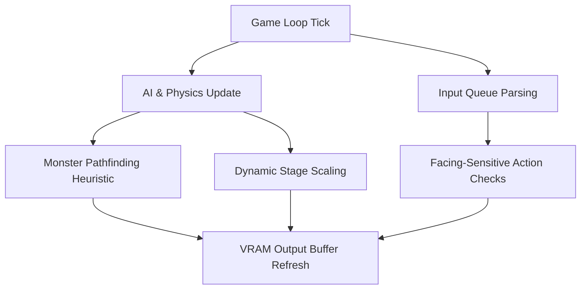

# Ahoy! Magazine Issue 7 (July 1984) — Gameplay Improvements & Technical Analysis

This document details technical analyses of the emulated retro games from *Ahoy!* Issue 7 and outlines a concrete engineering plan to enhance playability, state logic, and visual presentation within the Wayland-Yul terminal shell environment.

---

## 1. System-Level Gameplay Analysis

### 1.1 Apple Panic (`MODE_APPLEPANIC`)
Currently, *Apple Panic* implements a floor-climbing, ladder-based layout where the player avoids a moving monster.
*   **Existing Limitation 1 (Aiming Digs)**: Digging always targets `player_x + 1` (to the right). If a monster approaches from the left, the player is unable to defend themselves unless they walk away first.
*   **Existing Limitation 2 (Heuristics/Ladder Climbing)**: Monsters only scan horizontal direction axes, leading to simplistic tracking patterns where they fail to climb ladders toward the player's vertical coordinate.
*   **Recommended Improvements**:
    1.  **Facing Direction**: Track player facing vector (`g_panic_player_facing = -1` or `1`) and target the dig hole at `player_x + facing`.
    2.  **Stairway/Ladder Heuristic**: Update the monster AI pathfinding loop to choose climbing steps when matching vertical coordinates are not aligned.

### 1.2 Air Assault (`MODE_AIRASSAULT`)
A classic arcade shooter showing space invaders style projectile defense.
*   **Existing Limitation 1 (Instantaneous Projectile Cleanups)**: Projectiles have no acceleration vectors, meaning collision ticks feel rigid and standard hit detection lacks visual feedback.
*   **Existing Limitation 2 (Static Difficulty Curve)**: Shield values and alien spawns remain constant throughout runtime, lacking standard round-increment acceleration.
*   **Recommended Improvements**:
    1.  **Scale Speeds**: Introduce logarithmic stage scaling so alien descend frequency doubles with each successful stage completion.
    2.  **Shield Regeneration**: Regenerate 1 shield point when score crosses 1,000-point benchmarks.

### 1.3 English Darts (`MODE_DARTS`)
An aiming and timing simulation mapping horizontal and vertical bar oscillations to target scores.
*   **Existing Limitation**: The aim indicator runs on a linear speed modulo sweep that is trivial to predict.
*   **Recommended Improvements**:
    1.  **Aiming Oscillation Speed**: Add sine-based velocity damping as indicators approach the border margins.
    2.  **ASCII Board Layout**: Render a multi-colored concentric ring dartboard graphic in VRAM rather than text coordinate printouts.

---

## 2. Actionable Implementation Plan



### 2.1 Code Modifications (`test_wayland_terminal_shell.c`)
- **Direction Tracking**: Inject `int g_panic_player_facing` initialized to `1` in game start. Update its value when parsing `'A'`/`'a'` (-1) or `'D'`/`'d'` (+1).
- **Dig Resolution modification**:
```c
int target_x = g_panic_player_x + g_panic_player_facing;
if (target_x >= 0 && target_x < 40) {
    g_panic_dig_ticks[g_panic_player_y][target_x] = 50;
}
```
- **Monster Climb Decision Check**: Add coordinates detection to ladder offsets (`12`, `18`, `28`) allowing monsters to trigger climbing operations under vertical alignment inequalities.
