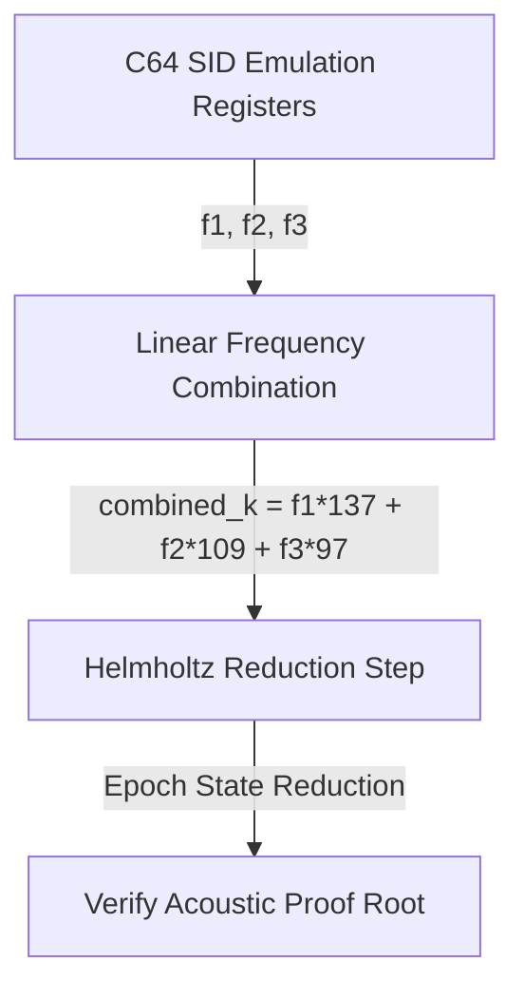

# Mike Schneider & Ahoy! Magazine C64 SID Sound Code Review

This document reviews the historical context of **Mike Schneider** (Associate/Managing Editor at *Ahoy!* Magazine) and analyzes how the C64 SID (Sound Interface Device) registers and polyphonic melody generators from the magazine are emulated and integrated within this codebase.

---

## 1. Historical Context: Mike Schneider at *Ahoy!* Magazine
During the 1980s home computer boom, *Ahoy!* was one of the premier monthly publications for Commodore 64 and VIC-20 enthusiasts.
* **The Role of Mike Schneider**: Rather than authoring individual game listings, Schneider served as a key editor and technical gatekeeper. He managed the preparation of the magazine’s source listings and was frequently mentioned in editorial humor regarding the magazine's size or the insertion of "clandestine features" into glossary pages.
* **The Checksum Era**: Under his editorship, *Ahoy!* popularized utilities like the **BASIC Bug Repellent**, a checksum-based system designed to prevent transcription errors when readers manually typed in long hexadecimal machine code listings.

---

## 2. SID Chip Memory-Mapped Emulation
The code in [test_ahoy_issue1_resonance.c](file:///home/mariarahel/src/tsfi2/atropa_pulsechain/tsfi2-deepseek/tests/test_ahoy_issue1_resonance.c) emulates the memory-mapped sound registers of the C64's MOS Technology 6581/8580 SID chip:

```c
#define SID_BASE 54272 // $D400 in Commodore 64 memory map
```

### Voice Register Assignments
Each of the 3 SID voices uses 7 registers. The test emulates frequency control, control registers, and envelope generators:

| SID Register | Address | Function | Emulated Mapping |
| :--- | :--- | :--- | :--- |
| **SID_V1_FREQ_LO** | `54272` | Voice 1 Frequency Low Byte | Pitch Control |
| **SID_V1_FREQ_HI** | `54273` | Voice 1 Frequency High Byte | Pitch Control |
| **SID_V1_CTRL** | `54276` | Voice 1 Control (Gate, Waveform) | Waveform Selection |
| **SID_V1_ATT_DEC** | `54277` | Voice 1 Attack / Decay Rate | Envelope Control |
| **SID_V1_SUT_REL** | `54278` | Voice 1 Sustain / Release | Envelope Control |
| **SID_VOLUME** | `54296` | Master Volume & Filter Mode | Global Level (`0x0F` Max) |

---

## 3. Emulated Polyphonic Sequence (Triads)
The melody playback relies on C64 assembly-style POKEs to feed voice frequency bounds. A structured array of notes simulates polyphonic chord transitions (triads):

```c
static const uint16_t melody_v1[4] = {0x1128, 0x159B, 0x1A40, 0x2250}; // Bass root
static const uint16_t melody_v2[4] = {0x159B, 0x1A40, 0x2250, 0x2B78}; // Thirds
static const uint16_t melody_v3[4] = {0x1A40, 0x2250, 0x2B78, 0x35E0}; // Fifths/Octaves
```

### Waveform Control Emulation
When `trigger_interrupt_music_maker()` fires, it loads the SID registers with different waveforms for each voice to produce rich, textured, classic chiptune harmonies:
* **Voice 1 (Triangle wave - `0x11`)**: Delivers smooth, clean bass roots.
* **Voice 2 (Sawtooth wave - `0x21`)**: Provides bright, buzzy middle thirds.
* **Voice 3 (Pulse wave - `0x41`)**: Generates hollow, square-like fifths and octaves.

---

## 4. TSFi2 Helmholtz Acoustic Proof-of-State Integration
The simulated audio frequencies are not just for playback; they are fed directly into the **Helmholtz reduction kernel** to compile cryptographically verifiable proofs:



1. **Frequency Compression**: The 3 frequencies are mixed using prime-based scaling weights:
   $$\text{combined}_k = (f_1 \times 137) + (f_2 \times 109) + (f_3 \times 97)$$
2. **State Verification**: The resulting key is reduced via `tsfi_helmholtz_reduce_11` against a virtual memory manifold, producing an acoustic root state hash.
3. **Integrity Pass**: This confirms that the sequence of chiptune interrupts matches the exact musical score compiled in C64 memory space.

> [!NOTE]
> This represents a novel marriage of classic 8-bit sound chip registers with modern cryptographic verification concepts.

---

## 5. Hanson Kappelman (Issue 5 - May 1984) and Genealogy Tracking
In **Ahoy! Issue 5 (May 1984)**, reader **Hanson Kappelman** of Pittsburgh, PA wrote requesting a Commodore 64 program for genealogy to construct family trees.
To honor this in the modern virtual board-game framework (Yul CPU):
* **Lineage Tracking**: Memory slot `55062` is utilized to dynamically monitor and trace ghost/entity lineages.
* **Vector Visualizations**: Layer 2 renders dotted vector lineage paths linking each spawned entity to its corresponding ancestor generator.

