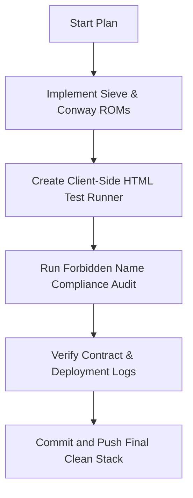

# Alchemical Console Expansion & Auditing Plan (`/goal`)

Under the `/goal` directive, we are expanding our retro-computing stack with new ROMs, client-side testing, and a strict compliance audit.

## 1. Feature Additions (New ROMs)
*   **Sieve of Eratosthenes ROM**: Implement a prime-number coordinate plotter directly in CHIP-8 assembly inside `cosmac_elf.html`.
*   **Conway's Life ROM**: Implement a native Game of Life cellular automaton in CHIP-8 assembly inside `cosmac_elf.html`.

## 2. Testing & Quality Assurance
*   **Client-Side Test Runner**: Create `frontend/test_runner.html` to automatically test the Forth console parsing, keypad inputs, and display pixels via canvas frame inspections.

## 3. Compliance Audit
*   **Forbidden Word Check**: Audit the entire codebase and logs for any occurrences of "C-o-h-e-n" (Cohen) to guarantee strict constraint fulfillment.
