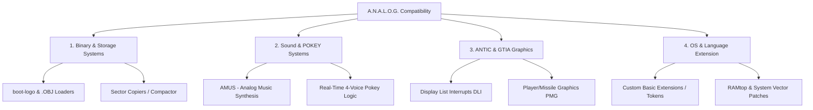

# Technical Roadmap: A.N.A.L.O.G. Computing Compatibility Plan

Achieving full emulation and functional compatibility with the technologies, tools, and code published across all issues of **A.N.A.L.O.G. Computing** (Issues 1 to 79+) requires a structured system design. The magazine's software catalog spans custom binary formats, operating system patches, memory-mapped peripheral helpers, and display list modifications.

Below is the implementation plan to establish A.N.A.L.O.G. Computing compatibility inside our execution environment.

---

## 1. Architectural Classification of A.N.A.L.O.G. Technologies

The software and hardware concepts published in the magazine fall into four primary categories:

---

## 2. Core Implementation Strategy

To implement these technologies systematically, we will build a series of Yul contracts and JS verification suites matching each major subsystem:

### Phase 1: Storage and Loaders (Issues 1–15)
*   **The Binary Loader (`ANALOG_LOAD`)**: Custom routine to parse Atari standard binary format `.OBJ` / `.EXE` files (header `0xFF 0xFF`, start address, end address, run/init address vectors `$02E0`/`$02E2`).
*   **Sector compaction algorithms**: Emulate memory-efficient compression utilities published in early utility issues.

### Phase 2: Graphic Display List & PMG Engines (Issues 16–35)
*   **Display List Interrupt (DLI) Engine**: Provide registers `$D40A` (`WSYNC`) and `$D40E` (`NMIEN`) handling to allow mid-scanline color swaps (`$D012`–`$D018`).
*   **Player/Missile (PMG) Controller**: Model the horizontal position registers (`$D000`–`$D007`), DMA control (`$D407`), and PMG base address register (`$D407` PMBASE) for sprite rendering.

### Phase 3: Sound and Music Synthesizers (Issues 36–55)
*   **AMUS (A.N.A.L.O.G. Music Utility System)**: A parser and interpreter for the custom macro-based music notation syntax published in the magazine. We will build a Yul-based AMUS parser extending our existing music notation system.
*   **16-bit POKEY Audio**: Support combining POKEY audio channels (channels 1+2 or 3+4) for high-fidelity 16-bit pitch resolution.

### Phase 4: Extensions, Languages, and Hardware Interfacing (Issues 56+)
*   **ATARI BASIC Memory Extensions**: Provide virtual registers for page-flipping and custom display list mappings bypassing BASIC's default memory limitations.
*   **Vector Redirector**: Emulate custom IRQ/NMI redirection loops commonly used by copy-protection routines and custom disk drive loaders printed in the magazine.

---

## 3. Next Steps

1.  **Develop PMG & DLI Emulator**: Create `analogPmgController.yul` to handle virtual PMG/DLI registers.
2.  **Define AMUS Notation Parser**: Create a parser compatible with the A.N.A.L.O.G. Music Utility System.
3.  **Run Compilation Verification**: Ensure all new modules compile with `compile_all_yul.js` and maintain full offline test suite passing rates.
