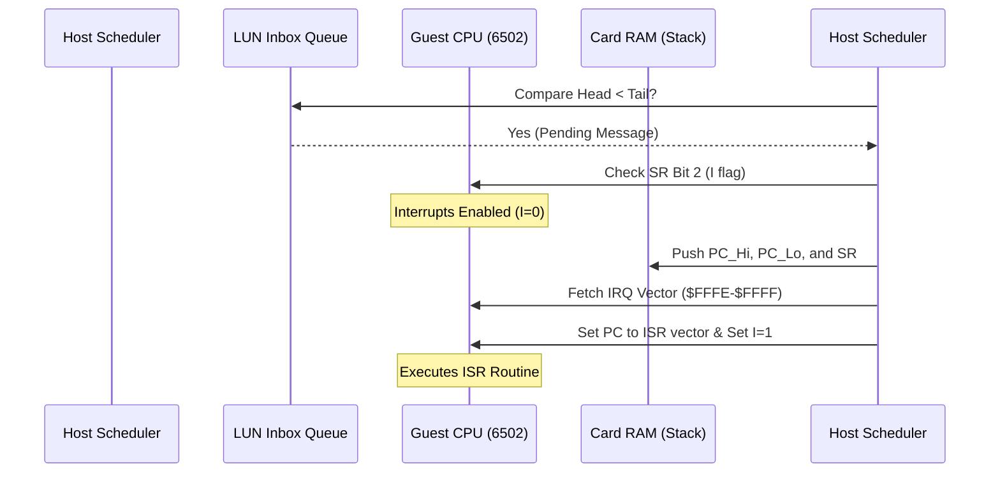

# ZMM VM Asynchronous Behavior & WinchesterMQ Coordination

This document analyzes the asynchronous scheduling, hardware interrupts, process spawning, and flow control coordination within the WinchesterMQ (WMQ) and ZMM VM scheduler.

---

## 1. Interrupt Request (IRQ) Injection

To support true asynchronous message receipt, the ZMM VM scheduler injects hardware interrupts (IRQs) into the guest CPU state when new messages arrive.

### Execution Flow
1. **Message Detection**: The scheduler checks if the target Card's inbox queue has pending messages by comparing `mqHead` (read pointer) and `mqTail` (write pointer):
   $$\text{mqHead} < \text{mqTail}$$
2. **Interrupt Mask Check**: The scheduler checks the guest Status Register (SR) for the interrupt disable flag (`I` flag, bit 2 / `0x04`). If `I == 0` (interrupts enabled), the IRQ triggers.
3. **Stack Push**:
   - The current program counter `IP` high byte is written to `$0100 + SP` and `SP` is decremented.
   - The program counter `IP` low byte is written to `$0100 + SP` and `SP` is decremented.
   - The status register `SR` is written to `$0100 + SP` and `SP` is decremented.
4. **Vector Fetch**: The CPU fetches the interrupt handler address from the 6502 IRQ vector address `$FFFE–$FFFF`. If uninitialized, it falls back to `$FF00`.
5. **Mask Interrupts**: The `I` flag in `SR` is set to `1` (`sr := or(sr, 0x04)`) to prevent nested interrupts.

---

## 2. Process Spawning (LAUN Broker)

Processes are spawned asynchronously via a dedicated broker queue on **LUN 5**.

### Sequence of Actions:
1. The VM scheduler inspects the spawn queue (LUN 5 LBA indices) on every scheduling cycle.
2. When a block starts with the `LAUN` magic header (`0x4c41554e`), the scheduler:
   - Extracts the target Card ID.
   - Extracts the 20-byte target binary contract address.
3. The scheduler uses `extcodecopy` to retrieve the contract's binary payload and writes it directly to the target Card's RAM window (`0x8000 + cardId * 0x1000`), capping it at **4KB**.
4. The scheduler sets the target Card's PCB state to active with Program Counter (PC/IP) initialized to `0`.

---

## 3. Flow Control & Backpressure

To prevent memory leaks or queue flooding, WinchesterMQ enforces a strict flow-control ceiling:

- **Queue Capacity Limit**: Every message queue is capped at **16 blocks**.
- **Backpressure Trigger**: When a sender attempts an `MQ_PUT` transaction to a LUN where:
  $$\text{tail} - \text{head} \ge 16$$
  the controller halts/rejects the write block, throwing a warning to force the sender process to yield and wait for the consumer to read messages.

---

## 4. Two-Phase Commit (2PC) Transactions

For maximum durability and processing integrity, consumers utilize a two-phase commit protocol to read from queues:

1. **Phase 1: Lease (Get)**:
   - The consumer queries the queue using `MQ_GET`.
   - The controller retrieves the block at the queue's head, sets `pending_ack` to the block's index, but **does not** increment the `head` pointer. The block is leased but remains in the queue.
2. **Phase 2: Commit (ACK)**:
   - Once the consumer has processed the message successfully, it sends a commit opcode `0x1E` containing the block's index.
   - The controller validates the lease, increments the queue's `head` pointer to consume the block permanently, and clears `pending_ack`.
   - If the lease expires (or the process fails before committing), the lease is cleared and the message remains at the head of the queue to be retried by another cycle.
