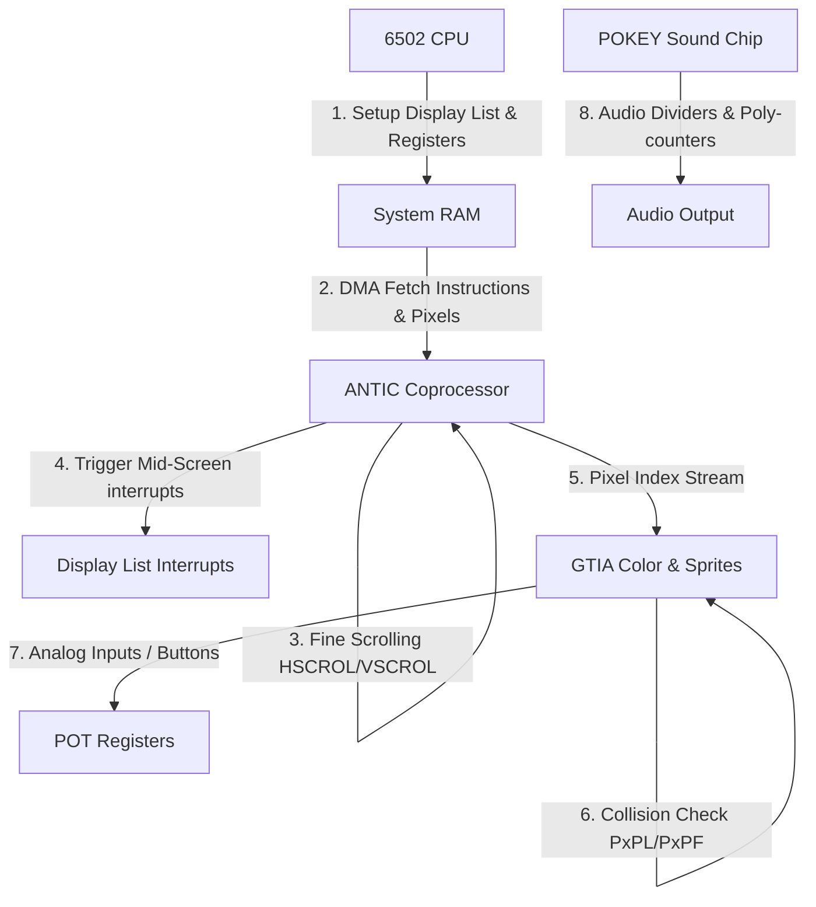

# Atari Unified Coprocessor Architecture

This document describes the unified integration of Atari's flagship graphics and sound coprocessor architectures: **ANTIC**, **GTIA**, and **POKEY**. By offloading scrolling, display mode generation, interrupts, audio generation, and collision detection to dedicated hardware, the system maximizes the efficiency of the 6502 CPU.

---

## 1. Unified Coprocessor Pipeline

During each video frame, the subsystems operate in parallel:

### Subsystem Interoperability

1. **ANTIC & GTIA Co-operation**: ANTIC resolves physical layout mapping (such as Display List instructions and scroll offsets) and sends high-level mode structures to GTIA. GTIA applies color translation palettes and overlays hardware player-missile sprites.
2. **GTIA Collisions**: As sprites and background pixels overlap on the presentation beam, GTIA updates hardware registers instantly, making collision checking a zero-CPU cost operation.
3. **POKEY Audio**: Operates independently, division loops and poly-counters (LFSRs) run in parallel, triggered by CPU register modifications.

---

## 2. Integrated Simulation

We have created a unified demonstration harness: [atari_unified_system.js](file:///home/mariarahel/src/tsfi2/atropa_pulsechain/scripts/atari_unified_system.js).

This script simulates a complete virtual frame loop incorporating:
* **ANTIC scrolling & display list resolution**
* **Display List Interrupt (DLI) palette shifts**
* **GTIA pixel overlap collision mapping**
* **POKEY audio frequency calculations**
* **Collision register resets (`HITCLR`)**
