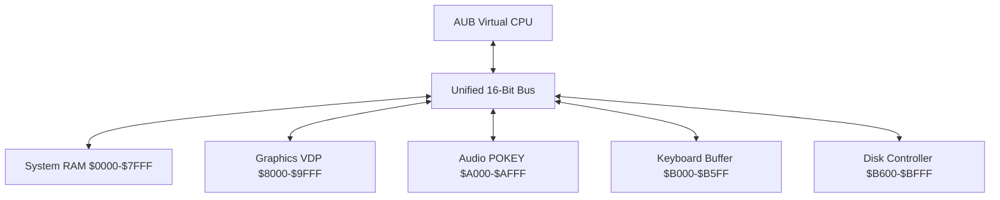

# Atropa Unified Bytecode (AUB) Specification
## A Custom Unified Instruction Set for Yul Processors & Peripherals

The **Atropa Unified Bytecode (AUB)** is a 16-bit virtual instruction set architecture (ISA) designed to bring cohesive unity to the various Yul virtual machines (`cpu6502.yul`, `zmachine.yul`) and peripheral systems (`graphicsSystem.yul`, `musicMaker.yul`, `keySystem.yul`, `diskSystem.yul`).

AUB replaces complex emulation overhead with a clean, memory-mapped instruction set that treats all processors and peripherals as unified participants on a single shared 16-bit bus.

---

## 1. Architectural Model



### CPU Registers
- **A** (Accumulator, 8-bit): Arithmetic and logic.
- **X, Y** (Index Registers, 8-bit): Loop counters and address indexing.
- **PC** (Program Counter, 16-bit): Current instruction address.
- **SP** (Stack Pointer, 8-bit): Points to stack space at `$0100-$01FF`.
- **SR** (Status Register, 8-bit): Flag indicators (Carry, Zero, Interrupt, Negative).

---

## 2. Memory-Mapped Peripheral Registers

To unify the peripheral Yul systems, specific memory windows are bound to each subsystem's contract interfaces:

| Address Range | Subsystem | Description | Yul Interface Equivalent |
| :--- | :--- | :--- | :--- |
| **`$8000 - $80FF`** | **Graphics Controller** | Registers for scrolling (HSCROL/VSCROL), screen resolution, and palette updates. | `graphicsSystem.yul` |
| **`$8100 - $9FFF`** | **Frame Buffer / VRAM** | Screen pixel or character grid character layout. | `graphicsSystem.yul` |
| **`$A000 - $A00F`** | **Audio Synth (POKEY)** | Frequency controls, distortion masks, and volume registers. | `musicMaker.yul` |
| **`$B000 - $B00F`** | **Keyboard / Controller** | Key registers, buffer counts, and strobe buttons. | `keySystem.yul` |
| **`$B600 - $B6FF`** | **Disk Controller** | Track, sector, buffer address, and read/write execution flags. | `diskSystem.yul` |

---

## 3. Instruction Set Architecture (ISA)

AUB supports standard 8-bit opcodes with optional 8-bit or 16-bit operands:

### Data Transfer Instructions
* **`LDA #val`** (`$A9`, 2 bytes): Load Accumulator with immediate value.
* **`LDA addr`** (`$AD`, 3 bytes): Load Accumulator from absolute memory.
* **`LDA addr, X`** (`$BD`, 3 bytes): Load Accumulator from absolute memory indexed with X.
* **`STA addr`** (`$8D`, 3 bytes): Store Accumulator to absolute memory.
* **`STA addr, X`** (`$9D`, 3 bytes): Store Accumulator to absolute memory indexed with X.
* **`LDX #val`** (`$A2`, 2 bytes): Load X register with immediate value.
* **`STX addr`** (`$8E`, 3 bytes): Store X register to absolute memory.

### Arithmetic & Logic
* **`ADD #val`** (`$69`, 2 bytes): Add immediate value to Accumulator.
* **`SUB #val`** (`$E9`, 2 bytes): Subtract immediate value from Accumulator.
* **`CMP #val`** (`$C9`, 2 bytes): Compare Accumulator with immediate value.

### Branch & Control
* **`JMP addr`** (`$4C`, 3 bytes): Jump to absolute address.
* **`JSR addr`** (`$20`, 3 bytes): Jump to Subroutine.
* **`RTS`**      (`$60`, 1 byte): Return from Subroutine.
* **`BEQ rel`**  (`$F0`, 2 bytes): Branch if Zero flag set.
* **`BNE rel`**  (`$D0`, 2 bytes): Branch if Zero flag clear.

### Unified Peripheral Control (Special Opcodes)
* **`SYS op`**   (`$0F`, 2 bytes): Trigger a hardware call directly to the underlying Yul peripheral system.
  - `SYS $01`: Sync VRAM buffer to the Ethereum state/viewport.
  - `SYS $02`: Play current sound registers loaded in `$A000`.
  - `SYS $03`: Force disk controller to execute operation specified at `$B600`.

---

## 4. Example Program: Sprite Load and Sound Trigger

The following AUB program checks for a keypress, loads a sprite address to graphics memory, and triggers an audio note:

```assembly
; Address Mappings
KEY_REG      = $B000
AUDIO_FREQ   = $A000
AUDIO_VOL    = $A001
VRAM_START   = $8100

START:
    ; 1. Poll for Keyboard press
    LDA KEY_REG
    CMP #$00
    BEQ START          ; Loop until a key is pressed

    ; 2. Play a tone via Audio peripheral
    LDA #$2F           ; Frequency pitch
    STA AUDIO_FREQ
    LDA #$0F           ; Full Volume
    STA AUDIO_VOL
    SYS $02            ; Execute Audio hardware flush

    ; 3. Write a character to the center of the screen VRAM
    LDA #$5A           ; Character 'Z'
    STA VRAM_START
    SYS $01            ; Sync VRAM viewport display

    RTS                ; Done
```

---

> [!TIP]
> Introducing this unified instruction set layout drastically reduces the complexity of writing custom compilers or interpreters inside Yul contracts, enabling one-pass assemblers to compile code targeting both CPU and external devices under a single, unified bus structure.
