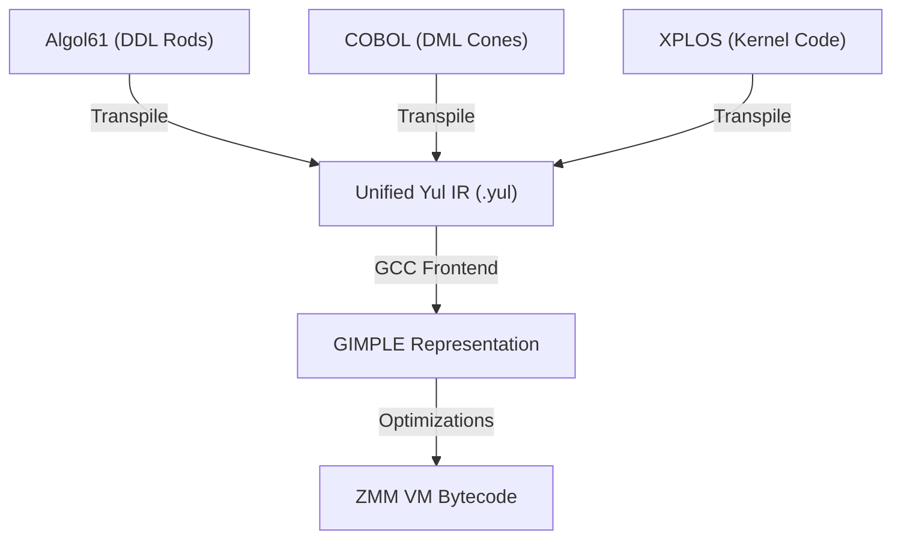

# Auncient Compiler Language Standardization Specification

This document details the standardization strategy to unify our custom compiler pipelines using a shared intermediate target representation.

---

## 1. Unified Intermediate Representation (IR) Workflow
All language parsers (Algol61, COBOL, and XPLOS) are decoupled from the compiler back-ends. Instead of generating machine bytecode directly, they compile source files to a unified **Yul AST / IR**:

---

## 2. Advantages of the Standardized Pipeline
* **Simplified GCC Frontend**: The `auncient` frontend inside GCC only needs to parse a single, well-defined Yul syntax stream.
* **Unified Optimization Passes**: Middle-end optimization passes (like AVX-512 vectorization and register pinning to `zmm30`) operate on the shared GIMPLE representation derived from the unified Yul IR.
* **Separation of Concerns**: Language front-ends can evolve independently as long as they emit compliant Yul syntax blocks.
