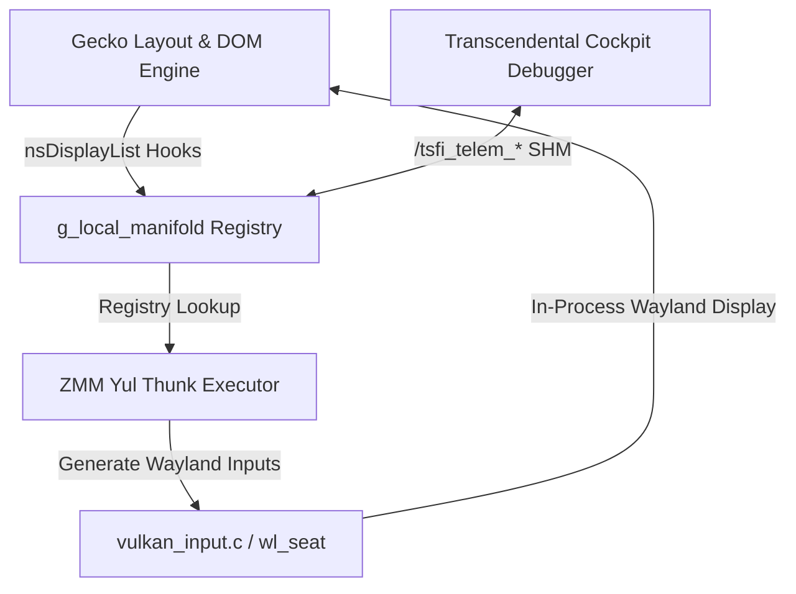

# TSFi Zero-Latency In-Process Automation System Design

This document details the architectural specifications and step-by-step implementation plan for building a Selenium-like browser automation engine using the **Auncient** Wayland Vulkan compositor, the ZMM Yul execution hardware, and shared memory manifolds.

---

## 1. Core Architectural Pillars



1.  **Direct Layout Introspection (Zero-Copy DOM):**
    *   Hook into [nsDisplayList.cpp](file:///home/mariarahel/src/mozilla/layout/painting/nsDisplayList.cpp) inside the Gecko layout engine.
    *   During layout cycles, dump key element boundaries (node tags, text content, IDs, classes, and viewport coordinates `x, y, w, h`) directly into `g_local_manifold` managed by [lau_registry.c](file:///home/mariarahel/src/mozilla/memory/tsfi2/src/lau_registry.c).
    *   This bypasses the standard WebSockets/HTTP serialization overhead of WebDriver.

2.  **Yul Automation Scripts:**
    *   Instead of JavaScript/Python drivers, the automation steps are written in **Yul** (EVM-compatible intermediate logic) and compiled to ZMM thunks.
    *   The ZMM executor ([tsfi_zmm_vm.c](file:///home/mariarahel/src/mozilla/memory/tsfi2/src/tsfi_zmm_vm.c)) runs the instructions natively on the CPU register bank, scanning elements and controlling flow.

3.  **Compositor Event Injection:**
    *   The browser compositor thread in [tsfi_browser.cpp](file:///home/mariarahel/src/mozilla/browser/app/tsfi/tsfi_browser.cpp) hosts the `wayland-tsfi` compositor.
    *   The ZMM script invokes native thunks that call into the compositor's input processing queue in [vulkan_input.c](file:///home/mariarahel/src/tsfi2/atropa_pulsechain/tsfi2-deepseek/plugins/vulkan/vulkan_input.c).
    *   These simulated hardware actions (pointer movement, keyboard press) are delivered to the Gecko event loops over the internal Wayland socket.

---

## 2. Component Design & APIs

### A. Layout Registry Hook (C++)
We define an dynamic mapping inside Gecko to register layout coordinates.
In [nsDisplayList.cpp](file:///home/mariarahel/src/mozilla/layout/painting/nsDisplayList.cpp):
```cpp
extern "C" {
  void tsfi_register_layout_element(const char* element_id, int x, int y, int w, int h);
}

// In nsDisplayList::Paint:
if (mContent && mContent->GetID()) {
  nsCString idStr;
  mContent->GetID()->ToCString(idStr);
  nsRect rect = GetBounds(aBuilder);
  tsfi_register_layout_element(idStr.get(), rect.x, rect.y, rect.width, rect.height);
}
```

### B. Yul Automation Script (`automation.yul`)
An EVM-like script compiled to ZMM bytecode. It queries coordinate manifolds and generates input sequences:
```yul
object "AutomationScript" {
  code {
    datacopy(0, dataoffset("runtime"), datasize("runtime"))
    return(0, datasize("runtime"))
  }
  object "runtime" {
    code {
      // Step 1: Query location of button id = "movie_player"
      let player_addr := call_reg_lookup("movie_player")
      if iszero(player_addr) {
        revert(0, 0)
      }
      
      // Step 2: Retrieve coordinates (first 32-bytes contain X/Y pack)
      let coords := mload(player_addr)
      let click_x := sar(128, coords)
      let click_y := and(0xffffffff, coords)
      
      // Step 3: Trigger Pointer Move & Click
      inject_pointer_move(click_x, click_y)
      inject_pointer_click()
    }
  }
}
```

### C. Input Simulation Bridge (C)
In [tsfi_input.c](file:///home/mariarahel/src/tsfi2/atropa_pulsechain/tsfi2-deepseek/plugins/window_src/tsfi_input.c):
```c
void tsfi_inject_pointer_event(uint32_t button, uint32_t state, double x, double y) {
    // Deliver Wayland seat pointer event directly to the active surface
    struct wl_pointer *pointer = tsfi_get_active_pointer();
    if (pointer) {
        wl_pointer_send_motion(pointer, tsfi_get_current_time(), wl_fixed_from_double(x), wl_fixed_from_double(y));
        wl_pointer_send_button(pointer, tsfi_get_serial(), tsfi_get_current_time(), button, state);
        wl_pointer_send_frame(pointer);
    }
}
```

---

## 3. Implementation Roadmap

### Phase 1: Event Injection Bridge
*   Expose C hooks (`tsfi_inject_pointer_event` and `tsfi_inject_keyboard_event`) from the Wayland compositor plugin to `libtsfi2.so`.
*   Link these symbols to the ZMM thunk registry ([tsfi_zmm_vm.c](file:///home/mariarahel/src/mozilla/memory/tsfi2/src/tsfi_zmm_vm.c)) so they can be triggered from Yul contracts.

### Phase 2: Layout Manifold Integration
*   Implement `tsfi_register_layout_element` inside `libtsfi2.so` to map Gecko coordinates to the local manifold registry.
*   Hook [nsDisplayList.cpp](file:///home/mariarahel/src/mozilla/layout/painting/nsDisplayList.cpp) to populate the elements manifold on every frame paint.

### Phase 3: Cockpit Control Interface
*   Extend the Transcendental Debugger (Cockpit) to load and register `automation.yul` scripts dynamically into the running browser's ZMM engine.
*   Monitor telemetry ammeter and execution logs to trace script completion.
