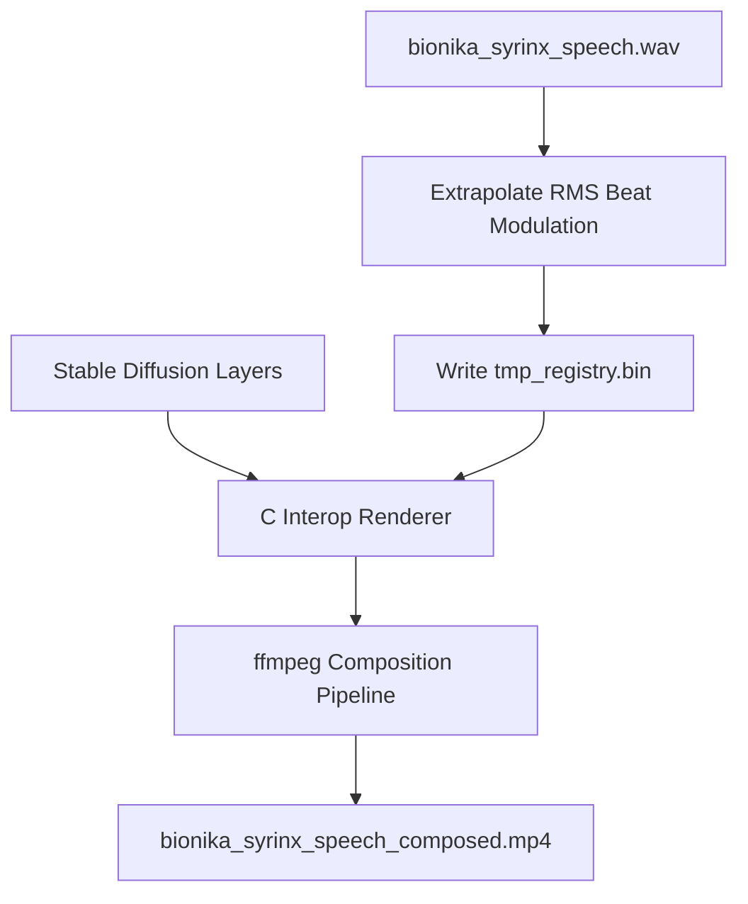

# Bionika Syrinx Composed Demoscene Presentation

The composed demoscene performance video has been successfully compiled.

### Video Performance Asset
*   **Composed Performance Path**: [bionika_syrinx_speech_composed.mp4](file:///home/mariarahel/src/tsfi2/atropa_pulsechain/bionika_syrinx_speech_composed.mp4)
*   **Audio Soundtrack Path**: [bionika_syrinx_speech.wav](file:///home/mariarahel/src/tsfi2/atropa_pulsechain/bionika_syrinx_speech.wav)

### Composition Pipeline

### Visual Layers Composited
1.  **LineArt Outline**: `manifold_layer_lineart.mp4` (contours)
2.  **Depth Map**: `manifold_layer_depth.mp4` (z-buffer projection)
3.  **Normal Vectors**: `manifold_layer_normal.mp4` (shading vectors)
4.  **Segmentation Mask**: `manifold_layer_segmentation.mp4` (material bounds)
5.  **Autotune/RMS Modulation**: `tmp_registry.bin` (dynamic blending opacity)
