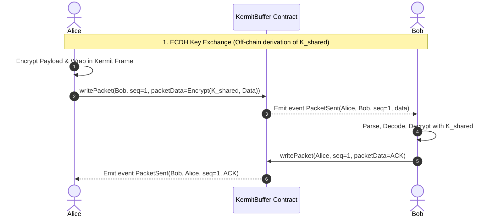

# Blockchain-Buffered Secure Kermit Transfer Protocol

This specification outlines how two blockchain users (Alice and Bob) can establish a secure, encrypted file-transfer pipeline using the Kermit protocol over an on-chain message buffer.

---

## 1. Cryptographic Key Agreement (On-Chain ECDH)

To encrypt the Kermit packets without exposing secret keys on the public ledger, Alice and Bob perform an **Elliptic Curve Diffie-Hellman (ECDH)** handshake using their native Ethereum (secp256k1) keypairs:

1. **Publish Public Keys**: Alice and Bob retrieve each other's public keys. This can be done by looking up their public address on-chain or looking up the public key recovery bytes from their previous signed transactions.
2. **Derive Shared Secret**:
   * Alice calculates: $S = d_{\text{Alice}} \times Q_{\text{Bob}}$
   * Bob calculates: $S = d_{\text{Bob}} \times Q_{\text{Alice}}$
   * Both compute the identical shared key: $K_{\text{shared}} = \text{keccak256}(S)$
3. $K_{\text{shared}}$ is now the symmetric master key, known only to Alice and Bob, and is never written to the blockchain.

---

## 2. On-Chain Message Buffer Design (Solidity / Yul)

Rather than storing files directly in expensive Solidity state storage (`sstore`), the transfer utilizes a lightweight message buffer contract that leverages EVM transaction events for low-gas communications.

```solidity
// SPDX-License-Identifier: MIT
pragma solidity ^0.8.20;

contract KermitBuffer {
    event PacketSent(
        address indexed sender,
        address indexed recipient,
        uint32 indexed sequence,
        bytes packetData
    );

    // Write a Kermit packet to the blockchain buffer
    function writePacket(address recipient, uint32 sequence, bytes calldata packetData) external {
        emit PacketSent(msg.sender, recipient, sequence, packetData);
    }
}
```

---

## 3. Communication Flow & Frame Encapsulation



### Protocol Execution Steps:
1. **Packet Assembly**: Alice fragments the file into standard chunks.
2. **Encapsulated Encryption**: For each packet, Alice encrypts the payload using the derived KDF:
   $$\text{Keystream} = \text{keccak256}(K_{\text{shared}} \mathbin{\Vert} \text{SEQ})$$
   $$\text{Ciphertext} = \text{Plaintext} \oplus \text{Keystream}$$
3. **Transmission**: Alice wraps the ciphertext inside a standard Kermit frame (adding SOH, LEN, SEQ, TYPE, and CHECK) and calls `writePacket` on the contract.
4. **Receipt & Acknowledgment**: Bob (listening to Solidity events on the buffer contract) intercepts the packet. He decrypts the payload, validates the checksum, and writes back an encrypted Kermit ACK packet (`TYPE = 'Y'`) to Alice through the buffer contract.
5. **Sliding Window Optimization**: To minimize gas costs and transaction confirmation times, the transfer can configure a larger Kermit **Window Size** (e.g., sending up to 8 packets before waiting for Bob's ACK).
