# Auncient Booty Bass Groove Matrix

The 32-second arrangement blends classic TB-303 synthesis with TR-808 drum patterns, modulated over four distinct sections.

## 1. Arrangement Timeline

```mermaid
gantt
    title Auncient Booty Bass Structure (133 BPM)
    dateFormat  X
    axisFormat %s
    
    section Audio Track
    Intro (Dark Bass, Hats)       :active, 0, 8
    Build-up (Snare Intro, Filter Sweep) :crit, 8, 16
    The Drop (Full Groove, Accent Mod)  :active, 16, 24
    Outro (Fades, Resonance Cut)      :24, 32
```



---

## 2. Step Sequencer Pattern (16-Step Grid)

| Step | 1 | 2 | 3 | 4 | 5 | 6 | 7 | 8 | 9 | 10 | 11 | 12 | 13 | 14 | 15 | 16 |
|---|---|---|---|---|---|---|---|---|---|---|---|---|---|---|---|---|
| **Bass Freq** | C2 | C3 | 0 | Eb2 | F2 | 0 | G2 | Bb2 | C2 | 0 | Bb2 | F2 | G2 | Eb2 | C2 | 0 |
| **Accent** | 1 | 0 | 0 | 0 | 1 | 0 | 0 | 1 | 1 | 0 | 0 | 0 | 1 | 0 | 1 | 0 |
| **Slide** | 0 | 1 | 0 | 0 | 1 | 0 | 0 | 1 | 0 | 0 | 1 | 0 | 1 | 0 | 0 | 0 |
| **Kick (808)** | 1 | 0 | 0 | 1 | 0 | 0 | 1 | 0 | 1 | 0 | 1 | 0 | 0 | 1 | 0 | 0 |
| **Snare** | 0 | 0 | 0 | 0 | 1 | 0 | 0 | 0 | 0 | 0 | 0 | 0 | 1 | 0 | 0 | 0 |
| **Open HH** | 0 | 0 | 1 | 0 | 0 | 0 | 1 | 0 | 0 | 0 | 1 | 0 | 0 | 0 | 1 | 0 |

---

## 3. Dynamic Filter Curve (Auncient Resonance Mod)

```
Cutoff (Hz)
  ^
400|                     +-------+
   |                    /|       |\
300|                   / |       | \
   |    +-------------/  |       |  \
200|   /|             |  |       |   \
   |  / |             |  |       |    \
100| /  |             |  |       |     +
   +----+-------------+--+-------+---------> Time
   0s   8s           16s 24s    32s
   [  Intro  ] [ Build ] [ Drop ] [ Outro ]
```
