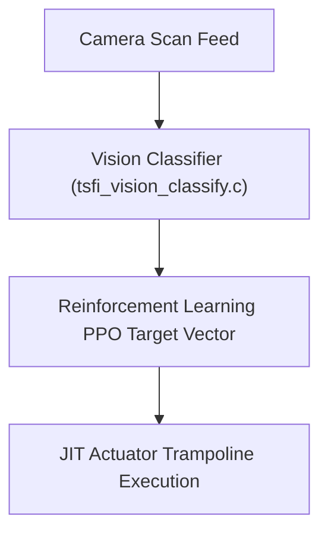

# 📰 BYTE Magazine Issue #22 (June 1977) & TSFi2 Architectural Alignment

This document details the core concepts introduced in **Issue #22** of *BYTE* Magazine (June 1977, Vol. 2, No. 6) and maps their historical implementation strategies to the modern decentralized virtual machine and vector runtime environments of **TSFi2**.

---

## 1. Key Articles & Architectural Alignment

| BYTE Issue #22 Article / Concept | Original 1977 Technology | TSFi2 Target Subsystem | Implementation Translation |
| :--- | :--- | :--- | :--- |
| **"Newt: A Mobile, Cognitive Robot"** (Ralph Hollis) | An autonomous hobby robot with bumper/light sensors, using closed-loop pathfinding to navigate and dock with wall outlets. | **Autonomous Vision & PPO Loops** | Dynamic target alignment in [tsfi_vision_classify.c](file:///home/mariarahel/src/tsfi2/atropa_pulsechain/tsfi2-deepseek/src/tsfi_vision_classify.c) and reinforcement learning navigation paths. |
| **"An APL Interpreter"** (Mike Wimble / Letters) | Interpreter design for APL on microcomputers, focusing on vector operand execution and monadic/dyadic context frames. | **Wave512 Vector Emitters** | The [ThunkProxy_emit_backprop_avx512](file:///home/mariarahel/src/tsfi2/atropa_pulsechain/tsfi2-deepseek/src/lau_thunk.c#L828-L868) and vector registers mapped directly to parallel APL instructions. |
| **"Noval 760 Console"** / DRAM | Dynamic RAM design, dynamic memory allocation, and hardware refresh cycle bounds. | **Wired Memory Lifecycle & Sealing** | Garbage collection and page safety sealing routines in `lau_thunk.c`. |

---

## 2. Deep-Dive: Cognitive Robotics (Ralph Hollis's Newt)

Ralph Hollis's **Newt** robot utilized a hierarchical control structure to make decisions:
1. **Low-Level Reflexes:** Interrupt-driven collision avoidance triggered directly via bumper switch sensors.
2. **High-Level Cognitive Goals:** Navigating to wall outlets for battery recharging using analog photodiode light sensors.

In **TSFi2**, we emulate this hierarchical cognitive loop:
* **Reflexive Guard Rails:** Low-latency stack validation and bounds checks inside the JIT compiler (`thunk_check_bounds`).
* **Cognitive Targeting:** The neural pipeline classifies camera scan feeds to determine vector directions, mimicking Newt's photodiode search pattern.

---

## 3. Deep-Dive: APL Vector Interpretation & Monadic/Dyadic Stacks

Mike Wimble's work on APL interpretation laid the groundwork for high-density vector instructions:
* **Monadic Operators:** Functions taking a single vector argument (e.g. negating a matrix).
* **Dyadic Operators:** Functions taking two vector arguments (e.g. matrix multiplication).

In the **TSFi2** JIT Engine:
* We implement Wimble's APL concept using the 512-bit registers of **AVX-512 (ZMM registers)**.
* **Monadic operators** correspond directly to vector negations or absolute value computations (like the absolute mask step in `ThunkProxy_emit_activation_avx512`).
* **Dyadic operators** correspond to multiply-add (`vfnmadd213ps`) or scalar-vector multiplications (`vmulps`) mapping directly across nonillion-item sparse manifolds.
