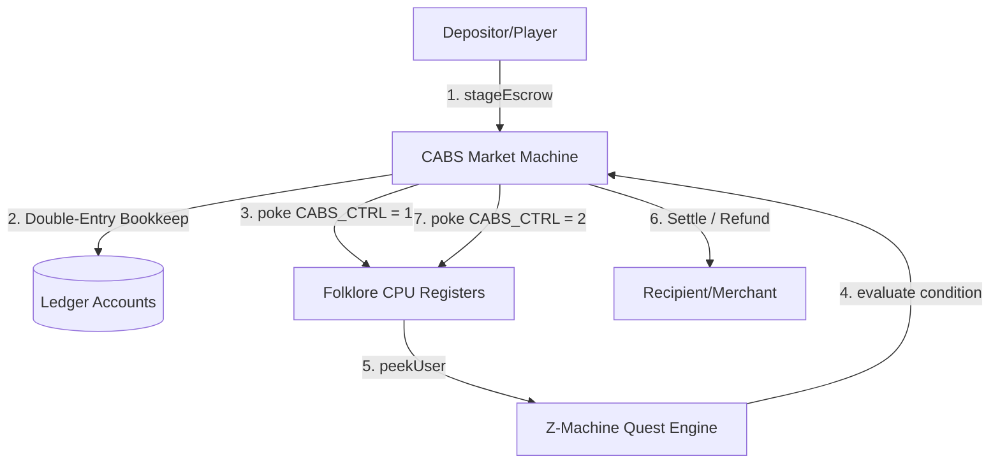

# CABS-Folklore Transaction Reconciliation Framework

The **CABS Market Machine** acts as a decentralized alchemical clearinghouse. By linking **EVM double-entry ledgers**, **deterministic CPU registers**, and **Z-Machine property verification trees**, it creates a multi-layered verification system that eliminates reconciliation disputes between counter-parties.

Below is the structured architecture of how the Market Machine automates and proves transaction reconciliation:

---

## 1. Double-Entry Ledger Bookkeeping (CABSAccounts)

The Market Machine maintains an internal, audit-ready double-entry ledger tracking three specific balance sheets:

| Account ID | Ledger Classification | Purpose | Reconciliation Verification |
| :--- | :--- | :--- | :--- |
| **1100** | **Asset / Volume** | Cumulative trade volume passing through the market engine. | Must equal the sum of all historical deposits. Cannot decrease. |
| **1200** | **Liability / Escrow** | Currently locked tokens awaiting settlement or timeout refund. | Must match the current sum of active, unsettled `EscrowTrade.amount` balances. |
| **2200** | **Equity / Treasury** | Accumulated **Diyat fees** (SWR mismatch tax) collected. | Must equal the sum of reflection losses from all settled trades. |

### The Reconciliation Balance Equation
For any block $N$, the following invariant must hold:
$$\sum \text{Balances}(\text{ERC20 Vault}) \equiv \text{CABSAccounts}[1200]$$
This mathematical parity allows external indexers to instantly verify if any funds are missing, locked, or misrouted by comparing the smart contract's actual token balance against the internal ledger register `1200`.

---

## 2. Hardware-Level Verification (Folklore CPU Namespaced Registers)

To prevent data tampering or "man-in-the-middle" state manipulation, the Market Machine pokes control words directly into the **Folklore CPU emulator registers** namespace of the transaction.

### Control Register Map
* **`57344` (CABS_CTRL)**: The state machine control register.
  * `1` = **DEPOSIT** (Escrow has been staged; funds are locked).
  * `2` = **COMMIT** (Escrow has been successfully evaluated and settled).
  * `3` = **REFUND** (Lock period timed out; funds returned to depositor).
* **`57347` (CABS_VAL)**: The value register holding the active trade volume.

### Namespaced Verification
Because the Folklore CPU registers are namespaced using `caller()` hashes, the state inside register `57344` is cryptographically tied to the `CABSMarketMachine` contract address. 
* If a merchant disputes a payment, an auditor does not need to parse complex transaction logs. 
* They simply execute a static `peekUser(CABSMarketMachineAddress, 57344)` call on the Folklore CPU. 
* A return value of `2` provides **hardware-level proof** that the transaction was committed and the merchant was paid.

---

## 3. Automated State Settlement and Wave Reflection

Reconciliation is fully automated and self-correcting via two paths:

### Path A: Target State Match (Commit)
When the Z-Machine reports that the player has matched the target property (e.g., Quest Completed flag set to `1` on Object `80` Prop `36` via Folklore register `55050`):
1. The machine calculates a **10% Diyat fee** (simulated SWR wave attenuation).
2. The remaining 90% is sent to the merchant.
3. The 10% fee is routed to the treasury and booked in Account `2200`.
4. Account `1200` is decremented by the full amount.

### Path B: Timeout Reflection (Refund)
If the player fails to complete the quest within the designated `timeoutBlocks`:
1. The depositor triggers `refundEscrow`.
2. The locked funds "reflect" back to the depositor's wallet.
3. Account `1200` is decremented.
4. `CABS_CTRL` register `57344` is updated to `3` (REFUND).

Both paths ensure that **no tokens are ever left in an unallocated state**, and every transition writes a permanent, verifiable control code to the virtual CPU memory.
