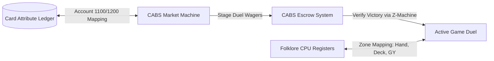

# CABS & Trading Card Game (TCG) Alchemical Resonance

Integrating **CABS double-entry ledgers** and the **Folklore CPU** with **Trading Card Games (TCG)** creates a highly secure, stateful, and mathematically balanced card economy. By mapping card mechanics directly to double-entry ledger loops and CPU memory zones, we can build self-balancing card dynamics and escrow-gated duels.

Below is the design spec detailing these alchemical interactions:

---

## 1. Card Attributes as CABS Ledger Accounts

In traditional on-chain TCGs, card statistics (Attack, Health, Mana, Level) are stored in standard contract variables. In a CABS-integrated TCG, these attributes are mapped directly to alchemical double-entry bookkeeping accounts:

* **Account 1100 (Active Combat Attributes - Volume/Power)**: Tracks the active power stats or accumulated combat experience (XP) of a card. When a card deals damage or absorbs energy, the power transfer is booked as a ledger shift.
* **Account 1200 (Active Damage / Attenuation - Escrow)**: Tracks the active damage taken by a card. Health is represented as:
  $$\text{Current Health} = \text{Max Health} - \text{Account}[1200]$$
  Healing a card moves balance out of Account `1200` back into the system, representing a reduction in the "escrowed damage" liability.
* **Account 2200 (Diyat Decay / Wear-and-Tear)**: Every battle or card trade attenuates the card's alchemical resonance (reflecting SWR loss). A card loses a small fraction of its stats permanently or accrues a "dust fee" in Account `2200` that must be reconciled using alchemical repair items (token burns) to restore the card to prime condition.

---

## 2. Escrow-Gated Duels and Wagers

CABS allows players to execute trustless duels with high-value card stakes or token wagers:

1. **Staging the Match**: Player A and Player B agree to a duel. They call `stageEscrow`, locking their staked cards (as ERC-721/1155 tokens) or wager tokens into `Account 1200` (Escrow).
2. **Victory Evaluation**: The Z-Machine act as the oracle. Once a duel concludes (verified by Z-Machine adventure or combat simulator state), `evaluateAndSettle` is called.
3. **Payout and SWR Diyat Fee**:
   * The victor receives the staked cards/tokens.
   * A **10% Diyat wave attenuation fee** is deducted from the wager (representing alchemical wear-and-tear) and routed to the game's treasury (`Account 2200`). This serves as a natural sink, balancing the game's economy.

---

## 3. Folklore CPU Zone Mapping

The Folklore CPU memory registers are mapped directly to TCG game zones. This allows 6502 assembly scripts or emulator states to run card logic locally and securely sync it on-chain:

| Memory Address | Zone | Purpose |
| :--- | :--- | :--- |
| **`56000 - 56009`** | **Hand Registers** | Pointer addresses referencing the 10 active cards in the player's hand. |
| **`56010 - 56019`** | **Board Registers** | Cards active on the battlefield and their grid coordinates. |
| **`56020 - 56029`** | **Graveyard Registers** | Cards defeated and waiting for necromantic triggers. |
| **`57344` (CABS_CTRL)** | **Combat Control** | Registers game state triggers (`1` = Match Staged, `2` = Match Committed, `3` = Match Forfeited/Refunded). |

This namespaced design ensures that card interactions (e.g., drawing a card, attacking, discarding) are calculated as simple CPU memory instructions, drastically reducing EVM transaction gas costs.
