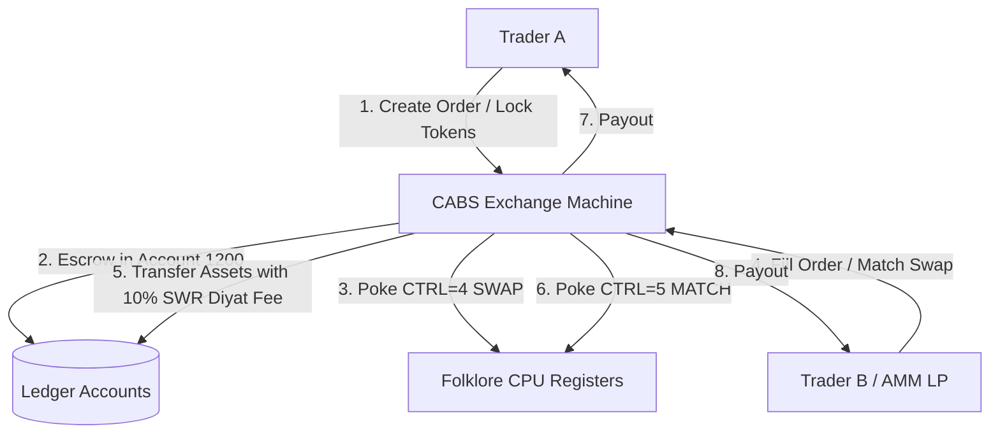

# CABS Alchemical Token Exchange Specification

This specification describes how to build a **Token Exchange Market** (Order Book and AMM Liquidity Pools) within the **CABS (Card Asset Bookkeeping System)** ledger framework. It leverages **double-entry bookkeeping accounts**, **Folklore CPU hardware registers**, and **Diyat reflection fees** to reconcile swap transactions.

---

## 1. Exchange Ledger Accounts

The Exchange Market extends the core CABS double-entry bookkeeping system with dedicated trading registers:

| Account ID | Classification | Ledger Purpose |
| :--- | :--- | :--- |
| **1100** | **Liquidity Reserves** | Total liquidity currently deposited by Liquidity Providers (LPs) in automated pools. |
| **1200** | **Locked Escrow** | Tokens currently locked in active Limit Orders or pending cross-chain reflections. |
| **2100** | **Trading Volume** | Cumulative trading volume (denominated in base CABS tokens) passing through the market. |
| **2200** | **Exchange Treasury** | Accumulation of transaction fees and **SWR attenuation fees** (slippage tax). |

---

## 2. Folklore CPU Hardware Registers for Swap Coordination

The Folklore CPU coordinates order matching. By mapping order properties to specific virtual hardware registers, trading bots or matching engines can query market state at the assembly level:

| Memory Address | Register Name | Purpose / Value Representation |
| :--- | :--- | :--- |
| **`57344`** | **`CABS_CTRL`** | State trigger: `4` = SWAP_ORDER_STAGED, `5` = SWAP_ORDER_FILLED, `6` = SWAP_ORDER_CANCELLED. |
| **`57348`** | **`CABS_SPEND_TOKEN`** | The token address of the asset being offered (cast to `uint256`). |
| **`57349`** | **`CABS_REC_TOKEN`** | The token address of the asset requested (cast to `uint256`). |
| **`57350`** | **`CABS_SPEND_VAL`** | The amount of the offered token. |
| **`57351`** | **`CABS_REC_VAL`** | The expected amount of the requested token. |

---

## 3. Limit Order Book Implementation

A trustless peer-to-peer limit order book can be built directly on the CABS ledger:

### A. Creating an Order (`stageSwapOrder`)
1. Trader A calls `stageSwapOrder(spendToken, receiveToken, spendAmount, targetAmount)`.
2. The contract executes `transferFrom` on `spendToken`, moving `spendAmount` from Trader A to the Exchange vault.
3. The contract credits the value to Account `1200` (Locked Escrow).
4. The contract pokes Folklore registers `57344` (set to `4`), `57348`, `57349`, `57350`, and `57351` under Trader A's namespaced storage.

### B. Filling an Order (`fillSwapOrder`)
1. Trader B calls `fillSwapOrder(orderId)`.
2. The contract verifies the order is active and verifies Trader B has approved the contract for `targetAmount` of `receiveToken`.
3. **SWR Slippage/Diyat Fee Calculation**:
   The exchange charges a 1% alchemical tax (SWR attenuation) on every swap:
   $$\text{Fee} = \frac{\text{targetAmount} \times 1}{100}$$
   $$\text{Trader A Payout} = \text{targetAmount} - \text{Fee}$$
4. **Asset Execution**:
   * `receiveToken` (minus Fee) is transferred from Trader B to Trader A.
   * `receiveToken` (Fee) is transferred to the Treasury (Account `2200`).
   * `spendToken` (escrowed) is transferred from the vault to Trader B.
5. **Ledger Update**:
   * Account `1200` (Escrow) is decremented by `spendAmount`.
   * Account `2100` (Volume) is incremented by `spendAmount`.
   * Account `2200` (Fees) is incremented by `Fee`.
6. **Folklore CPU Sync**:
   * `CABS_CTRL` (`57344`) is poked with `5` (SWAP_ORDER_FILLED).

---

## 4. AMM (Automated Market Maker) Liquidity Pools

Instead of a matching order book, tokens can be swapped instantly using an on-chain AMM math engine. 

### Alchemical Price Formula
Instead of the standard $x \times y = k$ Constant Product formula, the CABS exchange calculates rates by incorporating the **Folklore CPU's Math Coprocessor** or Z-Machine parameters to dynamically simulate wave resonance:
$$\text{Price} = \frac{\text{Reserve}_{\text{Receive}}}{\text{Reserve}_{\text{Spend}}} \times \left(1 - \frac{\text{Reflection Loss}}{\text{Resonance Factor}}\right)$$
* **Reflection Loss**: Read dynamically from the **Diyat contract** state, representing network congestion or slippage.
* **Resonance Factor**: Derived from the current block's entropy or Z-Machine game-world properties (e.g., active room ID or player quest stats). For example, completing high-tier quests increases player resonance, lowering their swap fees!

This architecture provides a gamified, state-dependent trading economy where the exchange rate is directly influenced by on-chain gameplay.
