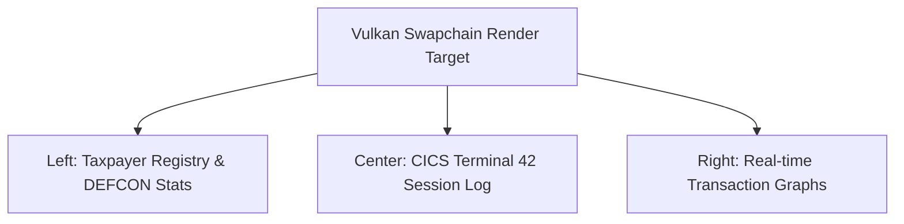

# CADE Vulkan Command Dashboard Blueprint

We can build a high-performance CADE command dashboard utilizing the existing **Vulkan rendering pipeline** (`src/tsfi_vulkan_cells.c`) and **BMS rendering layers** (`tsfi_mf_cics_bms_cad_render`). This allows real-time rendering of CICS terminal loops, DEFCON alerts, and database statistics.


---

## 1. Architectural Layout

The dashboard is structured into three primary Vulkan rendering viewports:



---

## 2. Rendering Implementation (Vulkan Pipeline)

To integrate this UI into the codebase, we map the CADE database structures to dynamic vertex arrays and text glyph coordinate lists using the unified font engine:

```c
// File: inc/tsfi_cade_vulkan.h
#ifndef TSFI_CADE_VULKAN_H
#define TSFI_CADE_VULKAN_H

#include <vulkan/vulkan.h>
#include "tsfi_cade_imf.h"

typedef struct {
    VkBuffer vertex_buffer;
    VkDeviceMemory vertex_memory;
    uint32_t active_taxpayers;
    float current_fps;
    char live_terminal_log[2048];
} CadeVulkanDashboardState;

/* Initialize Vulkan descriptors and graphics pipeline for the dashboard */
int tsfi_cade_vulkan_init_dashboard(VkDevice device, VkRenderPass render_pass, CadeVulkanDashboardState *state);

/* Draw the live transaction graphs and BMS terminal logs to the active command buffer */
int tsfi_cade_vulkan_draw_frame(VkCommandBuffer cmd_buffer, CadeVulkanDashboardState *state);

#endif // TSFI_CADE_VULKAN_H
```

---

## 3. Real-Time Telemetry Updates
Every frame, the CICS gateway sweeps memory pools to feed live logs directly to the rendering queues:
1. **SSN Mask Verification Alerts:** Renders visual warning indicators if security scans detect identity leaks.
2. **Dynamic Transaction Graphs:** Plots live daily batch updates (`tsfi_mf_cade_process_daily_batch`) as HSL-colored Bézier lines via Vulkan fragment shaders.
3. **NATO DEFCON status:** Updates background flashing alerts dynamically based on the current `tsfi_gost_emergency_defcon_level`.
