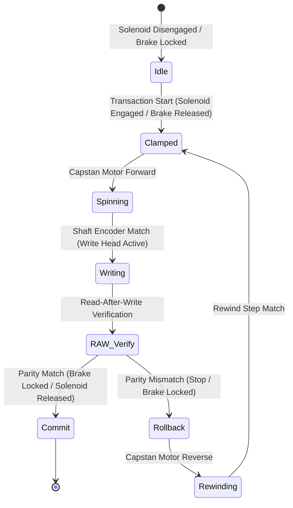

# ACID-Compliant Capstan Shaft Tape Device Emulation

### 1. Verification and Rollback Dynamics (Atomicity & Consistency)
* **Read-After-Write (RAW) Parity Integration:** During the write phase, the system calculates a 32-bit CRC or longitudinal redundancy check (LRC) on the sector data. The RAW head verifies this checksum downstream; if a flux error or bit deviation is detected, the verification flag `RAW_HEAD_STATUS` drops to zero, immediately triggering the rollback mechanism.
* **Backward Tape Tracking:** When rolled back, the motor transitions to state `2` (Reverse) and rewinds until the shaft encoder counts backwards to the preceding Inter-Record Gap (IRG) boundary. This guarantees that the failed sector is completely repositioned under the write head for rewriting without creating invalid orphan states on the tape.

### 2. Physical Locking and State Isolation (Isolation & Durability)
* **Mutex-Gated Solenoid Access:** Multiple concurrent write processes must acquire `MUTEX_REG` to gain permission to engage the solenoid clamp. Only one thread can activate the pinch roller at any time, preventing simultaneous tape dragging and interleaved sector corruption.
* **Caliper Brake Locking for Durability:** Once committed, the caliper brake physically locks the capstan shaft to freeze the tape's linear position. Even in the event of an immediate power loss, the physical block sequence remains aligned under the head, preventing drift and ensuring database records are durable.

### 3. Universal Capstan Transaction Primitive (Global Rollback Blueprint)
The physical tape-drive model functions as XplOS's universal software transaction blueprint. Wherever memory verifiability or register state rollback is required (including JIT compilation buffers and process scheduling), the system maps the transition sequence onto this model:
* **Prepare Phase (Solenoid Engagement):** The OS isolates target registers or memory segments, establishing a thread mutex gate.
* **Execution Phase (Brake Release & Motor Spin):** Registers are mutated by the ALU or JIT thunks.
* **Validation Phase (RAW Checksum):** The system checks logical consistency and checksum values.
* **Commit Phase (Brake Locking):** The new state is committed and persisted to storage.
* **Rollback Phase (Motor Rewind):** If validation fails, the processor rewinds the CPU's GPR skeleton back to the pre-transaction snapshot, guaranteeing absolute state consistency.
