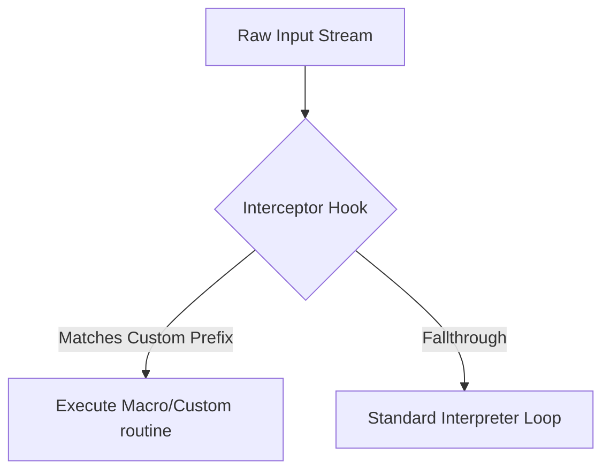

# From Carlson's CHRGET Hook to EMACS: An Architectural Evolution of Character Interception

Edward H. Carlson’s **CHRGET hook** (published in *MICRO: The 6502 Journal*, Issue 25, June 1980) is a famous early microcomputer hack for Apple II, OSI, and PET BASIC. By modifying the zero-page character-fetching routine (`CHRGET` at `$00E2-$00FA`), Carlson intercepted the stream of characters parsed by the BASIC interpreter to inject custom syntax (such as `@` for `PRINT AT`).

This pattern of **character-level input redirection** and dynamic expansion is the exact same architectural concept that led to the creation of **EMACS (Editor MACroS)** on the Incompatible Timesharing System (ITS) at MIT during the mid-1970s.

---

## 1. Character-by-Character Interception: The Common Thread

In both Carlson's BASIC hack and EMACS's TECO origins, the core engine processes a stream of characters sequentially:



### The CHRGET Mechanics
Standard 6502 Microsoft BASIC fetched the next character from memory using a routine located in zero-page (for speed):
```assembly
CHRGET: INC $7A       ; Increment text pointer low byte
        BNE +         ; Skip high byte increment if no page roll
        INC $7B       ; Increment text pointer high byte
+       LDA ($7A),Y   ; Indirect indexed load of the character
        CMP #$3A      ; Check for end-of-statement or colon
        BCS Exit      ; If >= ':', return
        ...
```
Carlson's hack hijacked this zero-page routine to inspect `LDA ($7A),Y`. If it matched a special character (e.g. `@`), it bypassed the standard parser, calling a custom hook instead.

### The EMACS/TECO Mechanics
EMACS was originally written as a set of macros for **TECO** (Text Editor and Corrector). TECO's interpreter read characters from a command string or terminal.
Early hackers realized that by hooking into the character-input loop, they could check each incoming keystroke:
1. If the character matched a prefix (like `Ctrl` or `Meta`), intercept it.
2. Lookup the character in a table (a **keymap**).
3. Execute the corresponding macro string instead of performing the default TECO action.

---

## 2. The Birth of EMACS from TECO Macros

Before EMACS, TECO users had to type long command strings, then hit ESC-ESC to execute them (e.g. `5R` to move back 5 characters).
In 1976, **Richard Stallman**, building on work by Guy Steele, Dave Moon, and others, unified various macro packages (like TECMAC and TMACS) into **EMACS**.

EMACS succeeded because it turned TECO's command interpreter into a real-time, WYSIWYG editor. It did this by replacing the top-level character read loop:

```
+-------------------------------------------------------------+
|                     TECO Default Interpreter                 |
| Char -> Append to Buffer -> Wait for Exec Command (ESC ESC) |
+-------------------------------------------------------------+
                              |
                              v  (Interception Hook Added)
+-------------------------------------------------------------+
|                      EMACS Keymap Dispatch                  |
| Char -> Hooked instantly -> Lookup in Keymap Table          |
|         -> Run Macro/Function directly on buffer            |
+-------------------------------------------------------------+
```

---

## 3. Improving Upon Carlson: A Dynamic Forth Hook Registry

We can take Carlson's static interception idea and modernize it. Instead of hardcoding a single intercept character, we implement a **Dynamic Prefix Hook Registry** in our Forth interpreter.

By using `defhook`, any arbitrary prefix character or token can be registered to dynamically redirect parsing to a custom Forth word:

```forth
\ Example: Registering '@' to print character positions (equivalent to Carlson's PRINT AT hook)
: print-at ." [CURSOR MOVED] " ;
defhook @ print-at
```

This dynamic dispatching is direct intellectual ancestry to the keymaps (`global-set-key` / `define-key`) that define the flexibility of modern EMACS.
