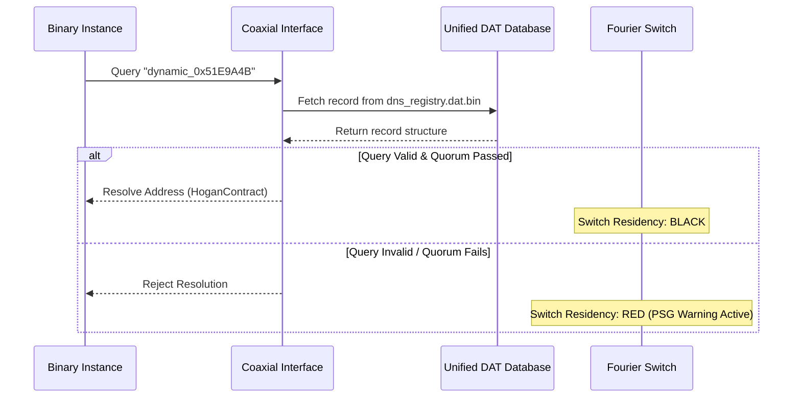

# Auncient Coaxial DNS over DAT Architecture

This document details the architectural specification and implementation for resolving symbolic binary names to dynamic addresses over coaxial links mapped to a unified DAT database storage layer.

---

## 1. System Components

### VM Register Context
* **Database File**: Mapped to `dns_registry.dat.bin` using the mandatory `.dat.bin` extension.
* **Symbolic Map**: Associates contract names (e.g., `HoganContract`) with ZMM hardware addresses (e.g., `0x51E9A4B`).
* **Address Resolution**: Queries must strictly target address strings matching the `dynamic_<address>` template. Contract name string lookups are rejected by the low-level resolver.

### Mathematical Operation
* **Consensus Quorums**: New mapping additions or transitions must be signed by active consensus validators:
  $$Signatures_{active} = \sum_{i=0}^{31} \left( \frac{QuorumMask}{2^i} \pmod 2 \right)$$
  The update is committed if $Signatures_{active} \ge 3$.

### Visual / Geometric Manifestation
* **Switch Residency**:
  * **BLACK Residency**: Active when name-to-address lookups succeed and maintain valid quorum signatures. The Lissajous projection lines retain their default orbital velocity.
  * **RED Residency**: Triggered upon invalid address queries, unchecksummed coaxial payloads, or insufficient signatures. Instantly clamps coordinates along the Y-axis (producing floor chin distortion) and triggers PSG warning tones.

---

## 2. Dynamic Address Lookup Flow

---

## 3. Storage Layout Specification

The DNS entries are written as a sequential list of fixed-size records in the unified binary database:

| Displacement | Field Name | Data Type | Purpose |
|---|---|---|---|
| `0x00` | `contract_name` | `char[32]` | Symbolic representation of the local binary |
| `0x20` | `resolved_address` | `uint32_t` | Target hardware register identifier on ZMM VM |
