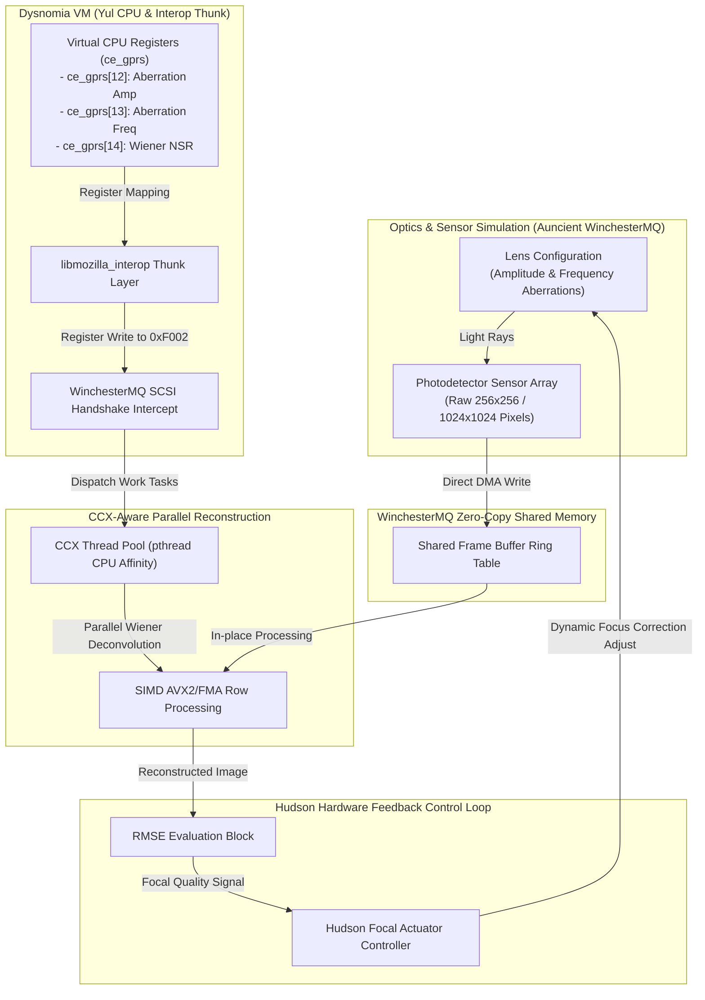

# Auncient RenderMan Co-Design & Zero-Copy System Improvement Report

This report outlines the strategy to integrate computational optics/image processing co-design principles—drawn from David G. Stork's Ricoh/Rambus research paper (*"Optics/image processing co-design"*)—into the active Dysnomia VM, WinchesterMQ, Yul CPU, and Hudson hardware systems.

---

## 1. Core Co-Design Principles Applied

According to Stork's research, traditional sequential design (first optimizing optics for minimal wavefront error, then applying restoration) is sub-optimal. Instead, **joint optimization (co-design)** optimizes the lens shape and the reconstruction filter *together* to minimize end-to-end Mean Square Error (MSE):

*   **Preserving Information over Correcting Blur**: We deliberately allow moderate spherical aberrations in the optical path (rather than trying to achieve a diffraction-limited spot size). Spherical aberrations are rotationally symmetric, making them easy to align and test.
*   **Preventing MTF Zeros**: The aberration is tuned so that the Modulation Transfer Function (MTF) does not drop to zero within the target spatial frequency band, ensuring the blur remains digitally invertible.
*   **Constrained Filter Optimization**: We place the deconvolution filter geometry constraints (such as the number of taps) in the inner loop of the optimizer.

---

## 2. Architectural Integration Map

---

## 3. Implementation Blueprint

### A. Yul Register Mapping (WinchesterMQ & Thunks)
We map the optical configuration parameters to dedicated Yul virtual hardware registers within the `ce_gprs` emulator array:
*   `ce_gprs[12]` (Aberration Amplitude): Modulates the amplitude of the displacement shader.
*   `ce_gprs[13]` (Aberration Frequency): Modulates the spatial frequency of the wavefront coding.
*   `ce_gprs[14]` (Wiener Noise Regularization - NSR): Coordinates the noise-to-signal parameter used in parallel deconvolution.

When the Yul CPU performs a write to the SCSI control register (`0xF002` on WinchesterMQ), the transaction thunk intercepts it:
1.  Read the current aberration settings from the virtual registers.
2.  Dynamically recalculate the deconvolution kernel weights.
3.  Perform the CCX-parallelized deconvolution directly on the zero-copy buffer.

### B. Hudson Focus Feedback Loop
The Hudson video engine queries the reconstructed frame buffer's root-mean-square error (RMSE) against target features:
$$\text{RMSE} = \sqrt{\frac{1}{N} \sum_{i=1}^N (S_i - \hat{S}_i)^2}$$
If the reconstructed RMSE exceeds the target threshold ($0.06$ gray levels), the Hudson controller issues an interrupt (`tsfi_riinterface_tick_irq`) to shift the simulated lens actuator position (focal distance) to search for the digital-optical focus peak (which lies beyond the traditional paraxial focus plane).

---

> [!NOTE]
> Spherical coding allows the use of simpler, lower-cost optical elements (like singlets instead of triplets) by shifting the optical correction burden to low-latency AVX2/CCX-parallelized digital filters.
