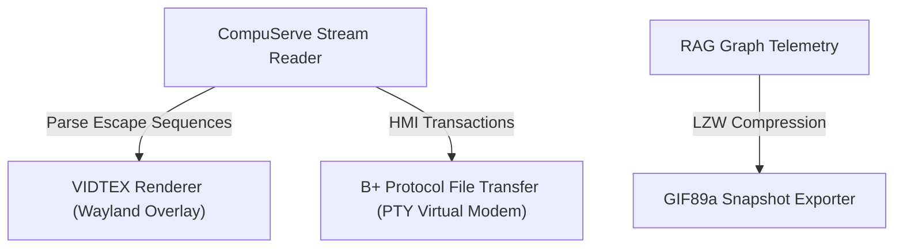

# CompuServe Technology Integration Blueprint

This blueprint outlines how classic technologies from the **CompuServe Information Service (CIS)** can be mapped and integrated into the **TSFI Sovereign Yul CPU** and **Wayland Terminal Emulator** system.

---

## 🗺️ CompuServe Core Technologies & Integration Vectors

### 1. VIDTEX Escape Graphics Protocol
*   **Historical Context**: VIDTEX allowed early microcomputers (Commodore, TRS-80, Atari) to render vector paths, cursor animations, and custom colors over dial-up terminals using specialized ESC sequences.
*   **Wayland Integration**:
    *   Map incoming raw character streams containing custom escape codes (e.g., `ESC ?` or custom control codes) to the existing `GfxPrimitive` overlay engine.
    *   Expand `gfx_primitives` support to draw lines, run-length encoded (RLE) color blocks, and vector paths directly onto the framebuffer based on terminal shell output.

### 2. CompuServe GIF87a & GIF89a (LZW Compression)
*   **Historical Context**: Developed in 1987 by CompuServe to exchange high-quality graphics over low-bandwidth modem connections using Lempel-Ziv-Welch (LZW) lossless compression.
*   **Yul CPU/VM Integration**:
    *   **LZW Decoder**: Implement an on-chain or VM-native LZW decompressor in Solidity/Yul to decode graphic files stored in the smart contracts.
    *   **RAG Framebuffer Snapshots**: Compile frame telemetry and export static or animated RAG graphs into standard **GIF89a** formats directly from `tests/test_wayland_terminal_shell.c`.
    *   **Dracula Color Palettes**: Align the 256-color global palette of the GIF format with the Dracula palette currently used in the console.

### 3. CompuServe B+ Protocol & Host-Micro Interface (HMI)
*   **Historical Context**: Reliable, error-free serial file transfer protocols supporting metadata queries and transaction headers, evolved to exchange files over noisy telephone line modems.
*   **Workspace System Integration**:
    *   **File Upload/Download**: Create a virtual serial link (`/dev/pts` / PTY) inside the Yul VM so the shell can execute `bget` / `bsend` commands.
    *   **IPC Telemetry Channel**: Implement HMI packet structures to exchange visual capturing telemetry (like `rag_telemetry.jpg`) or 3D coordinate meshes between the background Yul VM processes and the Wayland terminal UI.

---

## 🛠️ Proposed Implementation Roadmap

1.  **Phase 1**: Add full parser support for **VIDTEX escapes** in the terminal emulator state machine, allowing Yul VM programs to draw vector lines directly onto the user's overlay screen.
2.  **Phase 2**: Write a lightweight LZW encoder to export RAG telemetry frame captures as animated GIFs directly from the software framebuffer.
3.  **Phase 3**: Implement a mock CompuServe Host-Micro Interface (HMI) responder to allow remote script control over terminal properties.
