# Concurrency Pipelining Optimization Analysis

## 1. The Core Idea: Overlapping Weight Loading and RPC Latency
Currently, the card rendering pipeline is strictly sequential:

```mermaid
gantt
    title Sequential Pipeline (Current)
    dateFormat  X
    axisFormat %s
    section Sequential Steps
    1. Fetch YUE Stats (blocking RPC)    :active, 0, 3.2
    2. Voxel Render & Write SHM Depth    :active, 3.2, 3.3
    3. C++ Vulkan & Weight Load (5.4GB)  :active, 3.3, 7.4
    4. C++ UNet Denoise Sampling         :active, 7.4, 8.5
    5. VAE Decode & Save Card            :active, 8.5, 9.1
```

By running **Step 1 (YUE Stats Fetch) + Step 2 (Voxel Render & SHM Write)** concurrently with **Step 3 (C++ Vulkan Init & Weight Loading)**, we can overlap their execution:

```mermaid
gantt
    title Concurrent Pipeline (Proposed)
    dateFormat  X
    axisFormat %s
    section Thread A (Python Coordinator)
    1. Fetch YUE Stats (blocking RPC)    :active, 0, 3.2
    2. Voxel Render & Write SHM Depth    :active, 3.2, 3.3
    5. Composite Layout & Save Card      :active, 5.4, 6.0
    section Thread B (C++ Worker Process)
    3. Vulkan Init & Weight Load (5.4GB) :active, 0, 4.1
    4. UNet Denoise Sampling (Inference) :active, 4.1, 5.2
    VAE Decode & Write Raw Out           :active, 5.2, 5.4
```

---

## 2. Why Concurrency is Mathematically and Logically Safe

### A. The ControlNet SHM Contract
The C++ worker reads the depth image pointer via `/dev/shm/tsfi_cn_depth`. 
- **Initialization Stage (0.0s to 4.1s):** The C++ worker calls `new_sd_ctx()`. During this time, it only parses files, maps safetensors weights into CPU/GPU memory, and sets up Vulkan pipelines. It does **not** read `/dev/shm/tsfi_cn_depth` data.
- **Inference Stage (4.1s+):** The C++ worker calls `generate_image()`. Only at this moment does it read the bytes stored in `/dev/shm/tsfi_cn_depth`.

### B. Time Delta Guarantee
- **Thread A Duration (RPC + Voxel render + SHM Write):** **~3.25 seconds**.
- **Thread B Duration (Vulkan Init + 5.4GB weight load):** **~4.14 seconds**.

Since `3.25s < 4.14s`, Thread A is guaranteed to have finished writing the depth map to shared memory **before** Thread B attempts to read it for `generate_image()`.

---

## 3. Implementation Details

We can implement this in python using `threading` or `multiprocessing`. 

### Proposed Python Coordinator Workflow
1. **Spawn Thread B:** Start the C++ worker (`./bin/tsfi_sd_worker`) immediately using a non-blocking `subprocess.Popen` pipeline.
2. **Execute Thread A (Concurrently):**
   - Query YUE stats dynamically from the blockchain RPC (takes ~3.20s).
   - Generate voxel coordinates (taking into account hypobar/epibar orbital spikes).
   - Render voxel scene via PIL and save the depth map to `/dev/shm/tsfi_cn_depth`.
3. **Join & Synchronize:**
   - Wait for the C++ subprocess (`subprocess.Popen.wait()`) to complete.
   - Read output raw data, composite, and perform VLM verification.

### Expected Latency Improvement
- Current Latency: **9.11s**
- Proposed Latency: **~5.90s**
- **Net Saving: ~3.21 seconds (35.2% speedup)** with zero changes to model architectures or weight size!
