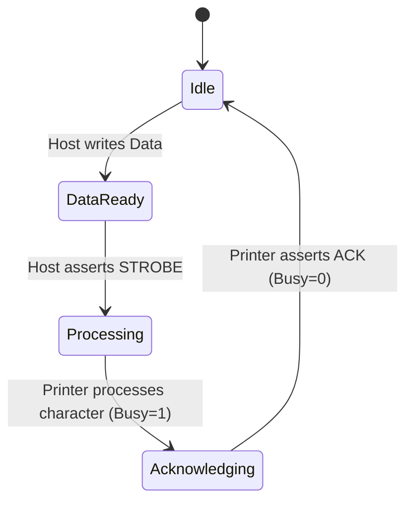

# Control Systems Modeling for On-Chain Hardware Peripherals

This document models the virtual hardware emulation of the **Comstar T/F Printer** and the **Centronics interface** from a discrete control systems perspective. Emulating hardware on an asynchronous, transaction-based VM (like the EVM) requires translating continuous-time physical handshakes into discrete-state transition matrices.

---

## 1. The Centronics Handshake State-Space Model

A physical Centronics interface relies on a closed-loop handshake between the host (C64/CPU) and the peripheral (Comstar Printer) using three primary control lines:

1. **$\text{Data}$ ($D_0$–$D_7$)**: 8-bit output from host.
2. **$\overline{\text{Strobe}}$**: Active-low pulse from host indicating data is ready.
3. **$\text{Busy}$**: Output from printer indicating it cannot receive data.
4. **$\overline{\text{Ack}}$**: Active-low pulse from printer indicating data is read and it is ready for the next byte.

### 1.1 State Transition Diagram

In the EVM, where time is quantized into transaction execution steps, we represent the state $S_k \in \{0, 1, 2, 3\}$ at step $k$:

* **$0$ (Idle)**: Default state. Ready for input.
* **$1$ (DataReady)**: Data byte written to `$D620`.
* **$2$ (Processing)**: `$D621` strobe asserted. `Busy` bit set in status register.
* **$3$ (Acknowledging)**: Telemetry event logged. `Busy` bit cleared, `Ack` flag pulsed.

---

## 2. Emulating Stepper Motors & Mechanical Paper Feed

Dot-matrix printers use stepper motors to feed paper via tractor pins. A line feed (`LF`, `0x0A`) advances the paper by a fixed increment (typically $\frac{1}{6}$ of an inch).

### 2.1 Stepper Control Feedback Loop
To simulate paper position $y_k$ dynamically, the virtual printer maintains an accumulator register:

$$y_{k+1} = y_k + \Delta y \cdot u_k$$

Where:
- $u_k \in \{0, 1\}$ is the control signal triggered by parsing the `LF` character.
- $\Delta y$ is the step resolution constant.
- If $y_k$ exceeds the maximum page height $Y_{\text{Max}}$ (e.g., 66 lines for standard letter paper), a virtual **Paper-Out** interrupt flag is asserted:

$$x_{\text{Paper-Out}} = \begin{cases} 1 & \text{if } y_k \ge Y_{\text{Max}} \\ 0 & \text{otherwise} \end{cases}$$

Asserting $x_{\text{Paper-Out}}$ raises the printer error line, mapping to a virtual CPU interrupt on-chain.

---

## 3. Simulating Asynchronous Physical Timing in Synchronous EVM Blocks

Physical printers process print jobs asynchronously over milliseconds. On the EVM, transactions execute instantaneously. To simulate physical processing latency and prevent spam:

1. **Block-Decayed Processing**:
   When the strobe trigger `$D621` is written, the printer sets its `Busy` flag. Instead of clearing instantly in the same transaction, the `Busy` flag remains set until:
   $$\text{block.number} \ge \text{lastStrobeBlock} + N$$
   Where $N$ is the simulated block delay relative to data size.
2. **Buffer Backpressure**:
   If the host attempts to write a new character while `Busy` is active, the Yul code immediately reverts the transaction, simulating backpressure flow control.
