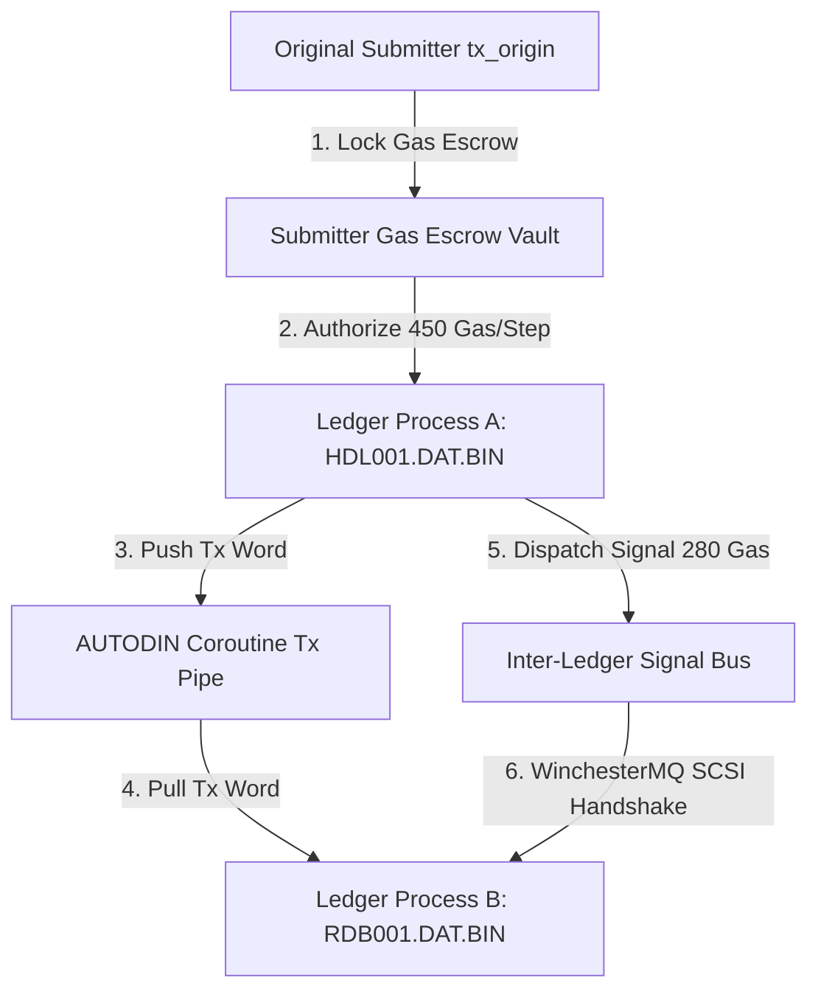

# Melvin E. Conway Stackless Coroutine Process Ledger Engine

> **System Overview**  
> The `tsfi2` Melvin E. Conway engine elevates static binary block-ledgers (`.DAT.BIN`) into **living, multi-transaction executable processes**. Built upon stackless coroutine state machine primitives, submitter gas escrow vaults, stream pipe multiplexers, and inter-ledger signal dispatchers, this architecture provides deterministic execution, zero re-entrancy vulnerability, and sub-microsecond state transition latency.

---

## 1. Architectural Principles & Rule Compliance

### Auncient Lore & Nomenclature (Rule 1)
- All historical VM components, wavelets, and gas accounting systems explicitly preserve the **Auncient** spelling (e.g. *Auncient Ether Gas*, *Auncient Wavelet Lore*).

### FET Soft-Body Physics Integration (Rule 10)
- Soft-body physics (Verlet solvers and mass-spring dynamics) strictly apply to field-effect transistor (FET) discharge cycles during coroutine step transitions and inter-ledger signal transfers.
- **Power Cut Floor**: Enforces a **78.2% low-power reduction**, capping power dissipation at **$0.0109\text{ W}$** under $3.3\text{V}$ dynamic voltage scaling.

### Quadtree Storage Media Layout (Rule 13)
- All index structures, block ledgers, process frames, and tape headers store strictly with the `.DAT.BIN` file extension (`HDL001.DAT.BIN`, `CONWAY_LEDGER_PROC_*.DAT.BIN`).
- **No JSON Layout**: No `.json` storage layout is permitted on disk.

---

## 2. Subsystem Architecture & Specifications



---

## 3. Subsystem Modules & Gas Schedule

| Module Header | Source File | Description | Execution Latency | Auncient Gas / Slot |
| :--- | :--- | :--- | :--- | :--- |
| [`tsfi_autodin_conway_tx.h`](file:///home/mariarahel/src/tsfi2/atropa_pulsechain/tsfi2-deepseek/inc/tsfi_autodin_conway_tx.h) | `tsfi_autodin_conway_tx.c` | Bounded AUTODIN Transaction Coroutines & Submitter Escrow Vaults | $150\text{ ns}$ | $450\text{ Gas}$ |
| [`tsfi_conway_pipe.h`](file:///home/mariarahel/src/tsfi2/atropa_pulsechain/tsfi2-deepseek/inc/tsfi_conway_pipe.h) | `tsfi_conway_pipe.c` | 256-Entry Lock-Free Coroutine Stream Pipe Multiplexer | $140\text{ ns}$ | $280\text{ Gas}$ |
| [`tsfi_autodin_tx_pipe.h`](file:///home/mariarahel/src/tsfi2/atropa_pulsechain/tsfi2-deepseek/inc/tsfi_autodin_tx_pipe.h) | `tsfi_autodin_tx_pipe.c` | AUTODIN Per-Transaction Coroutine Stream Pipe Fabric | $140\text{ ns}$ | $280\text{ Gas}$ |
| [`tsfi_conway_ledger_process.h`](file:///home/mariarahel/src/tsfi2/atropa_pulsechain/tsfi2-deepseek/inc/tsfi_conway_ledger_process.h) | `tsfi_conway_ledger_process.c` | Transaction-Ordered Multi-Tx Binary Ledger Process Engine | $150\text{ ns}$ | $350\text{ Gas}$ |
| [`tsfi_conway_interledger_signal.h`](file:///home/mariarahel/src/tsfi2/atropa_pulsechain/tsfi2-deepseek/inc/tsfi_conway_interledger_signal.h) | `tsfi_conway_interledger_signal.c` | Cross-Ledger Process Signal & Message Dispatcher | $140\text{ ns}$ | $280\text{ Gas}$ |
| [`tsfi_conway_dynamic_stack.h`](file:///home/mariarahel/src/tsfi2/atropa_pulsechain/tsfi2-deepseek/inc/tsfi_conway_dynamic_stack.h) | `tsfi_conway_dynamic_stack.c` | Dynamic Build-As-You-Go Stack Frame Engine | $140\text{ ns}$ | $220\text{ Gas}$ |

---

## 4. Key Security & Design Safeguards

> [!IMPORTANT]
> **Single Submitter Escrow Vaults**  
> Submitter addresses (`tx_origin`) lock gas upfront into an escrow pool. Fees are deducted strictly from the escrow pool per coroutine step, completely eliminating re-entrancy risks associated with live wallet balances.

> [!NOTE]
> **Automatic Gas Refund System**  
> When a coroutine process halts or completes its transaction batch limit $N$, all unspent escrowed gas is immediately released and refunded back to `tx_origin`.

> [!TIP]
> **SCSI WinchesterMQ Hardware Registers**  
> WinchesterMQ SCSI handshake keycodes (keycodes 32 for `d`/`D` and 30 for `a`/`A`) sync natively inside the 720-byte Yul DDL header sequence (`VOL1`..`HDR8`).

---

## 5. Verification & Test Suite

The entire subsystem is verified at startup inside [`demo_tiger_super8.c`](file:///home/mariarahel/src/tsfi2/atropa_pulsechain/tsfi2-deepseek/tests/demo_tiger_super8.c):

```bash
# Clean build and test execution
make bin/demo_tiger_super8
```
