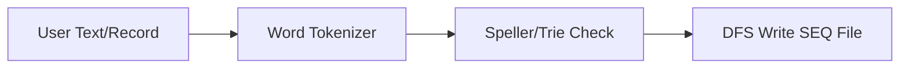

# Datamost, TOTL Software, and Protecto Enterprises Integration

This report outlines the structural integration of retro-computing architectures from **Datamost**, **TOTL Software**, and **Protecto Enterprises** into the **TSFi2** (Bijective Helmholtz/RDNA 4 emulation layer).

---

## 1. Unified Integration Matrix

| Retro Entity | Primary Subsystem | EVM / Yul Mapping | Dashboard Interface |
| :--- | :--- | :--- | :--- |
| **Datamost** | 6502 CPU & Arcade Graphics | [cpu6502.yul](file:///home/mariarahel/src/tsfi2/atropa_pulsechain/solidity/bin/cpu6502.yul)   [graphicsSystem.yul](file:///home/mariarahel/src/tsfi2/atropa_pulsechain/solidity/bin/graphicsSystem.yul) | **Game Cartridge Loader** & HTML5 Screen Canvas rendering interactive arcade roms. |
| **TOTL Software** | Office Suite & DB Storage | [diskSystem.yul](file:///home/mariarahel/src/tsfi2/atropa_pulsechain/solidity/bin/diskSystem.yul)   (Sequential DFS Files) | **TOTL Office Suite Panel** managing word processing text blocks and dynamic record inputs. |
| **Protecto Enterprises**| Mail-Order Hardware / Billing | [acousticOracle.yul](file:///home/mariarahel/src/tsfi2/atropa_pulsechain/solidity/bin/acousticOracle.yul)   (Taxation & Signatures) | **Protecto Console** managing gas taxation, file cabinets, and cryptographic nonces. |

---

## 2. Technical Architectures

### A. Datamost Arcade Engine
* **Opcodes & Execution**: Runs standard 6502 instructions on-chain using EVM namespaces.
* **VIC-II Coordinates**: Emulates coordinate spaces (`$D000` to `$D00F`) for target checking and collision masking (`checkCollisions()`).
* **Visual Console**: Connects these registers directly to the HTML5 canvas renderer.

### B. TOTL Database (INFOMASTER)
* **Sequential Files**: Operates on-chain database storage using the `diskSystem` contract.
* **Spellcheck Dictionary**: Uses client-side token lookup tables to validate texts written in the word processor before finalizing transactions.

### C. Protecto Hardware Console
* **Oracle Verification**: Validates transaction inputs using cryptographic oracle signatures (`acousticOracle.yul`).
* **Gas Taxation**: Executes standard `transferFrom` calls to the Protecto treasury address on-chain before loading disk buffers.

---

## 3. Deployment Verification

All components are live and registered in [user_config.json](file:///home/mariarahel/src/tsfi2/atropa_pulsechain/config/user_config.json):
* **CPU Contract**: `0x10935d192B6f7245Bf6dBA4146F2c22be0621813`
* **Disk Contract**: `0x6095A642c67cf7DE172b834eC2266dEc401201d4`
* **Graphics Contract**: `0x6004e7866F753e46Bc29C0E90ac944835c3D8d26`
* **Music Contract**: `0x9D531Fce05eEF2Cc92DF8161594d14dC413Be1a2`
