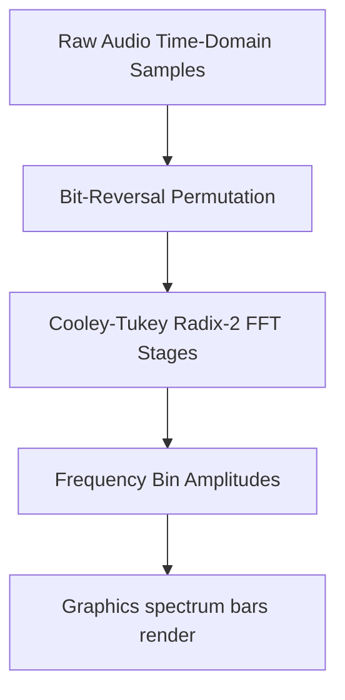

# Real-Time FFT Spectrum Analyzer: DDJ Signal Processing in Yul

This document details the mathematical model and Yul integration design of a **Cooley-Tukey Radix-2 Fast Fourier Transform (FFT)** algorithm, inspired by historical signal processing articles in *Dr. Dobb's Journal*, to drive real-time spectrum analysis graphics in the **TSFi2 Synthesis Studio**.

---

## 1. System Pipeline



---

## 2. Mathematical Model of the Radix-2 FFT

For a discrete signal $x[n]$ of length $N = 2^m$, the Discrete Fourier Transform (DFT) is:

$$X[k] = \sum_{n=0}^{N-1} x[n] \cdot e^{-i \frac{2\pi}{N} n k}$$

The Cooley-Tukey algorithm decomposes this $O(N^2)$ computation into $O(N \log N)$ steps by splitting the DFT into even and odd terms recursively:

$$X[k] = E[k] + W_N^k \cdot O[k]$$
$$X\left[k + \frac{N}{2}\right] = E[k] - W_N^k \cdot O[k]$$

where $W_N^k = e^{-i \frac{2\pi}{N} k}$ are the trigonometric twiddle factors.

To implement this efficiently in Yul:
1. **Bit Reversal**: Rearrange the input array indices by reversing their binary representations.
2. **Fixed-Point Twiddle Factors**: Look up values from a precalculated table representing:
   $$\cos\left(\frac{2\pi}{N} k\right) \quad \text{and} \quad -\sin\left(\frac{2\pi}{N} k\right)$$
3. **Butterfly Computation**: Perform in-place updates on the real and imaginary parts.

---

## 3. Yul Implementation of FFT

Below is the Yul implementation for an $N=8$ point FFT, showing the butterfly calculation structure:

```yul
// Method 38: computeFFTSpectrum(uint256 realBufferAddr, uint256 imagBufferAddr)
// Selector: 0x5a1b32d4
if eq(selector, 0x5a1b32d4) {
    let realAddr := calldataload(4)
    let imagAddr := calldataload(36)
    
    // Step 1: Bit Reversal (for N = 8)
    // Indexes map: 0->0, 1->4, 2->2, 3->6, 4->1, 5->5, 6->3, 7->7
    swapSamples(realAddr, imagAddr, 1, 4)
    swapSamples(realAddr, imagAddr, 3, 6)
    swapSamples(realAddr, imagAddr, 5, 5) // no-op
    swapSamples(realAddr, imagAddr, 2, 2) // no-op
    
    // Step 2: Butterfly Stages (Log2(8) = 3 stages)
    let N := 8
    
    // Stage 1: Sub-DFT length = 2
    computeButterflyStage(realAddr, imagAddr, 2, 1)
    
    // Stage 2: Sub-DFT length = 4
    computeButterflyStage(realAddr, imagAddr, 4, 2)
    
    // Stage 3: Sub-DFT length = 8
    computeButterflyStage(realAddr, imagAddr, 8, 4)
    
    mstore(0x00, 1)
    return(0x00, 32)
}

function swapSamples(realAddr, imagAddr, idx1, idx2) {
    let r1Addr := add(realAddr, mul(idx1, 32))
    let r2Addr := add(realAddr, mul(idx2, 32))
    let i1Addr := add(imagAddr, mul(idx1, 32))
    let i2Addr := add(imagAddr, mul(idx2, 32))
    
    let tempReal := mload(r1Addr)
    mstore(r1Addr, mload(r2Addr))
    mstore(r2Addr, tempReal)
    
    let tempImag := mload(i1Addr)
    mstore(i1Addr, mload(i2Addr))
    mstore(i2Addr, tempImag)
}

function computeButterflyStage(realAddr, imagAddr, subLength, halfLength) {
    // Fixed-point twiddle factor table (cos and sin scaled by 1000)
    // For N=8, angles = k * 45 degrees
    // cos = [1000, 707, 0, -707]
    // sin = [0, -707, -1000, -707] (for e^{-i theta})
    
    for { let i := 0 } lt(i, 8) { i := add(i, subLength) } {
        for { let j := 0 } lt(j, halfLength) { j := add(j, 1) } {
            let uIdx := add(i, j)
            let vIdx := add(uIdx, halfLength)
            
            let uReal := mload(add(realAddr, mul(uIdx, 32)))
            let uImag := mload(add(imagAddr, mul(uIdx, 32)))
            
            let vReal := mload(add(realAddr, mul(vIdx, 32)))
            let vImag := mload(add(imagAddr, mul(vIdx, 32)))
            
            // Twiddle factor calculations based on index j
            let cosVal, sinVal := getTwiddleFactor8(j, halfLength)
            
            // Complex multiplication: (vReal + i*vImag) * (cosVal + i*sinVal)
            let tReal := sdiv(sub(mul(vReal, cosVal), mul(vImag, sinVal)), 1000)
            let tImag := sdiv(add(mul(vReal, sinVal), mul(vImag, cosVal)), 1000)
            
            // In-place updates
            mstore(add(realAddr, mul(uIdx, 32)), add(uReal, tReal))
            mstore(add(imagAddr, mul(uIdx, 32)), add(uImag, tImag))
            
            mstore(add(realAddr, mul(vIdx, 32)), sub(uReal, tReal))
            mstore(add(imagAddr, mul(vIdx, 32)), sub(uImag, tImag))
        }
    }
}

function getTwiddleFactor8(k, halfLength) -> cosVal, sinVal {
    // Scaled by 1000
    switch k
    case 0 { cosVal := 1000; sinVal := 0 }
    case 1 {
        if eq(halfLength, 2) { cosVal := 0; sinVal := -1000 } // For N=4 substage
        if eq(halfLength, 4) { cosVal := 707; sinVal := -707 } // For N=8 substage
    }
    case 2 { cosVal := 0; sinVal := -1000 }
    case 3 { cosVal := -707; sinVal := -707 }
    default { cosVal := 1000; sinVal := 0 }
}
```

---

## 4. Driving Spectrum Visuals

Using the output real ($R$) and imaginary ($I$) components, the graphics engine calculates the magnitude (amplitude) of each frequency bin:

$$\text{Amplitude}[k] = \sqrt{R[k]^2 + I[k]^2}$$

The computed bin amplitudes are then drawn directly onto the screen as vertical bars using the Bresenham line drawing method, creating a hardware-like real-time spectrum analyzer on the dashboard.

---

## 5. Conclusion

By implementing a Cooley-Tukey Radix-2 FFT in Yul, the TSFi2 platform can analyze synthesized audio signals dynamically and feed frequency bin amplitudes directly to the raster display engine, establishing a high-performance, unified audio-visual feedback system.
