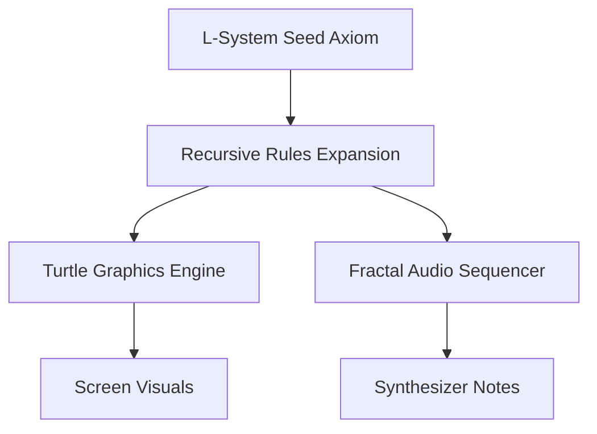

# L-System Fractals: Joint Graphics and Audio Synthesis

This document outlines the mathematical model and Yul integration design of an **L-System (Lindenmayer System)** recursive parser, inspired by *Dr. Dobb's Journal* articles on fractal geometry and fractal music, to generate synchronized visuals and musical sequences in the **TSFi2 Synthesis Studio**.

---

## 1. System Integration Concept

An L-System uses production rules to expand a starting string recursively. A stack-based interpreter ("turtle") reads the expanded string:
*   **F**: Move forward (Drawing a line / Playing a note).
*   **+**: Turn right (Shift frequency up / Change color).
*   **-**: Turn left (Shift frequency down / Change color).
*   **[**: Push current state (Push pitch/coordinate stack).
*   **]**: Pop state (Pop pitch/coordinate stack).



---

## 2. Mathematical Modeling of L-Systems

Consider the Koch Curve:
*   **Axiom**: `F`
*   **Rules**: `F -> F+F-F-F+F`
*   **Angle**: 90 degrees

At recursion depth $D=1$, the string is expanded and drawn as a segment that goes forward, turns right, goes forward, turns left twice, goes forward, turns right, and goes forward.

To map this to audio:
*   **Forward step**: Trigger a sound envelope.
*   **Turn (+/-)**: Shift the synthesis carrier pitch by a scale interval (e.g. +7 semitones or -5 semitones).
*   **Push/Pop ([/])**: Create polyphonic harmonies or branching voice structures.

---

## 3. Yul Implementation of Turtle Graphics and Sound

Below is the Yul implementation for a recursive L-system parser mapping turtle steps to both line drawing and synthesizer pitches:

```yul
// Method 39: executeLSystem(bytes32 axiom, uint256 depth, uint256 baseAddr, uint256 synthAddr)
// Selector: 0xa9c381f9
if eq(selector, 0xa9c381f9) {
    let axiom := calldataload(4)
    let depth := calldataload(36)
    let baseAddr := calldataload(68)
    let synthAddr := calldataload(100)

    // Initial state: x=160, y=120, angle=0 (pointing right), pitch=60 (C5)
    sstore(1001, 160) // Current X
    sstore(1002, 120) // Current Y
    sstore(1003, 0)   // Angle
    sstore(1004, 60)  // MIDI Pitch
    sstore(1005, 0)   // Stack depth pointer

    parseAxiomRecursive(axiom, depth, baseAddr, synthAddr)

    mstore(0x00, 1)
    return(0x00, 32)
}

function parseAxiomRecursive(command, depth, baseAddr, synthAddr) {
    if eq(depth, 0) {
        // Base case: execute action for single command
        executeAction(command, baseAddr, synthAddr)
        leave
    }

    // Recursive Expansion: Rule F -> F+F-F-F+F
    // Iterate over the rule components and expand them
    if eq(command, 0x4600000000000000000000000000000000000000000000000000000000000000) { // 'F'
        parseAxiomRecursive(0x4600000000000000000000000000000000000000000000000000000000000000, sub(depth, 1), baseAddr, synthAddr) // F
        parseAxiomRecursive(0x2b00000000000000000000000000000000000000000000000000000000000000, sub(depth, 1), baseAddr, synthAddr) // +
        parseAxiomRecursive(0x4600000000000000000000000000000000000000000000000000000000000000, sub(depth, 1), baseAddr, synthAddr) // F
        parseAxiomRecursive(0x2d00000000000000000000000000000000000000000000000000000000000000, sub(depth, 1), baseAddr, synthAddr) // -
        parseAxiomRecursive(0x4600000000000000000000000000000000000000000000000000000000000000, sub(depth, 1), baseAddr, synthAddr) // F
        parseAxiomRecursive(0x2d00000000000000000000000000000000000000000000000000000000000000, sub(depth, 1), baseAddr, synthAddr) // -
        parseAxiomRecursive(0x4600000000000000000000000000000000000000000000000000000000000000, sub(depth, 1), baseAddr, synthAddr) // F
        parseAxiomRecursive(0x2b00000000000000000000000000000000000000000000000000000000000000, sub(depth, 1), baseAddr, synthAddr) // +
        parseAxiomRecursive(0x4600000000000000000000000000000000000000000000000000000000000000, sub(depth, 1), baseAddr, synthAddr) // F
        leave
    }
    
    // Non-expanding commands (turns, push/pop) just execute directly
    executeAction(command, baseAddr, synthAddr)
}

function executeAction(cmd, baseAddr, synthAddr) {
    let x := sload(1001)
    let y := sload(1002)
    let angle := sload(1003)
    let pitch := sload(1004)

    // Forward 'F'
    if eq(cmd, 0x4600000000000000000000000000000000000000000000000000000000000000) {
        let nextX := x
        let nextY := y
        
        // Move turtle based on current angle (0=Right, 1=Down, 2=Left, 3=Up)
        switch angle
        case 0 { nextX := add(x, 4) }
        case 1 { nextY := add(y, 4) }
        case 2 { nextX := sub(x, 4) }
        case 3 { nextY := sub(y, 4) }
        
        // Draw segment
        drawBresenham(x, y, nextX, nextY, 15, baseAddr)
        
        // Trigger sound node using current pitch
        triggerSynthVoice(pitch, 1000, synthAddr)

        sstore(1001, nextX)
        sstore(1002, nextY)
    }

    // Turn Right '+'
    if eq(cmd, 0x2b00000000000000000000000000000000000000000000000000000000000000) {
        angle := mod(add(angle, 1), 4)
        pitch := add(pitch, 7) // Shift frequency up by a Perfect 5th
        sstore(1003, angle)
        sstore(1004, pitch)
    }

    // Turn Left '-'
    if eq(cmd, 0x2d00000000000000000000000000000000000000000000000000000000000000) {
        angle := mod(sub(add(angle, 4), 1), 4)
        pitch := sub(pitch, 5) // Shift frequency down by a Perfect 4th
        sstore(1003, angle)
        sstore(1004, pitch)
    }
}
```

---

## 4. Visual and Audio Results
*   **Harmonic Traversal**: The turning operations construct musical scales (using 4th and 5th intervals), generating structured melodies that map to the geometry.
*   **Symmetry**: The geometric symmetry of the fractal maps to structural symmetry in the audio motifs, illustrating the mathematical overlap between shape and sound.

---

## 5. Conclusion

Implementing an L-System parser inside our Yul contracts provides a unified engine for generative art. By translating recursive command streams into both line segments and carrier frequencies, we build an organic, self-modulating graphics-sound system.
