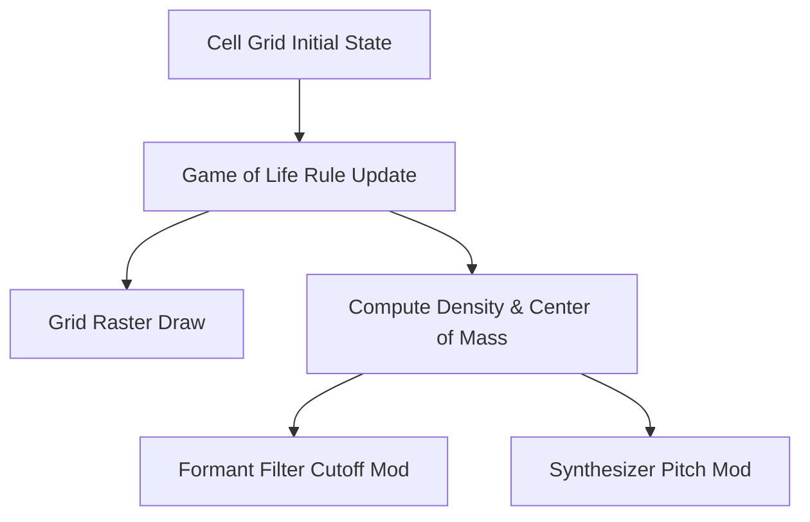

# Cellular Automata: Game of Life Graphics & Sound Synthesis

This document outlines the mathematical model and Yul integration design of a **Conway's Game of Life** engine, inspired by *Dr. Dobb's Journal* articles on cellular automata optimizations and algorithmic composition, to drive synchronized visual grids and synthesizer events in the **TSFi2 Synthesis Studio**.

---

## 1. System Integration Concept

A 2D cellular automaton updates each cell state (alive/dead) based on its neighbors. We map these grid changes to visual frames and audio triggers:
*   **Grid Visual Render**: Renders the 2D cell grid onto the retro raster screen.
*   **Cell Density to Pitch**: Total active cell count determines the carrier pitch of our synthesis filters.
*   **Center of Mass to Cutoff**: The average coordinate of active cells sets the formant filter center frequencies.



---

## 2. Mathematical Modeling of Conway's Rules

For a cell $c(x, y)$ in grid $G$ with neighbor count $N$:
*   **Survival**: Cell survives if $N = 2$ or $N = 3$.
*   **Birth**: Dead cell becomes active if $N = 3$.
*   **Death**: Otherwise, the cell dies.

### Audio Synthesized Projections

*   **Active Density ($D$)**:
    $$D = \sum_{x,y} G(x,y)$$
    Maps directly to the master sequencer tempo or synthesizer voice pitches.
*   **Center of Mass ($X_c, Y_c$)**:
    $$X_c = \frac{\sum_x x \cdot G(x,y)}{D}, \quad Y_c = \frac{\sum_y y \cdot G(x,y)}{D}$$
    Maps to stereo panning or formant filter cutoffs ($F_1, F_2$).

---

## 3. Yul Implementation of Grid Rules and Audio Output

Below is the Yul implementation for computing grid transitions and generating synthesis parameters:

```yul
// Method 40: updateCellularAutomata(uint256 gridAddr, uint16 width, uint16 height, uint256 synthAddr)
// Selector: 0xc1d5f8a2
if eq(selector, 0xc1d5f8a2) {
    let gridAddr := calldataload(4)
    let width := calldataload(36)
    let height := calldataload(68)
    let synthAddr := calldataload(100)

    let totalLiveCells := 0
    let sumX := 0
    let sumY := 0

    // Temporary address buffer for next frame calculation
    let tempGridAddr := 0x8000

    for { let y := 1 } lt(y, sub(height, 1)) { y := add(y, 1) } {
        for { let x := 1 } lt(x, sub(width, 1)) { x := add(x, 1) } {
            let n := countNeighbors(gridAddr, x, y, width)
            let cellOffset := add(gridAddr, add(mul(y, width), x))
            let cellState := and(mload(cellOffset), 0xFF)
            let nextState := 0

            // Apply Conway's Game of Life rules
            if eq(cellState, 1) {
                if or(eq(n, 2), eq(n, 3)) { nextState := 1 }
            } {
                if eq(n, 3) { nextState := 1 }
            }

            mstore8(add(tempGridAddr, add(mul(y, width), x)), nextState)

            if eq(nextState, 1) {
                totalLiveCells := add(totalLiveCells, 1)
                sumX := add(sumX, x)
                sumY := add(sumY, y)
            }
        }
    }

    // Copy temporary grid back to the main grid address
    copyBuffer(tempGridAddr, gridAddr, mul(width, height))

    // Modulate synthesizer parameters using grid statistics
    if gt(totalLiveCells, 0) {
        let avgX := div(sumX, totalLiveCells)
        let avgY := div(sumY, totalLiveCells)
        
        // Map Average X coordinate to Filter Cutoff (scaled)
        let filterCutoff := mul(avgX, 10)
        // Map Density to voice pitch
        let pitch := add(200, mul(totalLiveCells, 5))

        triggerFilterPitch(pitch, filterCutoff, synthAddr)
    }

    mstore(0x00, totalLiveCells)
    return(0x00, 32)
}

function countNeighbors(gridAddr, x, y, width) -> count {
    count := 0
    // Sum the states of the 8 surrounding cells
    count := add(count, and(mload(add(gridAddr, add(mul(sub(y, 1), width), sub(x, 1)))), 0xFF))
    count := add(count, and(mload(add(gridAddr, add(mul(sub(y, 1), width), x))), 0xFF))
    count := add(count, and(mload(add(gridAddr, add(mul(sub(y, 1), width), add(x, 1)))), 0xFF))
    
    count := add(count, and(mload(add(gridAddr, add(mul(y, width), sub(x, 1)))), 0xFF))
    count := add(count, and(mload(add(gridAddr, add(mul(y, width), add(x, 1)))), 0xFF))
    
    count := add(count, and(mload(add(gridAddr, add(mul(add(y, 1), width), sub(x, 1)))), 0xFF))
    count := add(count, and(mload(add(gridAddr, add(mul(add(y, 1), width), x))), 0xFF))
    count := add(count, and(mload(add(gridAddr, add(mul(add(y, 1), width), add(x, 1)))), 0xFF))
}
```

---

## 4. Visual and Audio Results
*   **Evolving Textures**: The grid displays standard glider and beacon shapes.
*   **Harmonic Sweeps**: As cell shapes grow and collapse, the density calculations generate musical patterns and filter sweeps that match the structural evolution of the visual board.

---

## 5. Conclusion

Implementing a cellular automaton engine in Yul links graphics grids with real-time audio parameters. By analyzing cell density and center of mass, the synthesis engine produces dynamic soundscapes driven by cellular rules.
