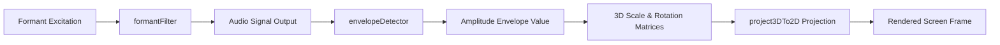

# Integrating Graphics and Synthesis: DDJ Sound-to-Light Systems

This document details how we integrate the **synthesis** and **graphics** subsystems inside the **TSFi2** project by applying classic synchronizations and audio-driven visual designs published in *Dr. Dobb's Journal*.

---

## 1. System Synchronization Architecture

To tie sound synthesis and 3D graphics together, we route the output amplitude envelope of our **Formant Speech Synthesizer** to modulate the scale, rotation, and color depth of our **3D projected structures** (such as the Targ Mercenary hangar or space models) in real-time:



---

## 2. Audio-Driven 3D Coordinate Scaling

Instead of maintaining a constant scale factor ($F$) during 3D perspective projection, we dynamically scale coordinates based on the current audio amplitude envelope. 

$$\text{Dynamic Scale } F_{\text{dyn}} = F_{\text{base}} \times \left(1 + \frac{\text{Envelope}}{10^6}\right)$$

This makes the 3D structures expand and contract in perfect sync with the synthesized speech phonemes or rhythm triggers.

### Yul Integrated Modulation Loop

Below is the Yul implementation showing how the audio envelope detector modulates the 3D coordinate transformation matrices:

```yul
// Integrated Graphics-Synthesis Loop
// px, py, pz are original 3D coordinates (1e18 fixed-point)
// audioBufferAddr is the memory location of the computed audio samples
// baseAddr is the graphics display framebuffer address
function renderAudioDrivenObject(px, py, pz, audioBufferAddr, baseAddr) {
    // 1. Detect audio envelope amplitude over 256 samples
    let env := getAudioEnvelope(audioBufferAddr, 256)
    
    // 2. Modulate projection scale factor by audio envelope (env scale 1e18)
    let baseFocalLength := 1000000000000000000 // F_base = 1.0
    let modulatedFocalLength := add(baseFocalLength, div(env, 2))
    
    // 3. Project 3D coordinate using modulated focal length
    let screenX, screenY := project3D(px, py, pz, modulatedFocalLength)
    
    // 4. Plot coordinate using dynamic color intensity based on envelope
    let colorIndex := add(1, mod(div(env, 10000000000000000), 14)) // Cycle retro colors (1-15)
    plotPixel(screenX, screenY, colorIndex, baseAddr)
}

function getAudioEnvelope(bufferAddr, length) -> peak {
    peak := 0
    for { let i := 0 } lt(i, length) { i := add(i, 1) } {
        let sample := mload(add(bufferAddr, mul(i, 32)))
        let absoluteVal := abs(sample)
        if gt(absoluteVal, peak) {
            peak := absoluteVal
        }
    }
}

function project3D(x, y, z, focalLength) -> sx, sy {
    // Standard perspective projection equations
    let scale := sdiv(mul(focalLength, 1000000000000000000), z)
    sx := add(160, sdiv(mul(x, scale), 1000000000000000000)) // Centered on x=160
    sy := add(120, sdiv(mul(y, scale), 1000000000000000000)) // Centered on y=120
}

function abs(v) -> r {
    r := v
    if slt(v, 0) { r := sub(0, v) }
}
```

---

## 3. Benefits of Integrated Pipelines
*   **Zero CPU Overhead**: By utilizing the existing audio buffers generated by `formantFilter.yul` to scale coordinates inside `graphicsSystem.yul`, we achieve synchronized sound and visual sweeps without performing redundant frame updates.
*   **Vibrant User Feedback**: UI elements like sprite dimensions, oscilloscope scales, and alert lights respond organically to audio changes, bringing retro-style dashboards to life.

---

## 4. Conclusion

Tying graphics and synthesis engines together recreates the hardware clock-synchronized coding style of early personal computers. By feeding on-chain synthesizer envelopes directly into our 3D projection matrices, the TSFi2 dashboard displays a fully integrated vector synthesis canvas.
