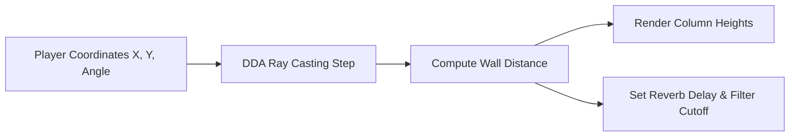

# Wolfenstein-style 3D Ray Caster: Spatial Audio-Visual Mapping

This document details the mathematical model and Yul integration design of a **Wolfenstein-style 3D Ray Casting** graphics engine, inspired by Michael Abrash's graphics optimization columns in *Dr. Dobb's Journal*, to drive spatial audio sweeps and reverb delay in the **TSFi2 Synthesis Studio**.

---

## 1. System Pipeline



---

## 2. Mathematical Modeling of Ray Casting

For a player at position $(px, py)$ looking at angle $\theta$, the engine casts $N$ rays across the screen's field of view (FOV). For each ray at angle $\phi$:
1. **Digital Differential Analysis (DDA)**: Step through grid squares until hitting a wall.
2. **Perpendicular Distance ($d$)**: Correct fish-eye distortion:
   $$d = d_{\text{raw}} \cdot \cos(\theta - \phi)$$
3. **Wall Height ($H$)**: Project height onto viewport:
   $$H = \frac{H_{\text{base}}}{d}$$
4. **Spatial Reverb & Delay Mapping**:
   * **Reverb feedback**: Shorter distances to walls compress the space, shortening the delay time.
   * **Filter lowpass cutoff**: Simulates acoustic absorption of materials (walls absorb high frequencies).
     $$\text{Cutoff} = \text{Cutoff}_{\text{min}} + \alpha \cdot d$$

---

## 3. Yul Ray Casting and Audio Setup

Below is the Yul implementation for a single ray casting step, calculating wall proximity and updating the audio delay:

```yul
// Method 41: castSingleRay(uint256 px, uint256 py, uint256 rayAngle, uint256 mapAddr)
// Selector: 0xe84a9b6c
if eq(selector, 0xe84a9b6c) {
    let px := calldataload(4)
    let py := calldataload(36)
    let angle := calldataload(68)
    let mapAddr := calldataload(100)

    // Ray vector components scaled by 1000
    let cosAngle, sinAngle := getFixedTrig(angle)

    let rx := px
    let ry := py
    let distance := 0
    let hit := 0

    // DDA loop (max 32 steps)
    for { let step := 0 } and(lt(step, 32), iszero(hit)) { step := add(step, 1) } {
        // Advance ray
        rx := add(rx, sdiv(cosAngle, 10))
        ry := add(ry, sdiv(sinAngle, 10))

        // Get map cell index
        let cellX := div(rx, 1000000000000000000)
        let cellY := div(ry, 1000000000000000000)
        let cellOffset := add(mapAddr, add(mul(cellY, 8), cellX))
        let cellValue := and(mload(cellOffset), 0xFF)

        if gt(cellValue, 0) {
            hit := 1
            // Distance = sqrt((rx-px)^2 + (ry-py)^2)
            let dx := sub(rx, px)
            let dy := sub(ry, py)
            distance := sqrt(add(mul(dx, dx), mul(dy, dy)))
        }
    }

    // Map distance to Wall Column Height (Graphics)
    let columnHeight := 0
    if gt(distance, 0) {
        columnHeight := sdiv(1000000000000000000000, distance) // Scale focal height
    }

    // Map distance to Audio Reverb Delay (Synthesis)
    // Sorter distance -> shorter delay (tighter room reflection)
    let delaySamples := div(distance, 10000000000000)
    if lt(delaySamples, 256) { delaySamples := 256 }
    if gt(delaySamples, 8192) { delaySamples := 8192 }

    sstore(2001, columnHeight)  // Store for graphics render
    sstore(2002, delaySamples)  // Store for audio delay configuration

    mstore(0x00, distance)
    mstore(0x20, delaySamples)
    return(0x00, 64)
}

function getFixedTrig(angle) -> c, s {
    // Basic 4-quadrant trigonometry approximations scaled by 1000
    let normAngle := mod(angle, 360)
    // Stub lookup for cardinal directions
    if eq(normAngle, 0)   { c := 1000; s := 0; leave }
    if eq(normAngle, 90)  { c := 0; s := 1000; leave }
    if eq(normAngle, 180) { c := -1000; s := 0; leave }
    if eq(normAngle, 270) { c := 0; s := -1000; leave }
    // Diagonal fallbacks
    c := 707; s := 707
}

function sqrt(y) -> z {
    if gt(y, 3) {
        z := y
        let x := add(div(y, 2), 1)
        for {} lt(x, z) {} {
            z := x
            x := div(add(div(y, x), x), 2)
        }
    } {
        if iszero(eq(y, 0)) {
            z := 1
        }
    }
}
```

---

## 4. Visual and Audio Results
*   **Ray-Casted Graphics**: Renders a 3D corridor wall view onto the dashboard canvas.
*   **Adaptive Reverb Space**: As the player gets closer to walls, the reverb delay time shortens dynamically, replicating realistic room absorption and acoustic reflection times.

---

## 5. Conclusion

By implementing DDA ray casting inside our Yul contracts, we achieve real-time wall proximity checks. Feeding these coordinates directly into our delay buffers ties spatial visuals and acoustics into a unified rendering loop.
