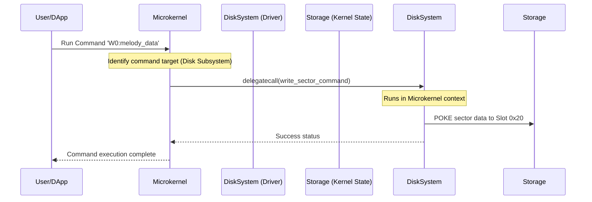

# Decentralized Microkernel OS: Shared-State Yul Operations on the EVM

This document outlines the architectural design for a decentralized, memory-mapped microkernel operating system. By mapping classic computer hardware architecture (inspired by the Commodore 64 and Datamost educational materials) directly onto EVM storage slots and message-passing schemes, we create a deterministic, collaborative runtime environment.

---

## 1. Memory-Mapped I/O (MMIO) Storage Map

In a physical C64, hardware chips (VIC-II, SID, CIA) are controlled by reading and writing to specific memory-mapped addresses (e.g., `$D000`–`$DFFF`). On the EVM, we replace physical RAM addresses with **32-byte storage slots**. 

Subsystem contracts share state by agreeing on a standardized layout of slots:

```mermaid
graph TD
    subgraph Storage Layout (256-bit slots)
        Slot00["Slot 0x00 - 0x1F: SID Sound Registers (musicMaker)"]
        Slot20["Slot 0x20 - 0x9F: 1541 Disk DOS Sector Blobs (diskSystem)"]
        SlotA0["Slot 0xA0 - 0xBF: Keyboard Buffer & Input Vectors"]
        SlotC0["Slot 0xC0 - 0xDF: System Clock & Jiffies Counter"]
        SlotE0["Slot 0xE0 - 0xFF: Kernel Status & Debounce Flags"]
    end
```

---

## 2. Shared-State Execution Modes

To coordinate these registers across multiple independent contracts (representing drivers, shells, and user space applications), the operating system utilizes three primary EVM execution mechanics:

### A. Core Driver Execution (`delegatecall`)
When the main Kernel needs to run a driver (e.g., the `diskSystem` driver to parse a DOS command):
1. The Kernel executes a `delegatecall` to the `diskSystem` address.
2. The driver code executes inside the **Kernel's storage context**, directly reading and writing to the memory-mapped slots (`0x20`–`0x9F`).
3. This eliminates the gas cost and complexity of copying large byte arrays between contracts.

### B. Hardware Queries (`staticcall`)
User-space programs query read-only system metrics (like the `Jiffies` timer or current audio frequency):
1. The application executes a `staticcall` to the `diskSystemAddress` or `musicMakerAddress`.
2. The hardware contract responds with the register values without permitting state modification.

### C. State-Changing Interrupts (`call`)
External events (block generation, user clicks, sensor signals) trigger interrupts:
1. The external orchestrator sends a transaction to the system entrypoint.
2. The handler dispatches standard `call` messages to register owners, allowing them to perform state checks and mutate memory safely.

---

## 3. Concurrency, Race Conditions, and Switch Bounce

Because EVM transactions are executed serially within a block but may contain multiple nested calls, we must prevent race conditions and illegal register manipulation:

1. **Switch Bounce Protection (Same-Block Re-entrancy):**
   State-changing registers (such as a hardware write queue) implement the re-entrancy protection demonstrated in `diskSystem.yul`. If a process attempts to write to a register multiple times within the same block without the system timer incrementing, the call reverts.
2. **Authorized CREATE2 Addresses:**
   The singular factory model ensures that user-space software can cryptographically verify that a driver contract at a specific address is authentic. Only drivers deployed by the authorized master key are allowed to receive `delegatecall` privileges from the microkernel.

---

## 4. Hardware Simulation Flow


