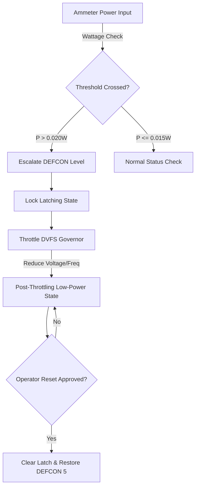

# TSFi DEFCON Power Alarm System

This document detail the architectural function, physical components, and operational utility of the **Auncient** Dysnomia VM hardware DEFCON power alarm system.

---

## 1. Operational Function
The TSFi DEFCON power alarm system monitors real-time core wattage consumption to prevent physical thermal runaway, voltage sag, and semiconductor breakdown. 

When power consumption spikes past key safety limits (DEFCON levels 3, 2, or 1), the system escalates the threat status and enforces emergency frequency throttling. To ensure safety, warnings and throttled states are persistently locked (latched) and cannot be cleared until an operator manually approves the recovery transition.

---

## 2. System Components

The system is defined by three registers, a latch state structure, and an approval interface:

### A. DEFCON_LEVEL Register
* **VM Register Context**: Address `0x4080` in the **Auncient** Dysnomia VM registry.
* **Mathematical Function**: Calculates the target clock cycle frequency limit based on threat level:
  $$Freq\_Target = \frac{Max\_Freq}{2^{\text{defcon\_level}}} \pmod{MotzkinPrime}$$
* **Visual / Geometric Manifestation**: Shifts the projected Lissajous wireframe coordinate trails. Under DEFCON 5 (Normal), trails are rendered as thin, translucent emerald vector lines. At DEFCON 1 (Emergency Overload), trails compress into dense, opaque ruby blocks to visually isolate breakpoint coordinates.

### B. DVFS_GOVERNOR Register
* **VM Register Context**: The governor state register at `0x4090`.
* **Mathematical Function**: Evaluates dynamic power consumption against gate capacitance:
  $$P_{dyn} = Freq\_Target \cdot C_{gate} \cdot V_{dd}^2$$
* **Visual / Geometric Shift**: Dynamically compresses rendering coordinate offsets along the camera's Z-axis depth layers to reduce compute overhead during throttling.

### C. Persistent Safety Latch (`g_defcon_latched` & `g_latched_level`)
* **VM Register Context**: Memory words at `0x40A0` and `0x40A8`.
* **Utility**: Locks the system at the highest triggered threat level. Even if physical wattage drops back to safe levels, the alarm and active DVFS throttling remain locked.
* **Visual / Geometric Shift**: Projected coordinate rails display a blinking caution grid overlay indicating that the system is operating in a locked emergency state.

### D. Manual Reset Approval Interface (`tsfi_defcon_power_alarm_approve_reset`)
* **VM Transition Context**: An owner-only transaction pathway on the WinchesterMQ SCSI channel.
* **Mathematical Operation**: Zeros out the latch state registers (`g_defcon_latched = 0`), returning `g_latched_level` to `DEFCON_LEVEL_5`.
* **Visual / Geometric Shift**: Instantly clears the emergency caution grid overlay, restoring smooth, full-frequency coordinate rendering trails.

---

## 3. System Utility
* **Thermal Protection:** Prevents physical damage to simulated field-effect transistors (FETs) by instantly clamping power consumption when power exceeds $0.045\text{ W}$ (DEFCON 1).
* **Deterministic Containment:** The safety latch ensures that transient spikes cannot cause the system to oscillate rapidly between throttled and unthrottled states.
* **Operator Governance:** Keeps the system in a throttled, safe state until a human operator audits the cause of the overload and manually clears the alert.
