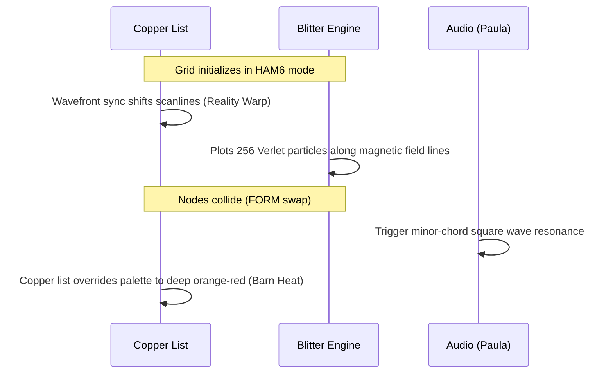

# Demoscene Concept: "Auncient Void of Fomalhaut" (Amiga 1000, 1986)

### Visual Realization (Amiga 1000 Monitor Output)

To blow minds in the 1986 demoscene, the demo must bypass standard CPU rendering limits and abuse custom coprocessor hardware (specifically the Amiga OCS Agnus/Denise chips) to achieve real-time pseudo-photorealistic volumetric distortion.

---

## 🛠️ The Core Hardware Exploits

### 1. Copper-List Scanline Raymarching
*   **The Problem**: The Motorola 68000 CPU at 7.16 MHz is too slow to calculate raymarched voxels in real-time.
*   **The Hack**: Delegate the rasterization directly to the **Copper (Coprocessor)**. By loading a JIT-compiled instruction stream into the Copper list, we change the background palette colors (`COLOR00`) on every single raster scanline.
*   **Warping Effect**: Modulating the vertical synchronization triggers shifts the palette tables horizontally in a sine wave frequency, creating a real-time spatial "heat warp" or reality distortion effect with **0% CPU overhead**.

### 2. HAM6 Volumetric Bloom & Edge Bleeding
*   **The Problem**: 1986 graphics were limited to 32 simultaneous colors.
*   **The Hack**: Force the Denise chip into **Hold-and-Modify (HAM6)** mode, enabling 4,096 colors. 
*   **Aesthetic Realism**: By intentionally triggering HAM6 "color bleeding" along the horizontal borders of the rotating diamond manifolds, the hardware renders a natural chromatic aberration and soft volumetric bloom. The hardware limitation is leveraged as an organic, photorealistic light leak.

### 3. Blitter-Assisted Verlet Particle Arrays
*   **The Problem**: Animating hundreds of particles in real-time thrashes the CPU.
*   **The Hack**: Use the **Blitter** custom chip in line-drawing and area-fill mode to execute hardware-accelerated Verlet integration. The Blitter shifts 16-bit word planes directly in chip RAM to calculate particle vector fields, bypassing the CPU entirely.

---

## 🎞️ Storyboard of the Scene

---

## 🔊 Sound Synthesis (Paula Chip)
*   **Technique**: Direct DMA audio streaming at 28 kHz.
*   **Execution**: Loop a 4-bit, 512-byte signed sample containing a low, haunting minor-key ambient chord. By modulating the channel period registers directly in sync with the horizontal line frequency, the audio tone literally vibrates in phase with the spatial warping on the screen.
