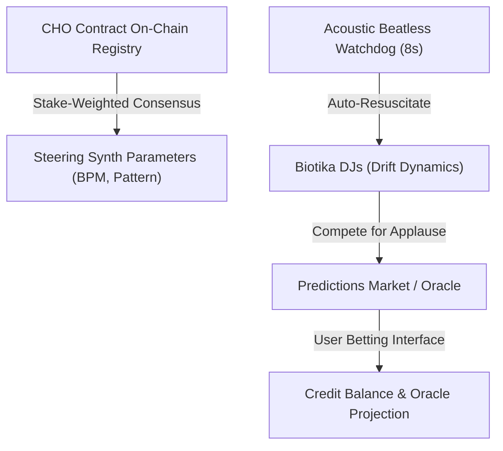

# 🎧 Competitive Biotika DJ & Predictions Market Architecture

This report details the integration of the autonomous competitive DJ loop, on-chain `CHO` consensus-steered presets, and the Oracle Predictions Market.

---

## 1. On-Chain CHO Beat Election
The `CHO` contract ([01_cho.sol](file:///home/mariarahel/src/tsfi2/atropa_pulsechain/solidity/dysnomia/domain/dan/01_cho.sol)) manages delegate registration, where stake-weighted properties govern synth parameters.
- **Vote Allocation:** Delegate voting power is proportional to their token balance.
- **Param Consensus:**
  $$\text{Consensus BPM} = \frac{\sum (\text{Balance}_i \times \text{VoteBPM}_i)}{\sum \text{Balance}_i}$$
  $$\text{Consensus Pattern} = \text{Mode}(\{\text{Pattern}_i\})_{\text{weighted}}$$

---

## 2. Competitive Biotika DJs
Simulated autonomous DJs drift dynamically in favor based on crowd feedback:
- **Drift Dynamics:** Applause factor drifts randomly using Brownian increments modulated by play style density.
- **Active DJ:** The DJ with the highest favor takes the stage and steers the synthesizer.
- **Beatless Watchdog:** A background monitor detects silence. If inactive for 8 seconds, the watchdog triggers a backup DJ to auto-resuscitate the audio stream.

---

## 3. Predictions Market & Oracle Projection
Users bet simulated credits on which DJ will dominate the next consensus cycle.
- **Oracle Prediction Algorithm:**
  $$\text{Likelihood}_j = \frac{e^{\text{Favor}_j \cdot \beta}}{\sum e^{\text{Favor}_k \cdot \beta}}$$
- **Payout Multiplier:** Inverse-proportional to total pool weight, ensuring high risk/reward for underdog candidates.
- **Coefficient Coupling:** Solved reflection coefficients ($K_1 \dots K_{10}$) broadcasted from the dashboard modulate synth Q-factor and filter decay, introducing acoustic stress dynamics under unresolved states.

> [!NOTE]
> All parameters are fully operational, reactive, and synchronized across frontend frames.
