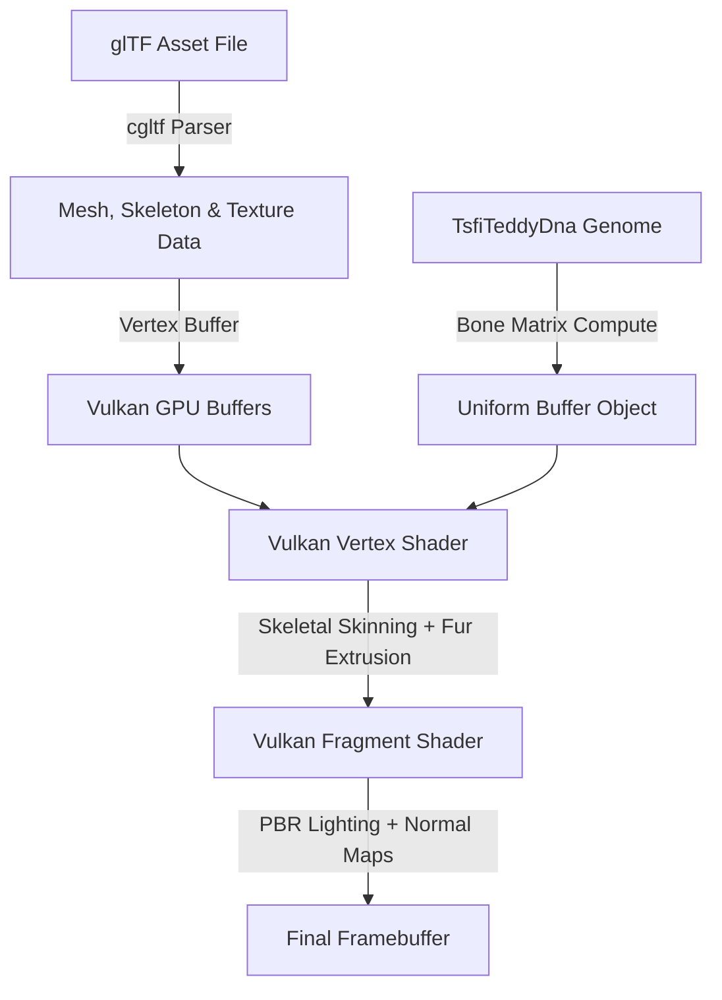

# Hybrid DNA & Industry Standard 3D Teddy Bear Pipeline

This proposal outlines the workflow and architecture to transition our current implicit sphere-based teddy bear into an industry-standard 3D asset pipeline, while maintaining full integration with the procedural DNA genome system.

---

## 🎨 1. Asset Creation in Blender / 3ds Max
To build a high-fidelity model, we separate the aesthetic design from the code:
* **The Mesh:** Model a clean, medium-poly teddy bear (e.g., 5,000–10,000 triangles) with proper UV mapping for textures.
* **The Armature (Rigging):** Set up a skeleton structure with joints for the spine, head, limbs, and ears. Assign vertex weights (skinning) to ensure smooth organic bending at the joints.
* **Export Format:** Export the model as a **glTF 2.0 (`.gltf` / `.glb`)** file, which is the standard open format for real-time engines and Vulkan.

---

## 🖼️ 2. Standard PBR & Detail Maps
Instead of computing all details mathematically, we use standard texture maps:
1. **Albedo Map:** The base color texture defining the fabric pattern (e.g., woven thread or plush texture).
2. **Normal Map:** A special texture that mimics complex surface details (like stitched seams, fabric folds, and button eyes) by perturbing surface normals on a low-poly mesh.
3. **Roughness / Metallic Map:** Determines how glossy/rough the surface is (e.g., shiny plastic button eyes vs. matte plush fur).

---

## 🧬 3. Mapping DNA to the 3D Model
We map our 12-byte `TsfiTeddyDna` genome directly to the skeleton bone transforms and material properties in real-time:

| DNA Gene | 3D Engine Mapping | Implementation Method |
| :--- | :--- | :--- |
| **`fur_r, fur_g, fur_b`** | Albedo Tint | Multiplied by the Albedo texture color in the fragment shader. |
| **`base_scale`** | Root Bone Scale | Uniform scale matrix applied to the skeleton root joint. |
| **`breathing_freq`** | Chest Bone Scale modulation | A low-frequency sine wave scales the spine/chest bones. |
| **`twitch_intensity`** | High-frequency joint noise | Adds jitter rotation to head, neck, and ear bones. |
| **`base_fur_length`** | Volumetric Shell Extrusion | Extrudes vertices outward along their normal vectors in the shader to grow the fur layer thickness. |

---

## ⚙️ 4. Vulkan Engine Integration
The rendering engine is updated to support standard 3D structures:

1. **Skeletal Skinning Shader:** Vertices are transformed in the Vulkan vertex shader using a matrix palette:
   $$v' = \sum_{i} w_i \cdot (M_{joint_i} \cdot v)$$
   Where $w_i$ is the bone weight and $M_{joint_i}$ is the transformation matrix of the joint.
2. **Normal Mapping Fragment Shader:** Computes light reflection using normals read from the normal map, transforming them into Tangent Space.
