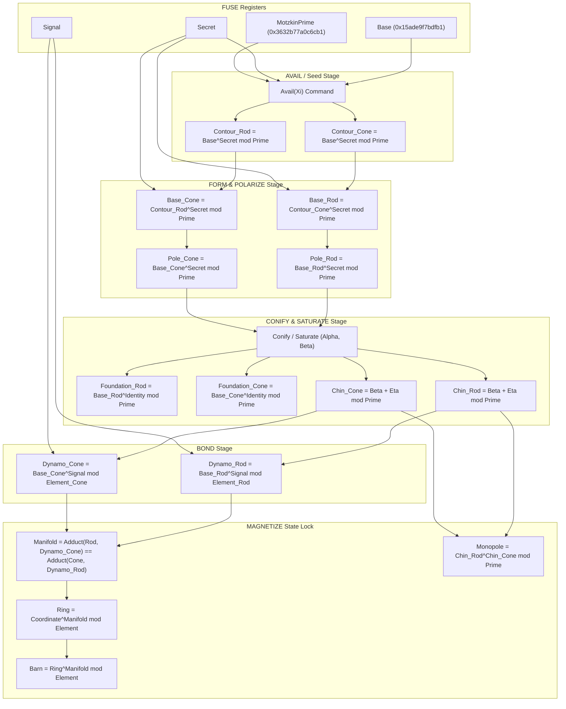

# Dysnomia BOOT Circuit Blueprint: AVAIL to MAGNETIZE Transition

This document defines the Auncient hardware register routing and modular arithmetic logic blocks necessary to execute the full **AVAIL** to **MAGNETIZE** transition using the 4 **FUSE** inputs.

## 1. Register Execution Equations

### Step 1: AVAIL (Constructor Init)
The **Seed** transaction routes the physical inputs into the primary contour registers of the Rod and Cone:
$$Contour_{Rod} = Base^{Secret_{Rod}} \pmod{MotzkinPrime}$$
$$Contour_{Cone} = Base^{Secret_{Cone}} \pmod{MotzkinPrime}$$

### Step 2: FORM & POLARIZE (Transitive Coupling)
The outputs of the contour registers are cross-coupled as feedback inputs to the opposing device. The base registers are updated:
$$Base_{Rod} = Contour_{Cone}^{Secret_{Rod}} \pmod{MotzkinPrime}$$
$$Base_{Cone} = Contour_{Rod}^{Secret_{Cone}} \pmod{MotzkinPrime}$$
Once the base potentials are stabilized, the polarization steering registers are resolved:
$$Pole_{Rod} = Base_{Rod}^{Secret_{Rod}} \pmod{MotzkinPrime}$$
$$Pole_{Cone} = Base_{Cone}^{Secret_{Cone}} \pmod{MotzkinPrime}$$

### Step 3: CONIFY & SATURATE (Impedance Matching)
The depth boundaries (Foundation) and the channel frequencies are resolved:
$$Foundation = Base^{Identity} \pmod{MotzkinPrime}$$
$$Channel = Base^{Signal} \pmod{MotzkinPrime}$$
The low-level bottom boundary clamp (Chin) is defined:
$$Chin = Beta + Eta \pmod{MotzkinPrime}$$

### Step 4: BOND (State Lock)
The dynamic velocity tracking word (Dynamo) is bound to the element spacing modulus, and the polarization registers are zeroed:
$$Dynamo_{Rod} = Base_{Rod}^{Signal} \pmod{Element_{Rod}}$$
$$Dynamo_{Cone} = Base_{Cone}^{Signal} \pmod{Element_{Cone}}$$
$$Pole_{Rod} \rightarrow 0,\quad Pole_{Cone} \rightarrow 0$$

### Step 5: MAGNETIZE (Commutative Convergence Verification)
The system asserts topological convergence:
$$Manifold = Dynamo_{Cone}^{Secret_{Rod}} \pmod{Element_{Rod}}$$
Verify that the cross-coupled adduct is equal:
$$Manifold_{Rod} == Manifold_{Cone}$$
Once validated, the golden geometric keys and global monopole are sealed:
$$Ring = Coordinate^{Manifold} \pmod{Element}$$
$$Barn = Ring^{Manifold} \pmod{Element}$$
$$Monopole = Chin_{Rod}^{Chin_{Cone}} \pmod{MotzkinPrime}$$
