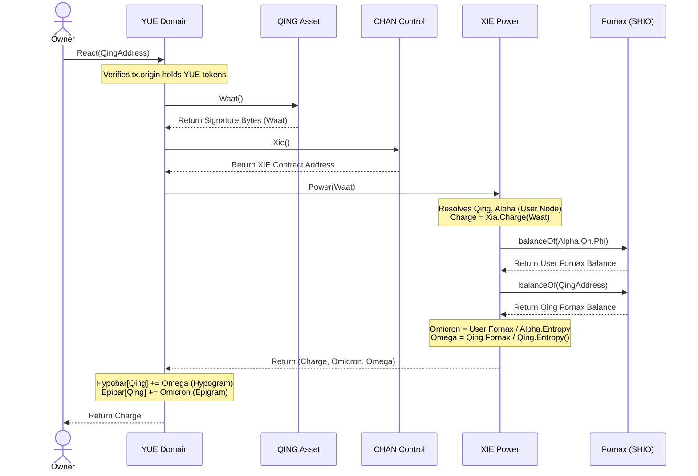

# Dysnomia System Integration Map

The Dysnomia ecosystem is organized as a multi-layered domain and asset state machine. This map outlines the relationships between key contracts, how they are bootstrapped, and the exact pipelines that trigger and record metrics (such as Hypobar, Epibar, and Core Reactions).

---

## 1. Core Token & Interface Layers

```
  [ Identity Layer ]           [ Control Layer ]           [ Domain Layer ]
        LAU     <------------->      CHAN      <------------->    YUE (Domain)
                                      |
                                      v
                                     XIE (Power)  ----------> Fornax (SHIO)
                                      |
  [ Asset Layer ]                     v
     QING (Token)  -------------------+ (Waat/Signature)
          |
          v
     XIA (Engine)  <------------->  SHIO (Fomalhaute)
```

### A. Identity: LAU
* **Purpose**: Tracks identity and credentials (usernames).
* **Key Fields**: `Username`.
* **Registration**: Deployed using `LAUFactory.New()`, then locked with `LAU.Username()`.

### B. Control & Power: CHAN & XIE
* **Purpose**: `CHAN` manages channel registration and permissions. `XIE` calculates numeric weight/power from signatures.
* **Key Interactions**:
  - `YUE` relies on `CHAN` to authorize domain interactions.
  - `XIE` resolves the **Fornax** `SHIO` contract at constructor time:
    ```solidity
    Fornax = SHIO(Xia.Mai().Qi().Zuo().Cho().Void().Nu().Psi().Mu().Tau().Upsilon().Eta().Psi());
    ```

### C. Domain: YUE
* **Purpose**: The domain manager contract that handles asset pairing (`Hong`/`Hung`) and collects metrics (`Hypobar`/`Epibar`).
* **Key Fields**: `Hypobar` (Hypogram) & `Epibar` (Epigram) mappings.

### D. Asset: QING & XIA
* **Purpose**: `QING` contracts act as the specific token assets. `XIA` acts as the execution/computation engine managing the underlying market rates.
* **Key Interactions**:
  - `QING.Waat()` returns a signature representation of the asset.
  - `XIA` resolves rod structures to link tokens like `Fomalhaute` (SHIO).

---

## 2. Stat Triggering Pipeline (Hypobar & Epibar)

When a reaction is triggered, the YUE domain contract queries the underlying signatures to compute the live metrics.



---

## 3. Core Reaction Layer (XIA & Fomalhaute)

Underneath the domain layer, the engine performs low-level EVM state shifts using the resolved `SHIO` tokens:

1. **Resolution**: `XIA` resolves `Fomalhaute` (a type of `SHIO` contract) via `Mai.Qi().Zuo().Cho().Void().Nu().Psi().Mu().Tau().Upsilon().GetRodByIdx(index)`.
2. **Evaluation**: The library function `ReactFomalhaute(Mu)` calls `ReactShioCone` using the resolved `Fomalhaute` address.
3. **Execution**: This executes the raw mathematical conversions (brightness/hue) that dynamically scale the engine's state variables.
