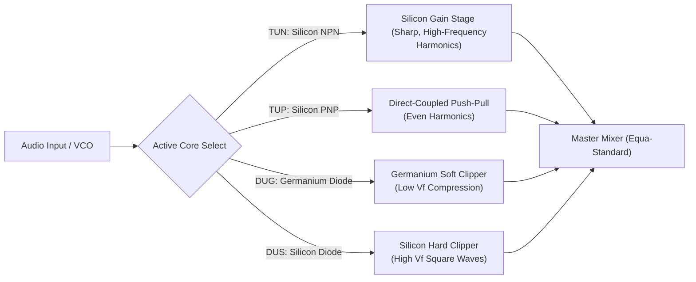

# Elektor Issue #1: Foundations of Audio & Transistor Synthesis

This document analyzes the historical and engineering principles introduced in the debut issues of *Elektor* (the English edition of the Dutch *Elektuur*), focusing on how these early transistor standards and circuits define the signal path and modular architecture of our **Synthesis Studio**.

---

## 1. The Historical Crossover (Elektuur & Elektor)

*   **April 1961 (Elektuur Issue #1 - Dutch)**: Bob W. van der Horst establishes the publication to help DIY hobbyists transition from vacuum tubes to solid-state Germanium transistors (OC71, OC72).
*   **December 1974 (Elektor Issue #1 - English)**: Elektor launches internationally, introducing the **Equa-Amplifier** and the legendary **TUP-TUN-DUG-DUS** semiconductor classification system.

---

## 2. Technical Primitives: The TUP-TUN-DUG-DUS Specification

In Elektor Issue #1, the editors faced a major challenge: hobbyists struggled to source exact transistor part numbers (e.g., BC107, AC126) depending on local distributor stocks. To solve this, Elektor defined four **Universal Semiconductor Specifications**:

| Designator | Type | Material | Key Properties | Studio Emulation Equivalent |
| :--- | :--- | :--- | :--- | :--- |
| **TUN** | Transistor Universal NPN | Silicon | $V_{be} \approx 0.6\text{V}$, high gain, sharp clipping | Silicon common-emitter stage, linear VCO control |
| **TUP** | Transistor Universal PNP | Silicon | Complementary to TUN, symmetric bias networks | Complementary push-pull stages |
| **DUG** | Diode Universal Germanium | Germanium | $V_{f} \approx 0.15\text{V} - 0.2\text{V}$, high leakage | Germanium clipping limiter, soft saturation |
| **DUS** | Diode Universal Silicon | Silicon | $V_{f} \approx 0.6\text{V}$, sharp conduction cutoff | Push-pull bias stabilization, gating triggers |

---

## 3. Audio Architecture: The Equa-Amplifier & Noise Synthesis

Elektor Issue #1 featured two audio circuits that form the basis of our synthesis nodes:

### A. The Equa-Amplifier Stage
A direct-coupled symmetrical transistor topology that eliminated heavy inter-stage coupling capacitors. By removing phase shift and capacitor coloration, the Equa-amplifier introduced:
*   **Active Low-Frequency Feedback**: Preserves base-frequency transient response without dynamic phase mud.
*   **Soft Symmetrical Saturation**: Acts as the master output saturation stage of the synthesizer.

### B. The Steam Whistle / Flickering Flame Generator
An early discrete analog sound effects generator:
*   Uses a **TUP-TUN relaxation oscillator** to synthesize a basic pulse train representing steam engine whistles.
*   Uses a **reverse-biased Germanium junction (DUG)** operating in the avalanche breakdown region as a physical white noise generator, which is then filtered using a simple passive RC low-pass network.

---

## 4. Synthesis Studio Layout: Modular Transistor Matrix

Using the TUP-TUN-DUG-DUS framework, we can build a **Modular Transistor Matrix** in the studio. This allows the user to wire primitive components directly inside the ZMM VM.

### Yul VM Implementation Strategy:
We can implement a unified `TransistorMatrix` Yul thunk that accepts a component flag (`0=TUN`, `1=TUP`, `2=DUG`, `3=DUS`) to route the input signal through different physical equations:
*   For **DUG** (Germanium Diode), we run the soft exponential current solver:
    $$I = I_s \left( e^{\frac{V}{0.026}} - 1 \right)$$
*   For **DUS** (Silicon Diode), we use a sharp clipping boundary with offset $0.6\text{V}$:
    $$I = \text{if } V > 0.6\text{V} \implies I_s e^{\frac{V - 0.6\text{V}}{0.026}}$$
*   For **TUN** (Silicon Transistor), we use a Newton-Raphson solver with $V_{be} \approx 0.65\text{V}$ and $\beta=250$.
